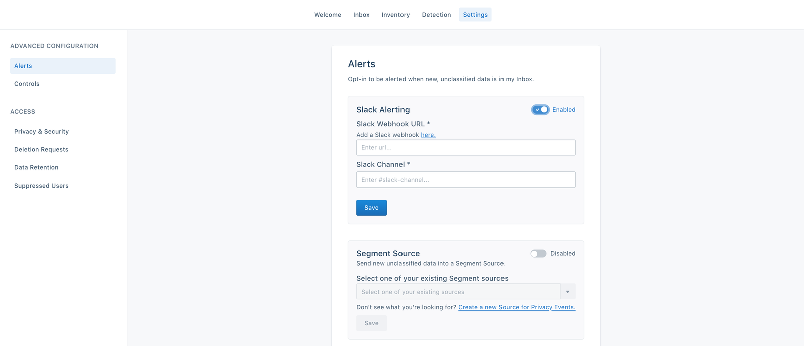



The Privacy Portal gives you control over whether specific data is allowed to
enter Segment.

The controls are available to all customers, across all plan types. With
these, you can block data at the source level, which means
data from those sources never enters Segment once blocked. This does not support blocking to device-mode destinations.

For example, if you want to prevent certain types of PII (like Credit Card
Number) from ever being ingested by Segment, you can block it using standard
controls by classifying those fields as "Red" in your Data Inventory,
and then blocking them in your standard controls settings. Blocking fields
blocks the properties from entering Segment, but does not block the rest of the
event data from flowing through. Remember that any data you classify as "Red" in your Data Inventory is
blocked if you enable these controls.

If you block Segment data at the source level using these controls, the data
does not enter Segment and we can not Replay it. Additionally, if you have
[Privacy Controls](#privacy-controls) configured to change how you route Red and
Yellow data into or out of Segment, the standard controls respect the rules set
by those Controls. For example, if you have a Privacy Control set up to block
**Red** data at the Source-level, any new fields you classify in the Data Inventory as
**Red** are also blocked from that Source. Only fields added to the Data Inventory are blocked by a Privacy Control.

## Privacy Alerts

Alerts notify you when a new, unclassified data type appears in your Privacy
Portal inbox. You can set up Slack alerts or a generic Source to pipe alerts to
other tools you might prefer for events and notifications. We recommend setting
up alerts to help you ensure your Inventory is always up to date.

**To set up a Slack Alert:**

1. From the Privacy Portal screen, click the **Settings** tab, and if necessary click **Alerts**.
2. On the **Slack Alerting** settings, set the toggle to **Enabled**.
3. Enter the Slack webhook by following the in-app hyperlink.
4. Enter the name of the #slack-channel to be send alerts to.
5. Click **Save**.

you're all set!

**To send alerts to a Segment Source:**

1. From the Privacy Portal screen, click the **Settings** tab, and if necessary click **Alerts**.
2. On the **Segment Source** settings, set the toggle to **Enabled.**
3. From the dropdown menu in the settings, select an existing Segment Source, or click the link to create a new Source.
   We recommend that you use the HTTP Source so you can easily send the data to wherever you prefer to consume alerts.
4. Click **Save**.

you're all set!
