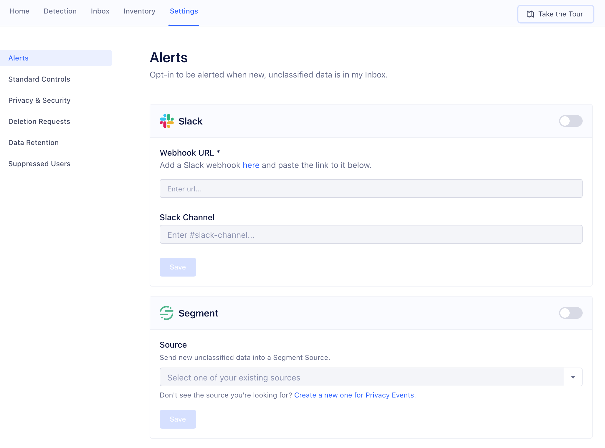

## Privacy Controls

The Privacy Portal gives you control over whether specific data is allowed to
enter Segment ([Standard Controls](#standard-controls)), or be sent to specific
Destinations at all ([Advanced Controls](#advanced-controls)).

> **Note**: All Privacy Controls are in Public Beta, meaning their use is governed by [(1) Segment First Access](https://segment.com/legal/first-access-beta-preview/) and Beta Terms and Conditions and [(2) Segment Acceptable Use Policy](https://segment.com/legal/acceptable-use-policy/)).

### Standard Controls

Standard controls are available to all customers, across all plan types. With
these standard controls, you can block data at the source level, which means
data from those sources never enters Segment once blocked. Source-level Privacy
Controls do not support blocking to device-mode destinations.

For example, if you want to prevent certain types of PII (like Credit Card
Number) from ever being ingested by Segment, you can block it using standard
controls by classifying those fields as "Red" in your Inbox or Data Inventory,
and then blocking them in your standard controls settings. Blocking fields
blocks the properties from entering Segment, but does not block the rest of the
event data from flowing through. Remember that any data you classify as "Red" is
blocked if you enable these controls.

If you block Segment data at the source level using these controls, the data
does not enter Segment and we can not Replay it. Additionally, if you have
[Privacy Controls](#privacy-controls) configured to change how you route Red and
Yellow data into or out of Segment, the standard controls respect the rules set
by those Controls. For example, if you have a Privacy Control set up to block
**Red** data at the Source-level, any new fields you classify in the Inbox as
**Red** will also be blocked from that Source.

### Advanced Controls

Advanced controls are in public beta, but are available to all customers who
have the Protocols add-on as part of their Segment Plan. As of today, advanced
controls are available upon request through the in-app **Advanced Privacy Controls** card.

Advanced controls allow you to block, allow, or hash data on a granular Source
and Destination level. By submitting a request in the app, Segment will
configure Controls for you. Advanced Controls works on both Server-Side Sources,
as well as Server-Side and Cloud-mode Destinations. Blocking events at the
Source simply blocks the properties from entering Segment, but does not block
the rest of the event from flowing through. Blocking events at the Destination
simply blocks the properties from being sent to the Destination, but it does not
block the rest of the event from being forwarded to destinations.

Hashing is available upon request, and at this time is only compatible with
cloud-mode destinations, and device-mode destinations sent from Analytics.js.
Warehouses and S3 are not currently supported by Privacy Controls. Our default
hashing algorithm is `sha256`, and others may be available upon request through
the in-app form link.

Note that if you block Segment data at the Source, this is irreversible and we
can not Replay it for you. Additionally, note that if you have any [Privacy Controls](#privacy-controls) configured for how to route your Red and Yellow
data into or out of Segment, the classifications you create in the Inbox will
respect by those Controls. For example, if you have a Privacy Control set up to
block **Yellow** data from Google Analytics, any new fields you classify in the
Inbox as **Yellow** will also be blocked from Google Analytics.

## Privacy Alerts

Alerts notify you when a new, unclassified data type appears in your Privacy
Portal inbox. You can set up Slack alerts or a generic Source to pipe alerts to
other tools you might prefer for events and notifications. We recommend setting
up alerts to help you ensure your Inventory is always up to date.

**To set up a Slack Alert:**

1. From the Privacy Portal screen, click the **Settings** tab, and if necessary click **Alerts**.
2. On the **Slack Alerting** settings, set the toggle to **Enabled**.
3. Enter the Slack webhook by following the in-app hyperlink.
4. Enter the name of the #slack-channel to be send alerts to.
5. Click **Save**.

you're all set!

**To send alerts to a Segment Source:**

1. From the Privacy Portal screen, click the **Settings** tab, and if necessary click **Alerts**.
2. On the **Segment Source** settings, set the toggle to **Enabled.**
3. From the dropdown menu in the settings, select an existing Segment Source, or click the link to create a new Source.
   We recommend that you use the HTTP Source so you can easily send the data to wherever you prefer to consume alerts.
4. Click **Save**.

you're all set!
