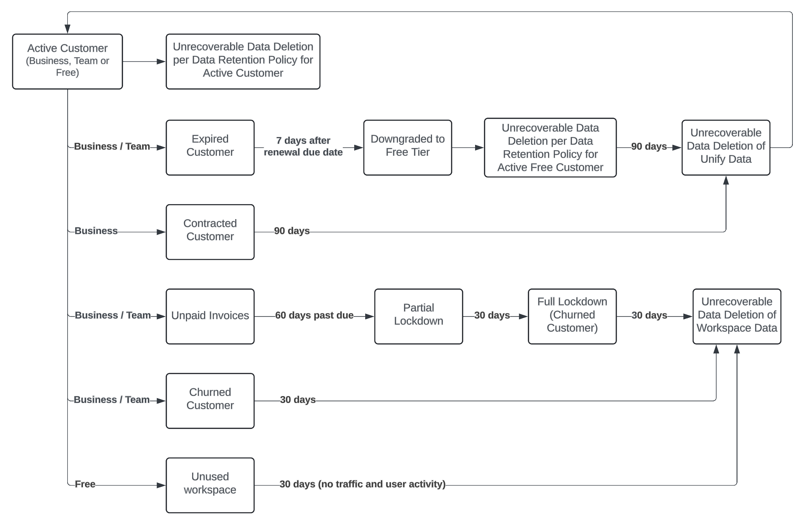

Twilio Segment’s Data Retention and Deletion Policy provides clarity, consistency and compliance across all Segment services and brings Segment’s data retention policy in line with industry standards and regulations. By implementing and enforcing this policy, Segment aims to enhance data governance and ensure that Segment customers can manage their data accurately, efficiently and securely within clearly defined retention periods.

Segment enforces a strict data retention policy for all:

- **[Active customers](#active-customers):** A Business or Team Tier customer that has an active Segment contract with no outstanding invoices and no locked workspace, or a Free Tier workspace that has had event traffic or user activity in the past 30 days.   
- **[Expired customers](#expired-customers):** A Business or Team Tier customer that hasn’t renewed their Segment contract and has their workspace downgraded to Free Tier.   
- **[Contracted customers](#contracted-customers):** A Business Tier customer that elects to stop using add-on features like Unify, Unify+, Engage and/or Linked.  
- **[Churned customers](#churned-customers):**  A Business or Team Tier customer that has either explicitly terminated the contract or has unpaid invoices and has their workspace fully locked out.  
- **[Unused Free Tier workspace](#unused-free-tier-workspace)**: A workspace on the Free Tier that has not received any Segment event traffic or had any user activity in the last 30 days.   

## Effective Date
Segment’s enforcement of this data retention policy for active customers begins on:
- **April 15, 2025** for Object Store data
- **July 15, 2025** for Archive event and Profile events data stores

## Active customers

An active customer is a Business or Team Tier customer that has an active Segment contract with no outstanding invoices and no locked workspace, or a Free Tier workspace that has had event traffic or user activity in the past 30 days. 

Segment enforces a data retention period of up to 3 years for Business Tier customers. If you currently have an extended retention period in place, Segment continues to honor the previously agreed upon retention period. If your business requires a longer retention period, please contact your sales team to discuss available options.

### Data retention period

The default data retention period for each of the data types is as follows:

| Tier         | Archive Event Data Retention | Profile Event Data Retention | Object Data Retention             | Audit    | HIPAA Audit    |
| ------------ | ---------------------------- | ---------------------------- | --------------------------------- | -------  | -------------- |
| **Business** | 3 years                      | 3 years                      | 180 days                          | 3 years  | 3 years        |
| **Team**     | 365 days                     | Not applicable               | 90 days                           | 365 days | Not applicable |
| **Free**     | 180 days                     | Not applicable               | 60 days                           | 180 days | Not applicable |

> info ""
> Segment calculates your data retention period for archive event and profile event data starting from the date Segment ingests an event, not from the date an event originally occurred. Object data retention periods are calculated from the date an object was last updated.

Segment will unrecoverably delete a disabled [Unify Space](/docs/unify/identity-resolution/space-setup/#step-one-create-a-new-dev-space) 90 days after it was disabled.

Segment recommends keeping your data for at least 30 days to enable [replays](/docs/guides/what-is-replay/) of your data.

To change your data retention settings, open Segment and navigate to **Privacy > Settings > Data Retention**.

### Workspace Default Archive Retention Period

Select the default retention period for the workspace in this setting. This value applies to all sources in the workspace.

- 14 days
- 30 days
- 90 days
- 180 days
- 365 days
- 3 years (the default setting starting July 15, 2025)
- Unlimited (deprecated July 15, 2025)
 
### What data is impacted?

With this data retention policy, all data beyond the retention period is unrecoverably deleted from all of Segment and impacts the following:

* [Data Replays](/docs/guides/what-is-replay/) will only be available for data within the retention period. Unify, Engage and Linked customers that replay data to recreate Unify Spaces or Profiles may encounter variations in the number of profiles, as well as in the identifiers, traits and properties associated with the profiles, depending on the data available.
* Backfill Data is only available for data within the retention period when sources are connected to your warehouse.   
* [Data residency](/docs/guides/regional-segment/) migrations across regions (US and EU) is only available for data within the retention period.  
* Additional impacts to Object data:  
  * [Object API](/docs/connections/sources/catalog/libraries/server/object-api/#set), [Bulk API](/docs/connections/sources/catalog/libraries/server/object-bulk-api/), or [SendGrid](/docs/connections/sources/catalog/cloud-apps/sendgrid/#streaming) and [Mandrill](/docs/connections/sources/catalog/cloud-apps/mandrill/#streaming) streaming sources: Any data older than 180 days is treated as a new record and may not contain any historic properties. To prevent loss of data properties, Segment recommends that you always send full objects with all properties.  
  * Users and Accounts: Segment aggregates data from Identify and Group events into [Users and Account objects and tables for warehouse destinations](/docs/connections/storage/warehouses/schema/#warehouse-tables) object store records. Any object store records not updated in the last 180 days will be deleted from Segment's object stores. Any new data after object store records are deleted for inactivity is treated as a new object store record. If the source is connected to a Warehouse destination, object store entities are synced into [`<source>.users` and `<source>.accounts` tables](/docs/connections/storage/warehouses/schema/#warehouse-tables), and the existing record in the warehouse will be replaced with the new object store record, resulting in possible loss of attribute data. To prevent loss of attributes, Segment advises customers to migrate to using [Profiles Sync](/docs/unify/profiles-sync/overview/), always send complete Identify and Group calls, or back up your `<source>.users` and `<source>.accounts` tables. 
* [Computed traits](/docs/unify/Traits/computed-traits/) is built using the available data within the retention period. Recreating these traits may result in different values based on the available data.  
* [Profiles](/docs/unify/), [Engage](/docs/engage/) [Audiences](/docs/engage/audiences/) and [Journeys](/docs/engage/journeys/) that are built using Events will use available data within the retention period. Recreating these may result in different Profiles based on the available data. Depending on how the conditions are defined, Profiles may or may not exit Computed traits, Engage Audiences, and Journeys due to the data retention policy, and this may result in mismatches in counts when comparing against a preview.

### What data is not impacted?

With this policy the following data is not impacted, but may be subject to other policies:

* **[Object Cloud Sources](/docs/connections/sources/#object-cloud-sources)**: This involves Segment fetching object data from third party Cloud Sources. Since Segment always fetches the full objects, the retention policy will have no impact.  
* **Profiles**: Unify Profiles, Identifiers, and Traits created are not subject to this data retention policy.   
* **Third Party Destinations**: Data in your third party destinations shared by Segment in the course of your implementation remains unaffected. Data stored in a third party system may be subject to the data retention policy of that system.    
* Anything a user creates in the Segment App, like Audiences, Journeys, Data Graphs, Connections, and more, **are not subject to this data retention policy**.

## Expired customers

An expired customer is a Business or Team Tier customer that hasn’t renewed their Segment contract and has had their workspace downgraded to the Free Tier. 

Segment will enforce a maximum data retention period of 90 days for Unify data, unless customers explicitly request immediate deletion through a [support ticket](/docs/privacy/account-deletion/#delete-your-workspace-data). Once on the Free Tier, the workspace will be subject to the Free Tier data retention policies. 

### What data is impacted?

Expired customers will have:

* Their data immediately subject to data retention of an active, Free Tier customer. All data beyond the retention period is deleted and unrecoverable.  
* Their Unify data deleted and unrecoverable 90 days from the date their workspace was downgraded.

## Contracted customers 

A contracted customer is a Business Tier customer that elects to stop using add-on features like Unify, Unify+, Engage and/or Linked.

Segment enforces a maximum data retention period of up to 90 days for all contracted customers, unless they explicitly request immediate deletion through a [support ticket](/docs/privacy/account-deletion/). All data beyond the retention period is deleted and unrecoverable as described below.

### What data is impacted?

With this data retention policy, all data in all your Unify Spaces after the retention period is deleted and unrecoverable. If you opt-in to Unify, Unify+, Engage, and/or Linked after the retention period, you'll be starting with a brand new implementation with no previous data.

### What data is not impacted?

If contracting from Engage or Linked, your Connection and Unify data will remain unaffected and will be subject to the [Active customer retention policy](#active-customers).

If contracting from Unify or Unify+, your Connection data remains unaffected and will be subject to the [Active customer retention policy](#active-customers).

## Churned customers 

A churned customer is a Business or Team Tier customer that has either:
- Explicitly terminated the contract
- Has unpaid invoices and had their workspace fully locked out

Customers that have explicitly terminated their Segment contract will have their data unrecoverably deleted within 30 days of contract termination. 

Customers that have unpaid invoices and have their workspaces fully locked out will have their data unrecoverably deleted after 30 days of full lock out, unless explicitly requested for immediate deletion through a [support ticket](/docs/privacy/account-deletion/#delete-your-workspace-data). 

| Tier         | Data Retention             |
| ------------ | -------------------------- |
| **Business** | 30 days post full lockout. |
| **Team**     | 30 days post full lockout. |

## Unused Free Tier workspace

An Unused Free Tier workspace is a workspace that has not received any Segment event traffic or user activity in the last 30 days. 

Segment unrecoverably deletes the workspace after 30 days of inactivity, unless explicitly requested for immediate deletion through a [support ticket](/docs/privacy/account-deletion/#delete-your-workspace-data). 

### Data deletion delays

When data reaches the end of its retention period, deletion is scheduled in accordance with Segment’s data retention policy. While Segment aims to complete the deletion process promptly, there may be occasional delays due to processing times or technical constraints. Segment is committed to initiating data deletions as soon as possible and strives to complete deletions within 7 days of the scheduled date.
