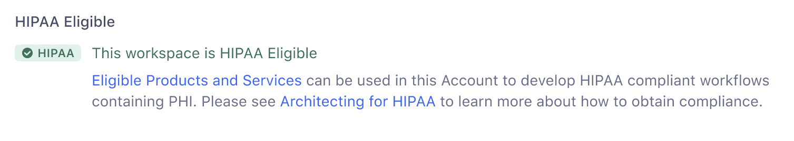

Segment is a HIPAA eligible platform, and meets the data privacy and security requirements of healthcare customers and their stakeholders. For more information about Segment becoming HIPAA eligible, see the [announcement blog post](http://segment.com/blog/segment-for-healthcare){:target="_blank"}.

## Business Associate Addendum

> info ""
> Twilio BAA are available to customers on a Business Tier plan.

Before you begin, check that the Segment products and services you'll use for your HIPAA workflows are on the list of Twilio's [HIPAA Eligible Products and Services](https://twil.io/HIPAA-eligible-products-and-services){:target="_blank"}. After you've verified availability, contact your Account Expert to [request a demo](https://segment.com/contact/sales/){:target="_blank"}.

## Verify your Workspace

Ensure your Workspace is eligible for HIPAA before you configure and send any personal health information (PHI).

1. In your Workspace, navigate to **Settings > Workspace Settings**.
2. On the **General Settings** tab, ensure that the HIPAA badge appears. This badge confirms that the Workspace is HIPAA eligible. 

With the BAA signed and Workspace confirmed as eligible, you can start building. For more information about starting a HIPAA compliant implementation, see Twilio's [Architecting for HIPAA on Twilio](https://twil.io/architecting-for-hipaa){:target="_blank"}, which outlines the shared responsibilities and requirements for building and maintaining HIPAA-compliant workflows in Segment.

## HIPAA Auditing
Segment maintains audit logs of every read and update action a user performs in the Segment app that may involve PHI/PII. 

Data captured in the HIPAA audit logs includes:
 - `workspace_id`: unique identifier of the workspace
 - `actor_user_id`: unique identifier Segment assigns to the logged in user
 - `event_type`: The action performed by the user. For example, `Source Debugger Raw Viewed`, `Destination Filter Modified`, or other events
 - `end_user_id`: Segment sometimes assigns this unique identifier to an end-user, event, audience, or journey, depending on the event type
 - `timestamp`: Time in UTC when the action occurred

These logs can be provided upon request. For specific requests, please reach out to [friends@segment.com](mailto:friends@segment.com){:target="_blank"}.

## Data encryption

Segment encrypts the data in select fields [marked as yellow in the Privacy Portal](/docs/privacy/portal/#default-pii-matchers) before sending them to event stream, cloud mode destinations, further supporting HIPAA compliance in your destinations. 

> info "Data encryption is currently in public beta"
> Data encryption only supports event-stream, cloud-mode destinations. Only data fields in `context`, `traits`, and `property` objects can be encrypted. 
>
> After Segment encrypts the data, the encrypted data value is always a `string`. Any downstream validation that looks for `integer` or `boolean` data types will fail for encrypted values.

### Configure data encryption for a new destination

To configure data encryption while setting up a new destination:
1. From the [Destinations page in the Segment App](https://app.segment.com/goto-my-workspace/destinations/){:target="_blank"}, click **Add destination**.
2. Select a destination from the catalog and click **Configure**.
3. On the destination's overview page, click **Add destination**. 
4. On the Select data source page, select the source you want to connect to your destination and click **Next**.
5. On the Setup page, give your destination a name, fill in any optional settings, and select the **Have Segment encrypt sensitive data** checkbox.
6. Open the **Fields** dropdown, select one or more fields you'd like to encrypt and click the **Generate Encryption Keys** button.   *If you don't see all of the fields that you want to encrypt, [change the classification of your missing data fields](/docs/privacy/portal/#change-a-recommended-classification) to Yellow in the Privacy Portal*.  
7. Securely store your private key.    **Note:** Once you finish setting up the destination, you cannot retrieve the key. 
8. Click **Create destination**.

> error "Private Key is not recoverable"
> Segment does not save the private key created during the data encryption setup flow, and cannot retrieve the key after you finish setting up your destination. You can generate a new key using the instructions in the [Configure new key pairs](#configure-new-key-pairs) section. Any data encrypted prior to generating a new key pair cannot be decrypted with the new key. 

### Configure data encryption for an existing destination
 
To configure data encryption for an existing destination:
1. Open the [My destinations page](https://app.segment.com/goto-my-workspace/destinations){:target="_blank”} in the Segment app.
2. Select a destination, and click the **Data Encryption** tab.
3. On the Data Encryption page, select the **Have Segment encrypt sensitive data** checkbox.
4. Open the **Fields** dropdown, select one or more fields you'd like to encrypt and click the **Generate Encryption Keys** button.   *If you don't see all of the fields that you want to encrypt, [change the classification of your missing data fields](/docs/privacy/portal/#change-a-recommended-classification) to Yellow in the Privacy Portal*.  
5. Securely store your private key.    **Note:** Once you finish setting up the destination, you cannot retrieve the key.
6. Click **Save**.

> error "Private Key is not recoverable"
> Segment does not save the private key created during the data encryption setup flow, and cannot retrieve the key after you finish setting up your destination. You can generate a new key using the instructions in the [Configure new key pairs](#configure-new-key-pairs) section. Any data encrypted prior to generating a new key pair cannot be decrypted with the new key. 

### Configure new key pairs

If you lose access to your private key, you can generate a new key pair in your destination's Data Encryption tab. Any data previously encrypted using the previous key pair is unaffected, but cannot be decrypted using the new key.

To generate a new key pair:
1. Open the [My destinations page](https://app.segment.com/goto-my-workspace/destinations){:target="_blank”} in the Segment app.
2. Select the destination you'd like to create new keys for and click **Data Encryption**.
3. Click **Regenerate Encryption Keys**.
4. Securely store your private key.    **Note:** Once you finish setting up the destination, you cannot retrieve the key.
5. Click **Save Changes** to update the key pair. 

### Edit encrypted fields

After enabling encryption for a destination, you can add or remove encrypted data fields in your destination's **Data Encryption** tab. All changes made to fields are forward-looking. You may experience some latency between making the changes and having the changes take effect.

To make changes to your selected fields:
1. Open the [My destinations page](https://app.segment.com/goto-my-workspace/destinations){:target="_blank”} in the Segment app.
2. Select the destination you'd like to edit your selected fields for and click **Data Encryption**.
3. Add or remove fields. 
  - To add fields, click the **Fields** box to open the dropdown and select the fields you'd like to add.
  - To remove fields, click the **x** icon next to the name of the field you'd like to remove. 
4. Click **Save Changes**. 

### Remove encryption

Disabling the data encryption setting removes encryption on all previously configured data.

To remove encryption from incoming data:
1. Open the [My destinations page](https://app.segment.com/goto-my-workspace/destinations){:target="_blank”} in the Segment app.
2. Select a destination, and click **Data Encryption**.
3. On the Data Encryption page, deselect the **Have Segment encrypt sensitive data** checkbox.
4. On the **Turn off data encryption?** popup, click **Confirm**.

> success ""
> Disabling the data encryption setting does not decrypt existing data, but does prevent any future data from being encrypted. 