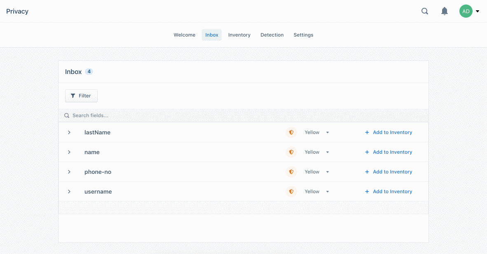
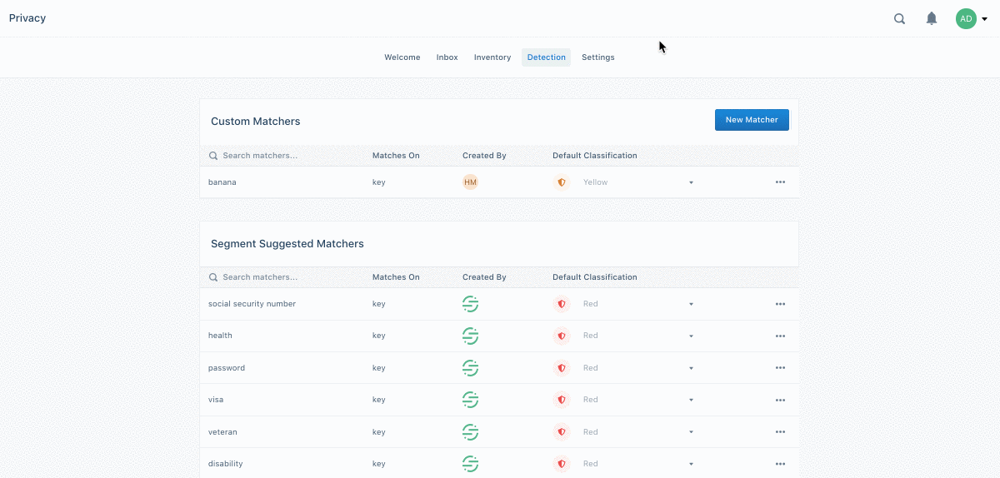

When preparing for new privacy regulations (such as the GDPR or the CCPA), the
best practice is to create a comprehensive data inventory which includes details
about what personal information you collect, where you collect it from, where
you store the data, and who has access to it. The Privacy Portal helps automate
this process for the data you collect with Segment.

When you use Segment as the single point of collection for your customer data, you can use the Privacy Portal to:

- Automatically detect and classify your customer data to create a dynamic data inventory
- Monitor changes to your inventory with real-time alerts
- Enforce your company's data privacy policies with standard privacy controls
- Streamline regulatory compliance with tools for user deletion and suppression

Privacy Portal features are available to all Segment workspaces, however only workspace owners can access the Privacy Portal.




## Privacy Inbox

The Inbox helps you keep track of new restricted data types as they are captured, quickly classify them, and build a data Inventory.

We detect these fields by scanning data from your Web, Mobile, Server, and Cloud Event Sources to detect PII based on our [default PII matchers](#default-pii-matchers). New properties sent into Segment appear in the Inbox in realtime.

When you view the Inbox for the first time, it displays every property that was sent into Segment from Web, Mobile, Server, and Cloud Event Sources dating back to August 9, 2019. ([Cloud Object Sources](/docs/connections/sources/#cloud-apps) do not appear in the Inbox at this time.)

You can click a row in the Inbox to learn more about a field and where it was collected. The expanded view shows:

- which events contain the field
- which sources are sending the field
- which matcher (and what type of matcher) detected the field
- an example code snippet containing a payload that the field appears in





To streamline the classification process, Segment pre-classifies the data in the
Privacy Portal Inbox as **Red** (likely highly restricted data), **Yellow**
(likely moderately restricted data), and **Green** (likely least restricted
data). These colors indicate how restricted the data is for your business. You
can also send and block data from flowing based on its color classification and
how restricted it is.

Segment makes recommendations about how a field should be classified using
built-in PII matcher [detection](#privacy-detection), however, you can always
update the classification in the Inbox based on your company's requirements.

### Change a recommended classification

You can update the classifications to suit your needs by clicking on the color
dropdown menu to change. For example, you might manually change a field that
does not contain personal information in your implementation from a "Yellow"
classification to "Green."


When you're satisfied that the fields have been classified appropriately, you
can click `Add to Inventory` to officially apply the classification to the
field. This moves the field into your [Data Inventory](#privacy-inventory),
which is a central repository of all of the properties _you_ classified as Red,
Yellow, and Green. Any time you send this field from a Web, Mobile, Server, or
Cloud Event Source — whether from another Source or event type — the Privacy
Portal automatically classifies it and adds it to the Inventory.

Keep in mind that if you have any Privacy Controls configured to control how you route Red and Yellow data into or out of Segment,
the classifications you create in the Inbox are forwarded on to those Controls.
For example, if you have a Privacy Control set up to block **Yellow** data from
Google Analytics, any new fields you classify in the Inbox as **Yellow** will
also be blocked from Google Analytics.

## Privacy Inventory

The Inventory is a central repository of all of the properties _you_ classified as Red, Yellow, and Green. Where the [Inbox](#privacy-inbox) shows new, unclassified data with Segment's _recommended_ classifications, the Inventory only contains data that you explicitly applied Classifications to.

**The Inventory is intended to be a Single Source of Truth so you can answer common regulatory questions about the data you're sending through Segment, for example:**

- What data am I sending into Segment, and how frequently?
- How restricted is the data I'm sending through Segment?
- Where is the data coming from, on a property-by-property level?
- Where am I sending this data?
- Who within my organization has access to each property within Segment?

Once you've classified the fields as Red, Yellow, and Green in the Inbox, the classified fields appear in the Inventory. You can use the filter at the top left to filter down to specific categories of data (for example, Red data, data from a production environment, data from specific sources).


Click into a field (for example, `ip`) in the Inventory to open the Inventory
details. The details sheet displays how many times a specific field has been
sent from each Source it comes from. You can click the Events tab to see which
events contained the event, along with the Sources which sent the event. The
data in the side sheet updates in realtime, and includes a limited historical
view.

You can click **Connected Destinations** to see which Destinations are
connected to the Source that contains the field. The Access tab displays a list
of who within your organization has access to this field.


Finally, workspace owners can use the **Download CSV** button to export a CSV of
their data Inventory to share with their Data Protection Officer (DPO), Chief
Information Security Officer (CISO), legal teams, and more! Note that the CSV
download button includes _all_ data from your Inventory, and ignores any filters
you applied in the UI.

## Privacy Detection

The Detection page in the Privacy Portal is where you can find out more about
exactly how data is being detected and classified in your workspace. You can
think of it as the brain behind the entire Privacy Portal, filled with the logic
that detects and classifies the data in the first place.

On this page, you can also modify your Detection settings and _tell Segment how you want us to match data_, so that it is meets your unique business needs.

### Default PII Matchers

Out of the box, the Privacy Portal contains matchers for the most common PII
fields. These matchers scan data coming from your Sources for PII based on both
exact-matching (looking for an exact match, such as a field name) and
fuzzy-matching (looking for both exact matches, and any values which are
similar).

In this section of Segment's Privacy Portal, you can see the fields we match
against by default. The display lists whether we match on the key (for example
the label "CCN") or value (for example, the payload 123-456-7890) in the
**Matches On** column. You can also see how we classify these matchers by
default in the **Default Classification** column.

Below is a full list of automatically detected restricted fields.


| Matcher                | Classification |
| ---------------------- | -------------- |
| social security number | red            |
| health                 | red            |
| password               | red            |
| visa                   | red            |
| veteran                | red            |
| disability             | red            |
| credit card            | red            |
| genetic                | red            |
| race                   | red            |
| passport               | red            |
| token                  | red            |
| birthdate              | yellow         |
| phone                  | yellow         |
| address                | yellow         |
| gender                 | yellow         |
| ethnicity              | yellow         |
| citizenship            | yellow         |
| name                   | yellow         |
| street                 | yellow         |
| city                   | yellow         |
| zipcode                | yellow         |
| email                  | yellow         |
| certificate            | yellow         |
| license                | yellow         |
| identification         | yellow         |
| serial                 | yellow         |
| ip                     | yellow         |
| photo                  | yellow         |
| salary                 | yellow         |
| religion               | yellow         |
| email                  | yellow         |
| mac                    | yellow         |
| sex                    | yellow         |
| gender                 | yellow         |
| sexual orientation     | yellow         |


When Segment detects data that meets the criteria for one of the default
matchers (in the list above) in properties in your Web, Mobile, Server, or Cloud
Event Sources, we display it in the [Privacy Portal Inbox](#privacy-inbox).

### Custom PII Matchers

This is where you can create your very own matchers to tell Segment what to scan
for in your workspace. You can use this feature to detect properties that are
unique to your company or region, or that aren't already handled by the default
matchers above. You can have up to 100 custom matchers per workspace. Custom
Matchers detect data in your Web, Mobile, Server, and Cloud Event Sources, and
the data they detect appears in the Inbox.

For example, if you have a restricted data point at your company called "SIN"
(for "social insurance number") you can tell Segment's Privacy Portal how to
treat that property whenever it is appears in data Segment processes.

**To create a Custom Matcher:**

1. Click **New Matcher**.
2. Enter the **Symbol Name** (for example the property name, like "Social Insurance Number"). Segment matches against the **Symbol Name**, as well as the other context you provide in the next steps.
3. Set the default classification:
   - **Red** for highly restricted
   - **Yellow** for moderately restricted
   - **Green** for least restricted
4. Choose whether to match on a **Key** (for example, "SIN", "Social Insurance Number", "Social Insurance No.", "SocInsNo") or on a **Value** (for example. "123-456-789", "1234567")
5. Select how precise the match should be, by choosing **Exact** or **Similar** match.
   - **Exact** matches mean that a key matches the term exactly (for example "phone number" but never "phne number")
   - **Similar to** matches a **Key** that is similar to a term within a fuzzy string distance (for example "email" and "e-mail"). We built fuzzy matching using [this public GitHub repository](https://github.com/imjasonmiller/godice). If the score is > 0.7, then we say it's a match.





Unless the field value pattern is unique, we recommend matching on the Key. For
example, for Credit Card Number, it's better to detect on Keys that look like
"CCN" or "Credit Card Number" instead of trying to detect any values that look
like "1234567890", because a 10-digit string can be found in all kinds of data
even when it's not an CCN. For example, the key "Product_ID" could contain a
10-digit string, even though Product_ID does not actually contain an SSN. A
North American phone number (without country code) is also ten digits.



#### An intro to Regular expressions

Custom Matchers use [regular expressions](https://en.wikipedia.org/wiki/Regular_expression) (using the [Golang Regex Package](https://golang.org/pkg/regexp/)) to provide you great flexibility for your matching patterns.

Regular expressions (or regexes) are a way to describe to a computer a pattern
that we're looking for, using a series of special symbols. For example, if we
want to match all Gmail emails, we'd write the following regex:

```text
@example.com
```

This pattern matches `jane@example.com`, `mike@example.com` and so on. Regular
expressions can also contain special symbols. One of them is `\d` and it tells
the computer to match a single-digit number. In that case, regular expression
`Number \d` would match `Number 1`, `Number 2` and so on. You can match multiple
digits by adding a plus sign (`+`) at the end: `Year \d+`. This pattern would
match `Year 2019`, `Year 2020`, etc.

If you need to match a specific word, you can type the word without any
modifiers. For example, a regular expression of `Apple` would only match strings
that contain `Apple`. You can also change it to match all `Apple` or `Orange`
words, by separating the search terms with a "pipe" character, like so:
`Apple|Orange`.

Regular expressions have much more flexibility than we can describe here. Check
out the following resources to learn more about regular expressions so you can
build new custom matchers:

- [RegExr](https://regexr.com/) - an online tool to experiment with regular expressions and test them
- [RegexOne](https://regexone.com/) - a tutorial which takes you from regular expression basics to advanced topics
- [Regexp Cheatsheet](https://devhints.io/regexp) - a handy cheatsheet to have nearby when you're writing regular expressions
