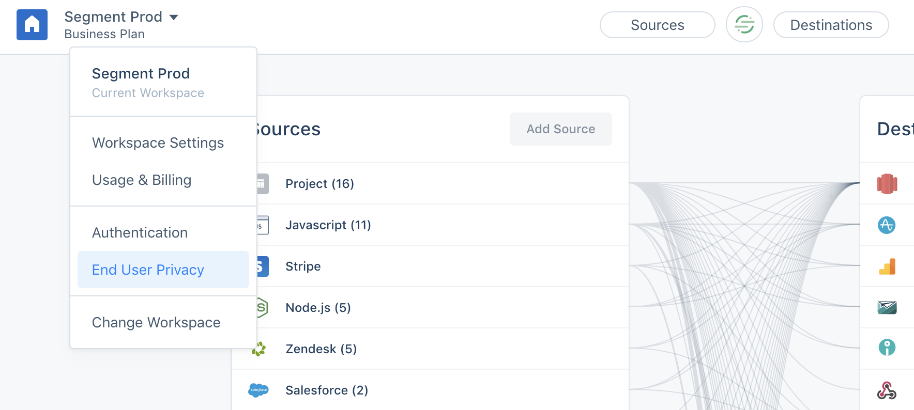
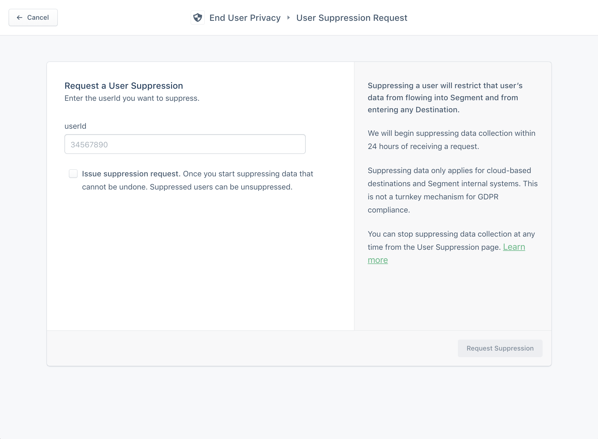
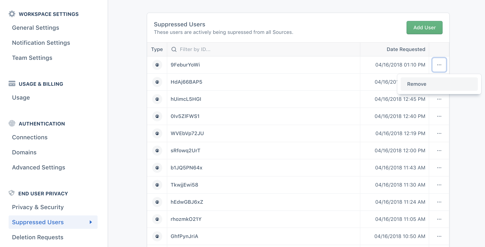
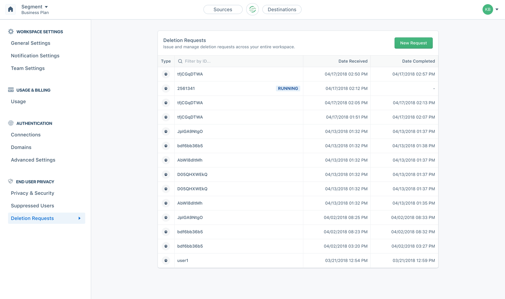
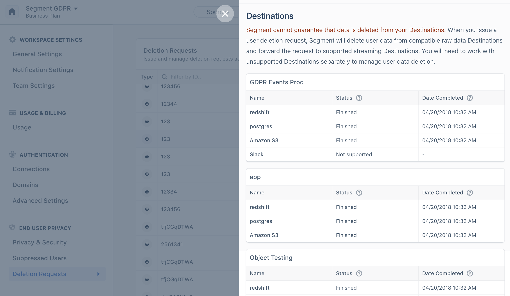

In keeping with our commitment to GDPR and CCPA readiness, Segment offers the ability to delete and suppress data about end-users when they can be identified by a `userId`, should they revoke or alter their consent to data collection. For example, if an end-user invokes their Right to Object or Right to Erasure under the GDPR or CCPA, you can use these features to block ongoing data collection about that user and, additionally, to delete all historical data about them from Segment's systems, connected S3 buckets and warehouses, and supported downstream partners.

[Contact us](https://segment.com/help/contact/) if you need to process more than 100,000 users within a 30 day period.

**NOTE (Business Plan Customers):** If you use this feature to delete data, you can not Replay the deleted data. For standard Replay requests, you must wait for any pending deletions to complete, and you cannot submit new deletion requests for the period of time that we replay data for you.

**NOTE:** The legacy GraphQL APIs for user deletion and suppression are deprecated. Instead, use the [Segment Config APIs](https://reference.segmentapis.com/?version=latest#57a69434-76cc-43cc-a547-98c319182247) to interact with our User Deletion and Suppression system.

## Overview

All deletion and suppression actions in Segment are asynchronous, and are categorized as what we call "Regulations." **Regulations** are requests to Segment to control your data flow. They can be issued from your Segment Workspace Settings page under **End User Privacy.**

With Regulations you can issue a single request to delete and suppress data about a user by `userId`. All regulations are scoped to your workspace, and target all sources within the workspace. This way, you don't need to look at every source in Segment to delete data about a single user.

There are currently three valid regulation types:

 - **SUPPRESS**
 - **UNSUPPRESS**
 - **SUPPRESS\_AND\_DELETE**

## Suppression Support and the Right to Revoke Consent

`SUPPRESS` regulations add a user to your suppression list by their `userId`. Suppressed users are blocked across all sources; any message you send to Segment with a suppressed userId is blocked at our API. These messages do not appear in the debugger, are not saved in our archives and systems, and are not sent to any downstream server-side destinations. Suppression does not affect device-mode destinations.

Usually, when a customer exercises their right to erasure, they also expect that you stop collecting data about them. Suppression regulations ensure that regardless of how you're sending data to Segment, if a user opts out, their wishes are respected on an ongoing basis and across applications.

**Suppression is not a substitute for gathering affirmative, unambiguous consent about data collection and its uses.**

Segment offers suppression tools to help you manage the challenge of users opting-out across multiple channels and platforms. However, we encourage and expect that you design your systems and applications so you don't collect or forward data to Segment until you have unambiguous, specific, informed consent or have established another lawful legal basis to do so.

To remove a user from the suppression list, create an `UNSUPPRESSION` regulation.

## Deletion Support and the Right to Be Forgotten

When you create a `SUPPRESS_AND_DELETE` regulation, the user is actively suppressed, and Segment begins permanently deleting all data associated with this user from your workspace. This includes scanning and removing all messages related to that `userId` from all storage mediums that don't automatically expire data within 30 days, including archives, databases, and intermediary stores.

Messages with this `userId` are also deleted from your connected raw data Destinations, including Redshift, BigQuery, Postgres, Snowflake and Amazon S3. Warehouse deletions happen using a DML run against your cluster or instance, and we delete from S3 by "recopying" clean versions of any files in your bucket that included data about that `userId`.

Finally, we also forward these deletion requests to a growing list of supported partners.

**Segment cannot guarantee that data is deleted from your Destinations.**

We forward deletion requests to supported streaming Destinations (such as Braze, Intercom, and Amplitude) but you should confirm individually with each partner that the request was fulfilled.

You will also need to contact any unsupported Destinations separately to manage user data deletion.

Note that if you later **UNSUPPRESS** a user, the deletion functionality does not clean up data sent after removing the user from the suppression list.

## **UI Walkthrough**

## Suppressed Users

The Suppressed Users tab shows an up-to-date list of **actively** suppressed `userId`s. Data about these users is blocked across all sources.

To create a suppression regulation and add a userId to this list, click **Add User**, and enter the `userId` in the field that appears. Then click **Request Suppression**.

A `SUPPRESS` regulation is created, and this userId is added to your suppression list within 24 hours.

To remove a user from the suppression list, click the ellipses (**...**) icon on the `userId` row, and click **Remove**.

This creates an `UNSUPPRESS` regulation, the `userId` is removed from your suppression list, and their data is no longer blocked within 24 hours.

## Deletion Requests

The deletion requests pane shows a log of all regulations with a deletion element along with their status, so that you can see the status of a deletion.

You can click an individual deletion to view its status across Segment and your connected destinations.

> Note: Deletion requests submitted through the [Segment Batch API](https://reference.segmentapis.com/?version=latest#57a69434-76cc-43cc-a547-98c319182247) appear in this view.

## Programmatic User Deletion and Suppression using the API

Use the [Segment Config APIs](https://reference.segmentapis.com/?version=latest#57a69434-76cc-43cc-a547-98c319182247) to interact with our User Deletion and Suppression system.

### Regulate User from a single Source in a Workspace

Refer to [Create Source Regulation](https://reference.segmentapis.com/?version=latest#32732f1a-572c-457b-9c38-77f3c7f77559) in the Config API.

### Delete Object from a Cloud Source

Refer to the [Cloud Source Object Deletion](https://reference.segmentapis.com/?version=latest#1273ed6e-43e2-4cc2-a9bc-f0c7d2f153e8) Config API method.

Cloud Sources sync objects to Segment. As a result, Cloud Sources are regulated based on an `objectId` instead of a `userId`.
Before you delete the object from Segment, you should delete it from the upstream system first.

### List Suppressed Users for your Workspace

Refer to [List Suppressed Users](https://reference.segmentapis.com/?version=latest#2ad8f59e-2490-4a85-bc6d-d758a6a373ce) method in the Config API.

### List Deletion Requests for your Workspace

Refer to the [List Regulations](https://reference.segmentapis.com/?version=latest#e27e4dac-892d-431e-b4f8-cee0eca5b3d8) Config API method.
