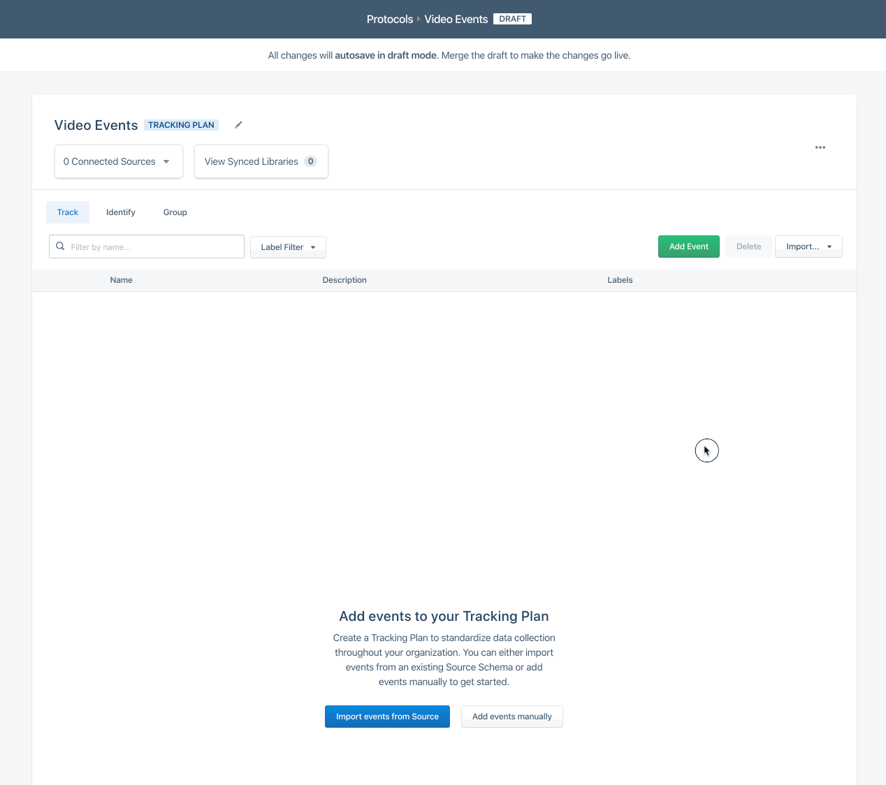

Tracking Plan Libraries make it easy to scale the creation of multiple Tracking Plans within your workspace. You can create libraries for track events or track event properties (Note: we do not currently support identify/group traits libraries). Editing Tracking Plan Libraries is identical to [editing Tracking Plans](/docs/protocols/align/tracking-plan/).

Once created, you can import event or property Libraries into a Tracking Plan using a simple wizard flow.

## Create a Tracking Plan Library

To create a new Library:
1. In the left navigation, click **Protocols**
2. Click **Libraries** in the top navigation bar
3. Click **New Library** and follow the steps to create an event or property library

### Tracking Plan Event Libraries

Tracking Plan Event Libraries support Track events and associated properties. Event Libraries are helpful when you want to track a group of events consistently across tracking plans. For example, if you are an eCommerce company with multiple apps, you likely need to track [eCommerce Spec](/docs/connections/spec/ecommerce/v2/) events consistently across those sources. Instead of having to re-create the eCommerce spec across multiple tracking plans, simply create a library and import the events to each Tracking Plan.

### Tracking Plan Property Libraries

Tracking Plan property Libraries support Track event property groups. Property Libraries are helpful when you have many events in a Tracking Plan that share a common set of properties. For example, if you want to consistently include `order_id`, `currency`, `cart_id` and a `products` array of objects in your checkout flow events, you can create a Library with these properties including descriptions, data types and conditional filters.

### Importing Libraries into a Tracking Plan

Event and property libraries can be easily imported into a Tracking Plan. Enter the Draft mode for a Tracking Plan and click the **Import from Event or Property Library** dropdown. A wizard will appear allowing you to either add the events to a tracking plan, or add properties to selected events already in the tracking plan. After adding your events or properties, remember to merge your changes!

### Enabling Library Syncing

When importing events from a Library, you can enable syncing to ensure that changes made to the Library are passed down to all "synced" Tracking Plans. Syncing is especially important when you want to make sure all your Tracking Plans define events consistently. For example, it's best practice to create separate tracking plans for mobile and web sources as these two sources share some but not all events. Library syncing is the best way to ensure that the shared events are consistently tracked across Tracking Plans, even as changes are made to the Library.

To enable syncing, simply select the desired Library from the Tracking Plan import flow, and toggle the syncing option. Doing so will automatically select all events in the Library to be imported. Partial syncs are not supported as it would make it impossible to ensure complete compliance with the Library.

When synced, events and properties from the synced Library cannot be edited and the Tracking Plan merge step is bypassed. Properties can however be added to synced events. Synced events cannot be removed unless the Library sync is removed. To unsync a library, click View Synced Libraries from the Tracking Plan and click the overflow menu to unsync the Library.

> warning ""
> All changes made to a synced library will immediately pass through to the Tracking Plans and may impact data deliverability

> warning ""
> [Property Library](/docs/protocols/align/tracking-plan-libraries/) syncing is **not** currently supported.
