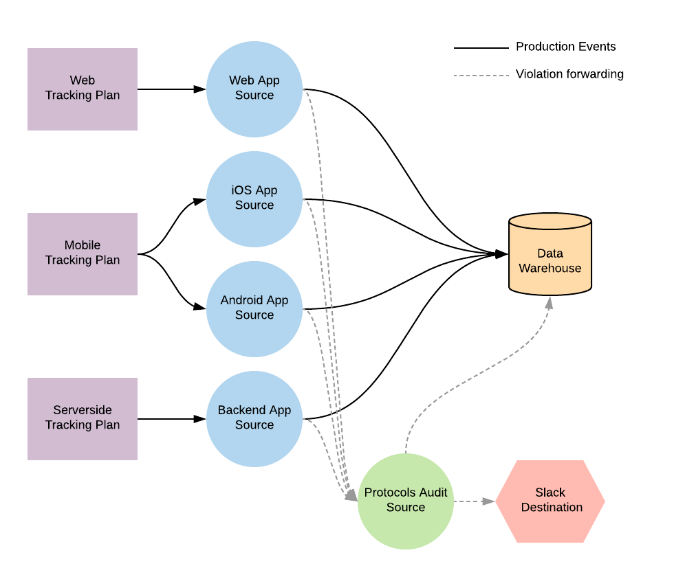
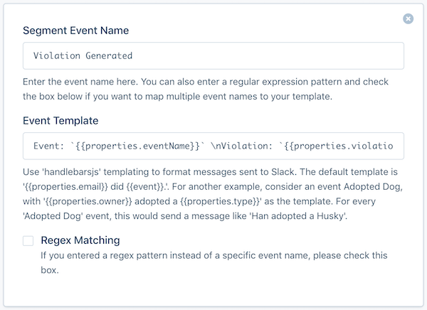
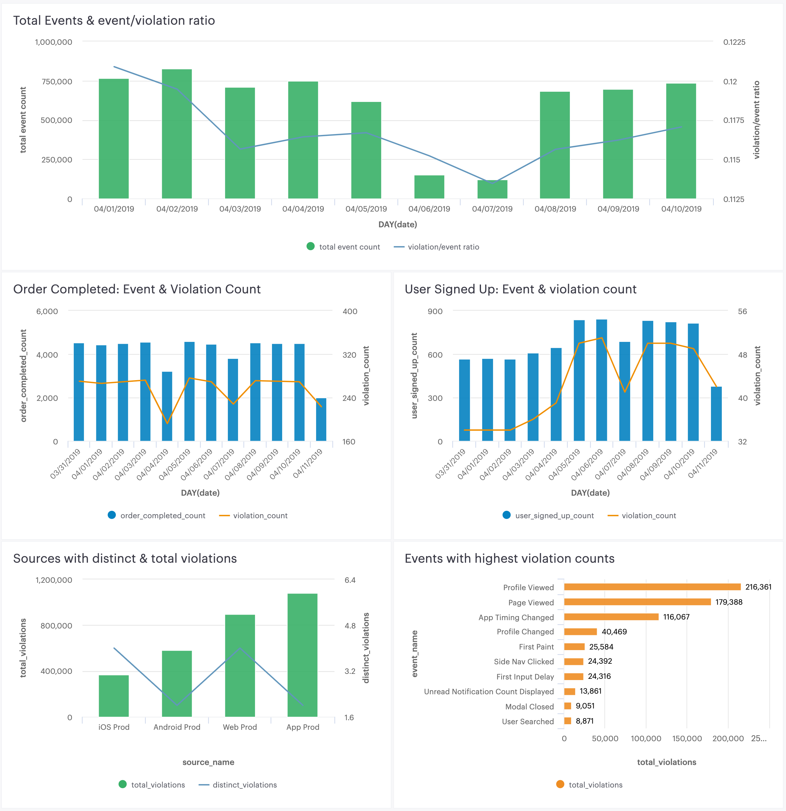

If you're using Protocols, you might want to get notifications when an anomaly in event volumes or [Protocols violation](/docs/protocols/validate/forward-violations/) counts occurs. This document clarifies what we mean by anomaly detection, gives examples of anomalies that might be relevant to your business, and provides some example solutions of how to monitor and alert on anomalies using some standard tools available today.

## What is anomaly detection?

Anomaly detection means finding out when your data collection is broken, missing, or incorrect. This covers a huge range of functionality!

When you first start using Protocols, you might focus on fixing data quality issues for a limited set of business critical events. After those first issues are resolved, you might get notifications if new issues occur or if old issues reoccur, so you can avoid manually monitoring data quality. New issues often occur when a new app version is released, and for many companies, that's weekly!

The issues you care about for anomaly detection are different for each business. An anomaly for one company could be completely normal for another company. For example, an B2B company would expect a steep drop-off of traffic and event volume on weekends, while a media or entertainment company would expect to see a rise in activity in the evenings and on weekends for their different locales.

Other types of issues you can monitor for include:
- An increase or decrease of event volumes by more than X standard deviations (per source or event)
- An increase of unique [violations](/docs/protocols/validate/forward-violations/) generated by Protocols (per source, event or property)
- An increase of total [violations](/docs/protocols/validate/forward-violations/) generated by Protocols (per source, event or property)
- An increase of [unplanned events](/docs/protocols/enforce/schema-configuration/#track-calls---unplanned-events) not defined in Tracking Plan
- An increase of [unplanned properties](/docs/protocols/enforce/schema-configuration/#track-calls---unplanned-properties) properties not defined in your Tracking Plan

## Anomaly Detection solutions

There are several easy ways to set up anomaly detection using the destination partner tools you probably already use. Many of these solutions come from our Segment customers using Protocols. They use these solutions to help manage data quality, and get notified when relevant anomalies are detected.

Regardless of the solution you choose, we recommend that you create a new Segment source to collect all violations and Segment workspace activity. To do this, create a new HTTP source in your workspace, and assign a name that you can easily understand (for example, `Protocols Audit Source`).

Next, set up [Violation forwarding](/docs/protocols/validate/forward-violations/) for each Tracking Plan connected to the Source. Once connected, your sources will look like:



**Note: When you enable violation forwarding, it counts as 1 MTU toward your monthly MTU limit. If you are on an API plan, all forwarded violations count against your API limit. Violations might also generate costs in downstream destinations and data warehouses.**

Once violation forwarding is enabled, you can build a custom anomaly detection solution that works for your business. The examples we cover here include:

1. [Forward violations to a Slack channel](#forward-violations-to-a-slack-channel)
2. [Create violation and event count Anomaly Detection dashboards in a BI tool](#create-customized-anomaly-detection-dashboards-in-a-bi-tool)
3. [Use a tool like Lazy Lantern to automate anomaly detection](#use-a-tool-like-lazy-lantern-to-automate-anomaly-detection)

### Forward violations to a Slack Channel
After you've enabled [Violation Forwarding](/docs/protocols/validate/forward-violations/), [enable the Slack destination](/docs/connections/destinations/catalog/slack/#getting-started) for your Protocols Audit Source. In the destination's settings, add an Incoming Webhook URL for the Slack channel you want to push notifications to. Next, add the `Violation Generated` event to the [Event Templates settings](/docs/connections/destinations/catalog/slack/#event-templates).

You can copy and paste the example snippet below into the Event Template field to format the Slack message with the event name, violation description and source name. You can customize this message however you want, including adding @ mentions, and any of the [properties included in the Violation Generated event](/docs/protocols/validate/forward-violations/).

```
Source: `{{properties.sourceName}}` \nEvent: `{{properties.eventName}}` \nViolation: `{{properties.violationDescription}}`
```
When you're done, it'll look like the screenshot below.




### Create customized Anomaly Detection dashboards in a BI tool
Custom dashboards are a great way to focus your teams around the metrics and events that matter most to your business. With a few simple queries you can build a dashboard to share with teams, so everyone can understand how well they're doing against your data quality objectives. Here's an example dashboard that combines [forwarded Violations](/docs/protocols/validate/forward-violations/) with production event data to track data quality. See below for detailed SQL queries!



Note: For all queries below, replace `protocols_audit_source` with whatever schema name you set for your forwarded violations source.

**Source-level event to violation count comparison:**
This query produces a table showing the total event and violation counts, along with a ratio of the two, broken out by day. A bar chart from this data can show when violations increase or decrease disproportionately to event volume in a source. This is the first place you would want to check to see if anomalies are occurring.

```sql
with
total_track_event_volume as (
      select  sent_at::date as date,
              count(*) as total_event_count
        from  <<YOUR_PROD_SOURCE_SCHEMA_NAME>>.tracks
    group by  sent_at::date
),

total_violations as (
      select  event_sent_at::date as date,
              count(id) as violation_count
        from  protocols_audit_source.violation_generated
       where  source_slug = '<<YOUR SOURCE SLUG>>'
         and  event_type = 'track'
    group by  event_sent_at::date
)

      select  v.date,
              t.total_event_count "Total Violation Count",
              nvl(v.violation_count, 0) "Total Event Count",
              nvl(v.violation_count, 0)::float/t.total_event_count::float as "Violations Per Event"
        from  total_track_event_volume t
   left join  total_violations v
          on  t.date = v.date
    order by  v.date desc
```

**Ratio of High priority events to violation counts:**
This query produces a table showing all violations and event counts by day for a single event sent to Segment. A bar chart from this data can show when violations increase or decrease disproportionately to event volume for the single event. We recommend selecting a few events that are important for your business (for example, `Order Completed`, `Video Viewed`, `User Signed Up`) and creating a separate query and chart for each event.

```sql
with
distinct_track_event_volume as (
      select  sent_at::date as date,
              count(*) as event_count
        from  <<YOUR_PROD_SOURCE_SCHEMA_NAME>>.<<IMPORTANT_EVENT_TABLE_NAME>>
    group by  sent_at::date
),

distinct_track_event_violations as (
      select  event_sent_at::date as date,
              count(id) as violation_count
        from  protocols_audit_source.violation_generated
       where  source_slug = '<<YOUR SOURCE SLUG>>'
         and  event_name = '<<IMPORTANT EVENT NAME>>'
    group by  event_sent_at::date
)

      select  v.date,
              t.event_count as "Distinct Event Count",
              nvl(v.violation_count, 0) as "Violation Count",
              nvl(v.violation_count, 0)::float/t.event_count::float as "Violations Per Distinct Event"
        from  distinct_track_event_volume t
   left join  distinct_track_event_violations v
          on  t.date = v.date
    order by  v.date desc
```

**Source-level distinct and total violation count (Last 7 days):**

This query produces a table that lists all sources connected to a Tracking Plan. For each source, the table shows distinct violations and total violations seen in the source. This table is similar to the [violations summary](/docs/protocols/validate/forward-violations/) view in the Segment app!

```sql
      select  source_name,
              count(distinct(violation_description)) as distinct_violations,
              count(*) as total_violations
        from  protocols_audit_source.violation_generated
       where  event_sent_at >= current_date - 7
    group by  source_name
```

**Event violation count (Top 10):**

This query produces a table listing the top 10 events with the most violations. A bar chart showing the worst offending events is a great way to focus your efforts on fixing the least reliable events.

```sql
      select  event_name,
              count(*) as total_violations
        from  protocols_audit_source.violation_generated
    group by  event_name
    order by  total_violations desc
       limit  10
```

### Use a tool like Lazy Lantern to automate anomaly detection

After you've set up [Violation Forwarding](/docs/protocols/validate/forward-violations/), you can enable the Lazy Lantern destination for the your `Protocols Audit Source` to start automatically generating Slack notifications when an anomaly occurs. Lazy Lantern can also be connected to your Segment production sources to track if any events are experiencing volume anomalies.

[Learn more about Lazy Lantern here](/docs/connections/destinations/catalog/lazy-lantern/)
