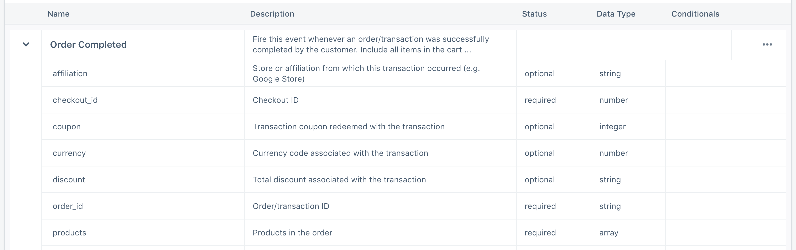
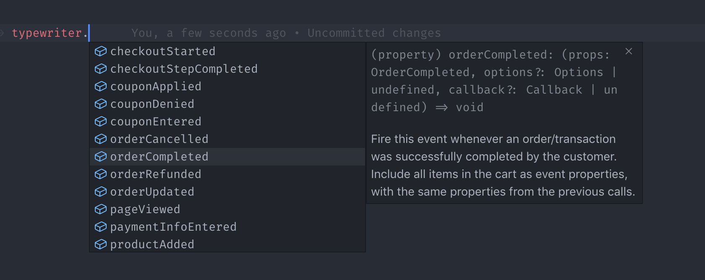
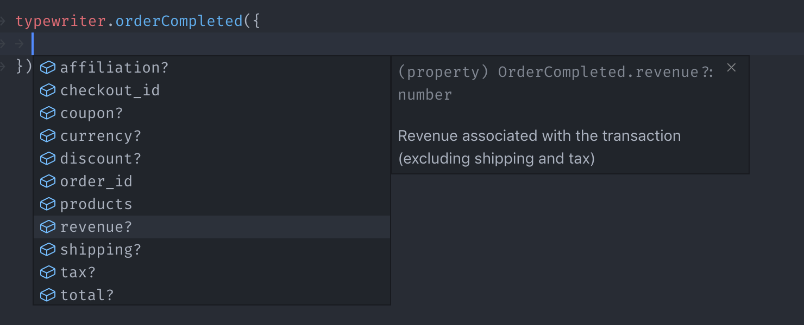
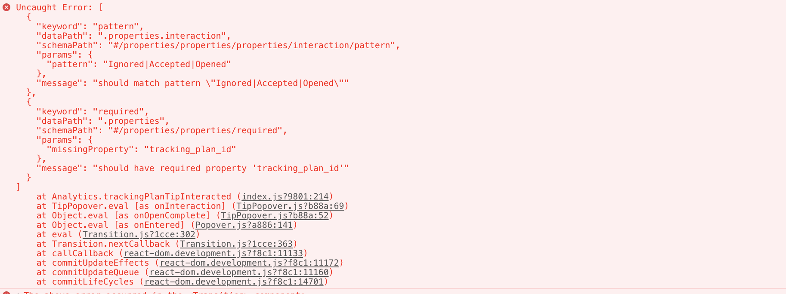
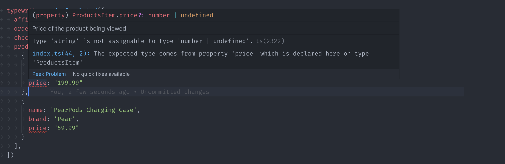
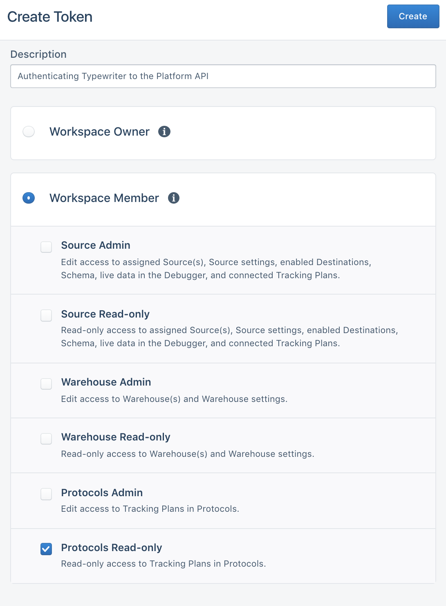
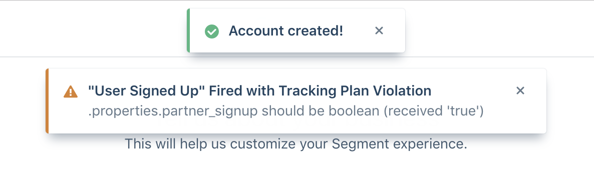

[Typewriter](https://github.com/segmentio/typewriter) is a tool for generating strongly-typed Segment analytics libraries based on your pre-defined [Tracking Plan](/docs/protocols/tracking-plan) spec.

At a high-level, Typewriter can take an event from your Tracking Plan like this `"Order Completed"` event:



And use it to generate a typed analytics call in different languages:

```js
// Example client in your web app
const typewriter = require('./analytics')

typewriter.orderCompleted({
  orderID: 'ck-f306fe0e-cc21-445a-9caa-08245a9aa52c',
  total:   39.99
})
```

```objc
// Example client in your iOS app
SEGTypewriterAnalytics.orderCompleted(
  orderID: "ck-f306fe0e-cc21-445a-9caa-08245a9aa52c",
  total: 39.99
)
```

> **Note**: Typewriter can currently generate clients for `analytics.js`, `analytics-node`, `analytics-ios` and `analytics-android`.

These generated clients are embedded with metadata from your Tracking Plan, which contextualizes your analytics instrumentation, and reduces (or entirely eliminates!) incorrect instrumentations in your production environments. In your editor, you can access event names, descriptions, property names, types and more:





You can also configure Typewriter to validate analytic events at runtime, which can alert you to instrumentation errors during development and testing. Typewriter can warn you about missing required properties, invalid enum values, regex mismatches, and any other advanced [JSON Schema](https://json-schema.org/understanding-json-schema/) you configure in your Tracking Plan.



You can use this with a test suite to automatically fail your unit tests if the instrumentation generates any violations:


If you're using a statically typed language (such as TypeScript, Java, Objective-C, Swift, etc.), then you also get access to compile-time warnings about your instrumentation:



Typewriter also helps teams adopt [analytics best practices](/docs/protocols/tracking-plan/best-practices/), such as avoiding autogenerated event names, and carefully considering what properties are tracked.

To get started, check out one of the quickstart guides below:
- [Browser Quickstart](#browser-quickstart)
- [Node.js Quickstart](#nodejs-quickstart)
- [iOS Quickstart](#ios-quickstart)
- [Android Quickstart](#android-quickstart)

> Have feedback on Typewriter? Consider opening a [GitHub issue here](https://github.com/segmentio/typewriter/issues/new).

## Prerequisites

Typewriter is built using [Node.js](https://nodejs.org/en/), and requires `node@8.x` or later, and `npm@5.2.x` or later to function.

You can check if you have Node and NPM installed by running the following commands in your command-line window:

```sh
$ node --version
v10.15.3

$ npm --version
6.9.0

$ npx --version
6.9.0
```

If you don't have these, [you'll need to install `node`](https://nodejs.org/en/download/package-manager). Installing `node` also installs `npm` and `npx` for you. If you're on macOS, you can install it with [Homebrew](https://brew.sh/):

```sh
$ brew install node
```

Once you've installed Node and NPM, run the `--version` commands again to verify that they were installed correctly.

## Browser Quickstart

Before you start, make sure you have `node` installed using the instructions in the [prerequisites](#prerequisites) above.

Next, install `analytics.js` in your app. For now, you just need to complete [`Step 1: Copy the Snippet`](/docs/connections/sources/catalog/libraries/website/javascript/quickstart/#step-2-copy-the-segment-snippet) from the [`analytics.js` Quickstart Guide](/docs/connections/sources/catalog/libraries/website/javascript/quickstart/).

Once you've got `analytics.js` installed, add Typewriter as a developer dependency in your project:

```sh
$ npm install --save-dev typewriter
```

Typewriter comes with a quickstart wizard that generates a [`typewriter.yml`](#configuration-reference) configuration, along with your first Typewriter client. To use this wizard, run:

```sh
$ npx typewriter init
```

> **Note**: You can regenerate your Typewriter client by running `npx typewriter`. You need to do this each time you update your Tracking Plan.

Running the command creates a `typewriter.yml` file in your repo. For more information on the format of this file, see the [Typewriter Configuration Reference](#configuration-reference).

The command also adds a new Typewriter client in `./analytics` (or whichever path you configured). You can import this client into your project, like so:

```js
// Import your auto-generated Typewriter client:
const typewriter = require('./analytics')

// Issue your first Typewriter track call!
typewriter.orderCompleted({
  orderID: 'ck-f306fe0e-cc21-445a-9caa-08245a9aa52c',
  total:   39.99
})
```

To help you minimize your bundle size, Typewriter supports [tree-shaking](https://webpack.js.org/guides/tree-shaking/) using named exports. All generated analytics calls are automatically directly exported, so you can import them like so:

```js
// Import your auto-generated Typewriter client:
const { orderCompleted } = require('./analytics')

// Issue your first Typewriter track call!
orderCompleted({
  orderID: 'ck-f306fe0e-cc21-445a-9caa-08245a9aa52c',
  total:   39.99
})
```

Typewriter wraps your analytics calls in an [ES6 `Proxy`](https://developer.mozilla.org/en-US/docs/Web/JavaScript/Reference/Global_Objects/Proxy), which helps protect your application from crashing if you make analytics calls with a generated function that doesn't exist. For example, if an `Order Completed` event didn't exist in your Tracking Plan in the first example above, then your app would crash with a `TypeError: typewriter.orderCompleted is not a function`. However, since `typewriter` dynamically proxies the underlying function calls, it can detect if a function does not exist, and handle it for you. Typewriter logs a warning message, then fires an `Unknown Analytics Call Fired` event into your source. Our team has found this useful when migrating JavaScript projects to Typewriter in bulk, since it gives us confidence that we won't introduce regressions that crash our application. Keep in mind that proxying does not work with named exports.

You're now good to go! To learn more about some of the advanced configuration options that Typewriter supports, read on.

## Nodejs Quickstart

Before you start, make sure you have `node` installed using the instructions in the [prerequisites](#prerequisites) above.

Next, install `analytics-node` in your app. For now, you just need to complete [`Step 2: Install the Module`](/docs/connections/sources/catalog/libraries/server/node/quickstart/#step-2-install-the-module) from the [`analytics-node` Quickstart Guide](/docs/connections/sources/catalog/libraries/server/node/quickstart).

Once you have `analytics-node` installed, add Typewriter as a developer dependency in your project:

```sh
$ npm install --save-dev typewriter
```

Typewriter comes with a quickstart wizard that generates a [`typewriter.yml`](#configuration-reference) configuration, along with your first Typewriter client. To use this wizard, run:

```sh
$ npx typewriter init
```

> **Note**: You can regenerate your Typewriter client by running `npx typewriter`. You need to do this each time you update your Tracking Plan.

Running the command creates a `typewriter.yml` file in your repo. For more information on the format of this file, see the [Typewriter Configuration Reference](#configuration-reference).

The command also adds a new Typewriter client in `./analytics` (or whichever path you configured). You can import this client into your project, like so:

```js
// Initialize analytics-node, per the analytics-node guide above.
const Analytics = require('analytics-node')
const analytics = new Analytics('YOUR_WRITE_KEY')

// Import your auto-generated Typewriter client.
const typewriter = require('./analytics')

// Pass in your analytics-node instance to Typewriter.
typewriter.setTypewriterOptions({
  analytics: analytics
})

// Issue your first Typewriter track call!
typewriter.orderCompleted({
  orderID: 'ck-f306fe0e-cc21-445a-9caa-08245a9aa52c',
  total:   39.99
})
```

Typewriter wraps your analytics calls in an [ES6 `Proxy`](https://developer.mozilla.org/en-US/docs/Web/JavaScript/Reference/Global_Objects/Proxy), which helps protect your application from crashing if you make analytics calls with a generated function that doesn't exist. For example, if an `Order Completed` event didn't exist in your Tracking Plan in the first example above, then your app would crash with a `TypeError: typewriter.orderCompleted is not a function`. However, since `typewriter` dynamically proxies the underlying function calls, it can detect if a function does not exist, and handle it for you. Typewriter logs a warning message, then fires an `Unknown Analytics Call Fired` event into your source. Our team has found this useful when migrating JavaScript projects to Typewriter in bulk, since it gives us confidence that we won't introduce regressions that crash our application. Keep in mind that proxying does not work with named exports.

You're now good to go! To learn more about some of the advanced configuration options that Typewriter supports, read on.

## iOS Quickstart

Before you start, make sure you have `node` installed using the instructions in the [prerequisites](#prerequisites) above.

Next, install `analytics-ios` in your app. For now, you just need to complete [`Step 1: Install the SDK`](/docs/connections/sources/catalog/libraries/mobile/ios/quickstart/#step-2-install-the-sdk) from the [`analytics-ios` Quickstart Guide](/docs/connections/sources/catalog/libraries/mobile/ios/quickstart).

Typewriter comes with a quickstart wizard that generates a [`typewriter.yml`](#configuration-reference) configuration, along with your first Typewriter client. To use this wizard, run:

```sh
$ npx typewriter init
```

> **Note**: You can regenerate your Typewriter client by running `npx typewriter`. You need to do this each time you update your Tracking Plan.

Running the command creates a `typewriter.yml` file in your repo. For more information on the format of this file, see the [Typewriter Configuration Reference](#configuration-reference).

You can now import your new Typewriter client into your project using XCode. If you place your generated files into a folder in your project, import the project as a group not a folder reference.

To use it in an Objective-C application:

```objc
// Import your auto-generated Typewriter client:
#import "SEGTypewriterAnalytics.h"

// Issue your first Typewriter track call!
[SEGTypewriterAnalytics orderCompletedWithOrderID: "ck-f306fe0e-cc21-445a-9caa-08245a9aa52c" total: @39.99];
```

To use it in a Swift application, you add a [Bridging Header](https://developer.apple.com/documentation/swift/imported_c_and_objective-c_apis/importing_objective-c_into_swift) like the example below:

```objc
// TypewriterSwiftExample-Bridging-Header.h
//
// Make sure to include all generated headers from your Typewriter client:
#import "Analytics/SEGTypewriterAnalytics.h"
#import "Analytics/SEGGarage.h"
#import "Analytics/SEGObjectItem.h"
#import "Analytics/SEGOccupantsItem.h"
#import "Analytics/SEGSubterraneanLab.h"
#import "Analytics/SEGTunnel.h"
#import "Analytics/SEGUniverse.h"
#import "Analytics/SEGUniverseCharactersItemItem.h"
```

Then, you can use your Typewriter client in Swift:

```objc
// Issue your first Typewriter track call!
SEGTypewriterAnalytics.orderCompleted(
  orderID: "ck-f306fe0e-cc21-445a-9caa-08245a9aa52c",
  total: 39.99
)
```

You're now good to go! To learn more about some of the advanced configuration options that Typewriter supports, read on.

## Android Quickstart

Before you start, make sure you have `node` installed. Use the instructions in the [prerequisites](#prerequisites) above.

Next, install `analytics-android` in your app, and configure the singleton analytics instance by following the first three steps in our [Android Quickstart](https://segment.com/docs/connections/sources/catalog/libraries/mobile/android/quickstart/#step-2-install-the-library).

Typewriter comes with a quickstart wizard that generates a [`typewriter.yml`](#configuration-reference) configuration, along with your first Typewriter client. To use this wizard, run:

```sh
$ npx typewriter init
```

> success ""
> **Note**: You can regenerate your Typewriter client by running `npx typewriter`. You need to do this each time you update your Tracking Plan.

Running the command creates a `typewriter.yml` file in your repo. For more information on the format of this file, see the [Typewriter Configuration Reference](#configuration-reference).

You can now use your Typewriter client in your Android Java application:

```java
// Import your auto-generated Typewriter client:
import com.segment.generated.*

// Issue your first Typewriter track call!
TypewriterAnalytics.with(this).orderCompleted(
  OrderCompleted.Builder()
    .orderID("ck-f306fe0e-cc21-445a-9caa-08245a9aa52c")
    .total(39.99)
    .build()
);
```

Congrats, you're ready to go! To learn more about some of the advanced configuration options that Typewriter supports, read on.

## Adding Events

To update or add a new event to a Typewriter client, first apply your changes to your Tracking Plan. Then run the following:

```sh
# Run this in the directory with your repo's `typewriter.yml`.
$ npx typewriter
```

## API Token Configuration

Typewriter requires a Segment API token to fetch Tracking Plans from the [Segment Config API](/docs/config-api/).

Only workspace owners can create Segment API tokens. To create an API token, open the `Tokens` tab on the [Access Management](https://app.segment.com/goto-my-workspace/settings/access-management) page and click `Create Token`. Typewriter only needs the `Protocols Read-only` role.

<!-- This is a pretty tall image with an off-gray background. Just formatting it slightly to reduce its size and add a border. -->


Typewriter looks for an API token in two ways, in the following order:
1. Executes a token script from the `typewriter.yml`. See [Token Script](#token-script) for more information.
2. Reads the contents of a `~/.typewriter` file.

The quickstart wizard prompts you for an API token and stores it in `~/.typewriter` for you.

Segment recommends you use a [Token Script](#token-script) to share an API token with your team. When you use a token script, you can supply your API token as an environment variable (`echo $TYPEWRITER_TOKEN`), from a `.env.` file (`source .env; echo $TYPEWRITER_TOKEN`) or using any other CLI tool for providing secrets.

## Editor Configuration

To make the most of Typewriter, Segment recommends installing a few extensions:

**JavaScript**

Typewriter clients include function documentation adhering to the [JSDoc](https://jsdoc.app/) specification. Install the relevant extension below for JSDoc support in your editor:

- *VSCode*: Supports JSDoc out-of-the-box.
- *Atom*: Install the official [atom-ide-ui](https://atom.io/packages/atom-ide-ui) and [ide-typescript](https://atom.io/packages/ide-typescript) plugins (the latter provides JavaScript support).
- *Sublime Text*: Install [`tern_for_sublime`](https://packagecontrol.io/packages/tern_for_sublime). And then [follow this guide's advice](https://medium.com/@nicklee1/configuring-sublime-text-3-for-modern-es6-js-projects-6f3fd69e95de) on configuring Tern.

**TypeScript**

For intellisense in TypeScript clients, install the relevant extension below for TypeScript support in your editor. If your project is a mix between JavaScript and TypeScript, then you should also install the plugins in the JavaScript section above so that your editor will also support JSDoc intellisense.

- *VSCode*: Supports TypeScript out-of-the-box.
- *Atom*: Install the official [atom-ide-ui](https://atom.io/packages/atom-ide-ui) and [ide-typescript](https://atom.io/packages/ide-typescript) plugins.
- *Sublime Text*: Install the [TypeScript](https://packagecontrol.io/packages/TypeScript) plugin from [Package Control](https://packagecontrol.io/installation).

**iOS**

XCode does not require any extra configuration and shows intellisense out-of-the-box.

**Android**

Android Studio does not require any extra configuration and shows intellisense out-of-the-box.

## Best Practices

We **strongly recommend** that you store your Tracking Plan (`plan.json`) in a version control system. This guarantees that Typewriter will generate the same client, regardless of any changes you make to your Tracking Plan in the Segment app. Otherwise, changes to your Tracking Plan could lead to broken builds.

We recommend that you only check in the `plan.json`, and generate your Typewriter client during the application build step (by calling `npx typewriter`). You can do this in `git` with the following `.gitignore`:

```bash
# Make sure to update `analytics` to the full path to your Typewriter client.
analytics/*
!analytics/plan.json
```

If this isn't possible you _can_ also check in the full generated client. We do not recommend this method.

## Configuration Reference

Typewriter stores its configuration in a `typewriter.yml` file in the root of your repo. A sample configuration might look like this:

```yml
# Segment Typewriter Configuration Reference (https://github.com/segmentio/typewriter)
# Just run `npx typewriter` to re-generate a client with the latest versions of these events.

scripts:
  # You can supply a Segment API token using a `script.token` command. See `Token Script` below.
  token: source .env; echo $TYPEWRITER_TOKEN
  # You can format any of Typewriter's auto-generated files using a `script.after` command.
  # See `Formatting Generated Files` below.
  after: ./node_modules/.bin/prettier --write analytics/plan.json

client:
  # Which Segment SDK you are generating for.
  # Valid values: analytics.js, analytics-node, analytics-ios, analytics-android.
  sdk: analytics-node
  # The target language for your Typewriter client.
  # Valid values: javascript, typescript, java, objective-c, swift.
  language: typescript

trackingPlans:
  # The Segment Protocols Tracking Plan that you are generating a client for.
  # Provide your workspace slug and Tracking Plan id, both of which can be found
  # in the URL when viewing the Tracking Plan editor. For example:
  # https://app.segment.com/segment-demo/protocols/tracking-plans/rs_QhWHOgp7xg8wkYxilH3scd2uRID
  # You also need to supply a path to a directory to save your Typewriter client.
  - id: rs_QhWHOgp7xg8wkYxilH3scd2uRID
    workspaceSlug: segment-demo
    path: ./analytics
```

At any time, you can regenerate this file by running the Typewriter quickstart wizard:

```bash
$ npx typewriter init
```

## Token Script

If your team has a standard way to supply secrets (passwords and tokens) in development environments, whether that's a simple `.env` file or an AWS-backed secret store, you can configure Typewriter to use it to get a Segment API token.

You configure this by creating a token script called `scripts.token` in your `typewriter.yml`. This script is a string that contains a shell command that, when executed, outputs a valid Segment API token. Here's a trivial, but **insecure**, example:

```yaml
scripts:
  # NOTE: NEVER commit a Segment API token to your version control system.
  token: echo "OIEGO$*hf83hfh034fnosnfiOEfowienfownfnoweunfoiwenf..."
```

To give a real example, at Segment we store our secrets in [`segmentio/chamber`](http://github.com/segmentio/chamber) which is backed by [AWS Parameter Store](https://aws.amazon.com/blogs/mt/the-right-way-to-store-secrets-using-parameter-store/). Providing access to a token in `chamber` looks like this:

```yaml
scripts:
  token: aws-okta exec dev-privileged -- chamber export typewriter | jq -r .typewriter_token
```

To learn more about the `typewriter.yml` configuration format, see the [Configuration Reference](#configuration-reference) above.

## Formatting Generated Files

In your `typewriter.yml`, you can configure a script (`scripts.after`) that'll fire after generating a Typewriter client. You can use this to apply your team's style guide to any of Typewriter's auto-generated files.

For example, if you wanted to apply your [`prettier`](https://prettier.io/) formatting to `plan.json` (the local snapshot of your Tracking Plan), you could use an `after` script like this:

```yaml
scripts:
  after: ./node_modules/.bin/prettier --write ./analytics/plan.json
```

To learn more about the `typewriter.yml` configuration format, see the [Configuration Reference](#configuration-reference) above.

## Connecting to CI

As mentioned in the [Best Practices](#best-practices) section above, Segment recommends that you only check in the `plan.json`, and not the generated clients, into your version control. Instead, we recommend building these clients as part of the build step for your application.

In your CI environment, this usually involves a step to build the Typewriter client. Make sure to build the production client before deploying the application, as explained in the [Tracking Plan Violation Handling](#tracking-plan-violation-handling) section below.

```yaml
# An example (simplified) CircleCI configuration:
jobs:
  test:
    steps:
      - npx typewriter development
      - yarn run test

  deploy:
    steps:
      - npx typewriter production
      - yarn run deploy
```

## Tracking Plan Violation Handling

You can also configure Typewriter to validate analytic events at runtime, which can alert you to instrumentation errors during development and testing. By default, Typewriter generates a "development" build, which means that it includes this logic. You can generate a "production" build that omits this logic:

```sh
# To build a development client (the default, if not supplied):
$ npx typewriter development
# To build a production client:
$ npx typewriter production
```

> **Note**: Not all languages support run-time validation. Currently, `analytics.js` and `analytics-node` support it using [AJV](https://github.com/epoberezkin/ajv) (both for JavaScript and TypeScript projects) while `analytics-ios` and `analytics-android` do not yet support run-time validation. Typewriter also does not yet support run-time validation using Common JSON Schema. For languages that do not yet support run-time validation, the development and production clients are identical.

Segment recommends using a development build when testing your application locally, or when running tests. We generally recommend _against_ using a development build in production, since this includes a full copy of your Tracking Plan which can increase the size of the application.

You can provide a custom handler that fires whenever a violation is seen. By default, this handler logs a warning.

For `analytics.js` and `analytics-node` clients, you can configure this handler with `setTypewriterOptions`:

```js
const typewriter = require('./analytics')

function yourViolationHandler(message, violations) {
  console.error(`Typewriter Violation found in ${message.event}`, violations)
}

typewriter.setTypewriterOptions({
  onViolation: yourViolationHandler
})
```

A common use case for this handler is to configure Typewriter to detect when your tests are running and if so, throw an error to fail your unit tests. For example:

```js
const typewriter = require('./analytics')

function yourViolationHandler(message, violations) {
  if (process.env.IS_TESTING === 'true') {
    throw new Error(`Typewriter Violation found in ${message.event}`)
  }
}

typewriter.setTypewriterOptions({
  onViolation: yourViolationHandler
})
```

> **Note**: Typewriter is preconfigured in `analytics-node` environments to throw an error if `NODE_ENV=test`, which is set by most Node.js testing libraries such as `ava` and `jest`.

Another common use case is to customize how violations are reported to your team. For example, at Segment, we customized this handler to show a [toast notification](https://evergreen.segment.com/components/toaster) to our developers in-app:



```js
const typewriter = require('./analytics')
const { toaster } = require('evergreen-ui')

typewriter.setTypewriterOptions({
  // Note that this handler only fires in development mode, since we ship the production build
  // of Typewriter to customers.
  onViolation: (msg, violations) => {
    toaster.warning(`"${msg.event}" Fired with Tracking Plan Violation`, {
      description: violations[0].message
    })
  }
})
```

## Known Limitations

Typewriter currently only supports `track` calls, however you can continue to use the underlying (untyped) analytics instance to perform `identify`, `group`, `page`, `screen`, and `alias` calls.

Not all languages support run-time validation. Currently, `analytics.js` and `analytics-node` support it using [AJV](https://github.com/epoberezkin/ajv) (both for JavaScript and TypeScript projects) while `analytics-ios` and `analytics-android` do not yet support run-time validation. Typewriter also does not yet support run-time validation using Common JSON Schema.

## Contributing

If you're interested in contributing, [open an issue on GitHub](https://github.com/segmentio/typewriter/issues/new) and we can help provide you pointers to get started!

## Feedback

We're always curious about any feedback you have on your experience with Typewriter! To contact us, [open an issue on GitHub](https://github.com/segmentio/typewriter/issues/new).
