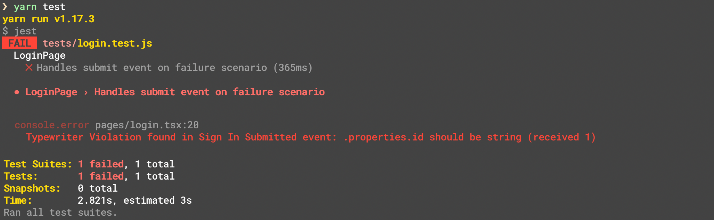

[Typewriter](https://github.com/segmentio/typewriter) is a tool for generating strongly-typed Segment analytics libraries based on your pre-defined [Tracking Plan](/docs/protocols/tracking-plan) spec.

At a high-level, Typewriter can take an event from your Tracking Plan like this `"Order Completed"` event:


Typewriter uses the event to generate a typed analytics call in different languages:

```js
// Example client in your web app
const typewriter = require('./analytics')

typewriter.orderCompleted({
  orderID: 'ck-f306fe0e-cc21-445a-9caa-08245a9aa52c',
  total:   39.99
})
```

```objc
// Example client in your iOS app
SEGTypewriterAnalytics.orderCompleted(
  orderID: "ck-f306fe0e-cc21-445a-9caa-08245a9aa52c",
  total: 39.99
)
```
> info ""
> Typewriter can generate clients for `analytics.js`, `analytics-node`, `analytics-swift` and `analytics-kotlin`. For use with the `analytics-ios` and `analytics-android` SDK, use [Typewriter v7](/docs/protocols/apis-and-extensions/typewriter-v7).

These generated clients are embedded with metadata from your Tracking Plan, which contextualizes your analytics instrumentation, and reduces (or entirely eliminates!) incorrect instrumentations in your production environments. In your editor, you can access event names, descriptions, property names, types and more:


You can also configure Typewriter to validate analytic events at runtime, which can alert you to instrumentation errors during development and testing. Typewriter can warn you about missing required properties, invalid enum values, regex mismatches, and any other advanced [JSON Schema](https://json-schema.org/understanding-json-schema/) you configure in your Tracking Plan.


You can use this with a test suite to automatically fail your unit tests if the instrumentation generates any violations:



If you use a statically typed language (such as TypeScript, Java, Objective-C, or Swift), you get access to compile-time warnings about your instrumentation:


Typewriter also helps teams adopt [analytics best practices](/docs/protocols/tracking-plan/best-practices/), such as avoiding autogenerated event names, and carefully considering what properties are tracked.

To get started, check out one of the quickstart guides below:
- [Browser Quickstart](#browser-quickstart)
- [Kotlin Quickstart](#kotlin-quickstart)
- [Node.js Quickstart](#nodejs-quickstart)
- [React Native Quickstart](#react-native-quickstart)
- [Swift Quickstart](#swift-quickstart)

> info ""
> For use with the Analytics-iOS and Analytics-Android SDK, use [Typewriter v7](/docs/protocols/apis-and-extensions/typewriter-v7).

Have feedback on Typewriter? Consider opening a [GitHub issue here](https://github.com/segmentio/typewriter/issues/new).

## Prerequisites

Typewriter is built using [Node.js](https://nodejs.org/en/), and requires `node@8.x` or later, and `npm@5.2.x` or later to function.

You can check if you have Node and NPM installed by running the following commands in your command-line window:

```sh
$ node --version
v10.15.3

$ npm --version
6.9.0

$ npx --version
6.9.0
```

If you don't have these, [you'll need to install `node`](https://nodejs.org/en/download/package-manager). Installing `node` also installs `npm` and `npx` for you. If you're on macOS, you can install it with [Homebrew](https://brew.sh/):

```sh
$ brew install node
```

Once you've installed Node and NPM, run the `--version` commands again to verify that they were installed correctly.

## Browser Quickstart

To get started with Typewriter in your browser:
1. Make sure you have `node` installed using the instructions in the [prerequisites](#prerequisites) above.
2. Install `analytics.js` in your app. For now, you just need to complete [`Step 1: Copy the Snippet`](/docs/connections/sources/catalog/libraries/website/javascript/quickstart/#step-2-copy-the-segment-snippet) from the [`analytics.js` Quickstart Guide](/docs/connections/sources/catalog/libraries/website/javascript/quickstart/).
3. Once you've got `analytics.js` installed, add Typewriter as a developer dependency in your project:

    ```sh
    $ npm install --save-dev typewriter
    ```

4. Run `npx typewriter init` to use the Typewriter quickstart wizard that generates a [`typewriter.yml`](#configuration-reference) configuration, along with your first Typewriter client. When you run the command, it creates a `typewriter.yml` file in your project. For more information on the format of this file, see the [Typewriter Configuration Reference](#configuration-reference).

    The command also adds a new Typewriter client in `./analytics` (or whichever path you configured). You can import this client into your project, like so:

    ```js
    // Import your auto-generated Typewriter client:
    const typewriter = require('./analytics')

    // Issue your first Typewriter track call!
    typewriter.orderCompleted({
      orderID: 'ck-f306fe0e-cc21-445a-9caa-08245a9aa52c',
      total:   39.99
    })
    ```

> info ""
> Run `npx typewriter` to regenerate your Typewriter client. You need to do this each time you update your Tracking Plan.

To help you minimize your bundle size, Typewriter supports [tree-shaking](https://webpack.js.org/guides/tree-shaking/){:target="_blank"} using named exports. All generated analytics calls generate and export automatically, so you can import them like so:

```js
// Import your auto-generated Typewriter client:
const { orderCompleted } = require('./analytics')

// Issue your first Typewriter track call!
orderCompleted({
  orderID: 'ck-f306fe0e-cc21-445a-9caa-08245a9aa52c',
  total:   39.99
})
```

Typewriter wraps your analytics calls in an [ES6 `Proxy`](https://developer.mozilla.org/en-US/docs/Web/JavaScript/Reference/Global_Objects/Proxy){:target="_blank"}, which helps protect your application from crashing if you make analytics calls with a generated function that doesn't exist. For example, if an `Order Completed` event didn't exist in your Tracking Plan in the first example above, then your app would crash with a `TypeError: typewriter.orderCompleted is not a function`. However, since Typewriter dynamically proxies the underlying function calls, it can detect if a function doesn't exist, and handle it for you. Typewriter logs a warning message, then fires an `Unknown Analytics Call Fired` event into your source. This helps to prevent regressions when you migrate JavaScript projects to Typewriter in bulk. Keep in mind that proxying doesn't work with named exports.

## Node.js Quickstart

To get started with Nodejs:
1. Make sure you have `node` installed using the instructions in the [prerequisites](#prerequisites) above.
2. Install `analytics-node` in your app. For now, you just need to complete [`Step 2: Install the Module`](/docs/connections/sources/catalog/libraries/server/node/quickstart/#step-2-install-the-module) from the [`analytics-node` Quickstart Guide](/docs/connections/sources/catalog/libraries/server/node/quickstart).
3. Once you have `analytics-node` installed, add Typewriter as a developer dependency in your project:

    ```sh
    $ npm install --save-dev typewriter
    ```

4. Run `npx typewriter init` to use the Typewriter quickstart wizard that generates a [`typewriter.yml`](#configuration-reference) configuration, along with your first Typewriter client. When you run the command, it creates a `typewriter.yml` file in your repo. For more information on the format of this file, see the [Typewriter Configuration Reference](#configuration-reference). The command also adds a new Typewriter client in `./analytics` (or whichever path you configured). You can import this client into your project, like so:

    ```js
    // Initialize analytics-node, per the analytics-node guide above.
    const Analytics = require('analytics-node')
    const analytics = new Analytics('YOUR_WRITE_KEY')

    // Import your auto-generated Typewriter client.
    const typewriter = require('./analytics')

    // Pass in your analytics-node instance to Typewriter.
    typewriter.setTypewriterOptions({
      analytics: analytics
    })

    // Issue your first Typewriter track call!
    typewriter.orderCompleted({
      orderID: 'ck-f306fe0e-cc21-445a-9caa-08245a9aa52c',
      total:   39.99
    })
    ```

> info ""
> Run `npx typewriter` to regenerate your Typewriter client. You need to do this each time you update your Tracking Plan.

Typewriter wraps your analytics calls in an [ES6 `Proxy`](https://developer.mozilla.org/en-US/docs/Web/JavaScript/Reference/Global_Objects/Proxy), which helps protect your application from crashing if you make analytics calls with a generated function that doesn't exist. For example, if an `Order Completed` event didn't exist in your Tracking Plan in the first example above, then your app would crash with a `TypeError: typewriter.orderCompleted is not a function`. However, since `typewriter` dynamically proxies the underlying function calls, it can detect if a function does not exist, and handle it for you. Typewriter logs a warning message, then fires an `Unknown Analytics Call Fired` event into your source. This helps to prevent regressions when you migrate JavaScript projects to Typewriter in bulk. Keep in mind that proxying doesn't work with named exports.

## Swift Quickstart

> info ""
> For use with the `analytics-ios` SDK, use [Typewriter v7](/docs/protocols/apis-and-extensions/typewriter-v7).

To get started using Typewriter with Swift:
1. Make sure you have `node` installed using the instructions in the [prerequisites](#prerequisites) above.
2. Install `analytics-swift` in your app. Follow the [analytics-swift Quickstart Guide](/docs/connections/sources/catalog/libraries/mobile/swift).
3. Run `npx typewriter init` to use the Typewriter quickstart wizard that generates a [`typewriter.yml`](#configuration-reference) configuration, along with your first Typewriter client. When you run the command, it creates a `typewriter.yml` file in your repo. For more information on the format of this file, see the [Typewriter Configuration Reference](#configuration-reference).

     <br> **Note:** Run `npx typewriter` to regenerate your Typewriter client. You need to do this each time you update your Tracking Plan.

4. Import your new Typewriter client into your project using XCode. If you place your generated files into a folder in your project, import the project as a group not a folder reference.

    <br> When you add the generated client to your Xcode Project you can use as a Swift extension method on any Analytics client object:

    ```swift
    Analytics.main.orderCompleted(OrderCompleted(
      orderID: "ck-f306fe0e-cc21-445a-9caa-08245a9aa52c",
      total: 39.99
    ))
    ```

## Kotlin Quickstart

> info ""
> For use with the `analytics-android` SDK, use [Typewriter v7](/docs/protocols/apis-and-extensions/typewriter-v7).

To get started using Typewriter with Kotlin:
1. Make sure you have `node` installed. Use the instructions in the [prerequisites](#prerequisites) above.
2. Install `analytics-kotlin` in your app. Follow the [analytics-kotlin QuickStart Guide](/docs/connections/sources/catalog/libraries/mobile/kotlin-android/#getting-started).
3. Run `npx typewriter init`. This command enables you to use the Typewriter quickstart wizard that generates a [`typewriter.yml`](#configuration-reference) configuration, along with your first Typewriter client. The command creates a `typewriter.yml` file in your repo. For more information on the format of this file, see the [Typewriter Configuration Reference](#configuration-reference).

  Typewriter creates the class file with the package name `typewriter`. Segment recommends you to enter the right package name during `npx typewriter init` by choosing to review the Advanced Options for Kotlin. You can also enter the right package name directly in `typewriter.yml`:

  ```yml
  client:
    language: kotlin
    sdk: kotlin
    languageOptions:
      package: com.segment.typewriter
```

> info ""
> Run `npx typewriter` to regenerate your Typewriter client. You need to do this each time you update your Tracking Plan.

You can now use your Typewriter client in your Android Kotlin or Java application as extensions to any `Analytics` object:

Kotlin:
```kotlin
// Import your auto-generated Typewriter client:
import com.segment.generated.*
analytics.orderCompleted(OrderCompleted(orderID = "110", total = 39.98))
```
Java:
```java
// Import your auto-generated Typewriter client:
import com.segment.generated.*

// Issue your first Typewriter track call!
TypewriterAnalytics.with(this).orderCompleted(
  OrderCompleted.Builder()
    .orderID("ck-f306fe0e-cc21-445a-9caa-08245a9aa52c")
    .total(39.99)
    .build()
);
```

## React Native Quickstart

To get started with React Native:
1. Follow the [Getting Started guide for React Native](/docs/connections/sources/catalog/libraries/mobile/react-native/).
2. Add `typewriter` as a dev dependency in your project once you have the library installed in your project.

    ```
    $ npm install --save-dev typewriter
    ```

3. Run `npx typewriter init` to use the Typewriter quickstart wizard that generates a `typewriter.yml` configuration along with your first Typewriter client.

   This command creates a `typewriter.yml` file in your repo. For more information on the format of this file, see the [Typewriter Configuration Reference](#configuration-reference). The command also adds a new Typewriter / Segment client in `./analytics` (or whichever path you configured). You can use this interchangeably as a normal React Native Segment client. It contains additional methods for your tracking plan:

    ```ts
    import {
      createClient,
      AnalyticsProvider,
    } from '../typewriter'; // Remember to import the methods from your typewriter generated file!
    const segmentClient = createClient({
      writeKey: 'SEGMENT_API_KEY'
    });
    const App = () => (
      <AnalyticsProvider client={segmentClient}>
        <Content />
      </AnalyticsProvider>
    );
    ```

    From there you can use it with hooks:

    ```ts
    import React from 'react';
    import { Text, TouchableOpacity } from 'react-native';
    import { useAnalytics } from '../typewriter'; // Important! To
    const Button = () => {
      const { orderCompleted } = useAnalytics();
      return (
        <TouchableOpacity
          style={styles.button}
          onPress={() => {
            orderCompleted({orderID: "111", total: 39.99});
          }}
        >
          <Text style={styles.text}>Press me!</Text>
        </TouchableOpacity>
      );
    };
    ```

    Or directly through the client:

    ```ts
    segmentClient.orderCompleted({orderID: "111", total: 39.99});
    // Remember this is just an extended client with the typewriter methods so all the normal segment methods still work!
    segmentClient.track('Untyped event');
    ```
> info ""
> Run `npx typewriter` to regenerate your Typewriter client. You need to do this each time you update your Tracking Plan.

## Adding Events

To update or add a new event to a Typewriter client, first apply your changes to your Tracking Plan. Then run the following:

```sh
# Run this in the directory with your repo's `typewriter.yml`.
$ npx typewriter
```

## API Token Configuration

Typewriter requires a Segment API token to fetch Tracking Plans from the [Segment Public API](https://docs.segmentapis.com/).


You must be a workspace owner to create Segment API tokens.

To create an API token:
1. Click on the **Tokens** tab on the [Access Management](https://app.segment.com/goto-my-workspace/settings/access-management) page and click **Create Token**.
2. Choose Segment's Public API.
3. Add a description for the token and assign access. If you choose *Workspace Member*, you only need to select **Tracking Plan Read-Only** for the Resource Role, as Typewriter only needs the *Tracking Plan Read-Only* role.
4. Click **Create**.

Typewriter looks for an API token in three ways, in the following order:
1. If a token is piped through, it will use that token. For example, `echo $TW_TOKEN | typewriter build`.
2. Typewriter executes a token script from the `typewriter.yml`. See [Token Script](#token-script) for more information.
3. Typewriter reads the contents of the `~/.typewriter` file.

The quickstart wizard prompts you for an API token and stores it in `~/.typewriter` for you.

Segment recommends you use a [Token Script](#token-script) to share an API token with your team. When you use a token script, you can supply your API token as an environment variable (`echo $TYPEWRITER_TOKEN`), from an `.env.` file (`source .env; echo $TYPEWRITER_TOKEN`) or using any other CLI tool for providing secrets.

Segment also recommends you to pipe through your API Token as this will let you keep your token secret, but it also allows you to share it across your team.

> warning ""
> Segment is keeping the Token Script execution for compatibility purposes only in v8 of Typewriter. Segment might deprecate this feature in the future, and encourages you to execute your script and pipe in the token. For example, `echo $TW_TOKEN | typewriter build`.

## Editor Configuration

To make the most of Typewriter, Segment recommends installing a few extensions:

**JavaScript**

Typewriter clients include function documentation adhering to the [JSDoc](https://jsdoc.app/) specification. Install the relevant extension below for JSDoc support in your editor:

- *VSCode*: Supports JSDoc out-of-the-box.
- *Atom*: Install the official [atom-ide-ui](https://atom.io/packages/atom-ide-ui) and [ide-typescript](https://atom.io/packages/ide-typescript) plugins (the latter provides JavaScript support).
- *Sublime Text*: Install [`tern_for_sublime`](https://packagecontrol.io/packages/tern_for_sublime). And then [follow this guide's advice](https://medium.com/@nicklee1/configuring-sublime-text-3-for-modern-es6-js-projects-6f3fd69e95de) on configuring Tern.

**TypeScript**

For intellisense in TypeScript clients, install the relevant extension below for TypeScript support in your editor. If your project is a mix between JavaScript and TypeScript, then you should also install the plugins in the JavaScript section above so that your editor will also support JSDoc intellisense.

- *VSCode*: Supports TypeScript out-of-the-box.
- *Atom*: Install the official [atom-ide-ui](https://atom.io/packages/atom-ide-ui) and [ide-typescript](https://atom.io/packages/ide-typescript) plugins.
- *Sublime Text*: Install the [TypeScript](https://packagecontrol.io/packages/TypeScript) plugin from [Package Control](https://packagecontrol.io/installation).

**iOS**

XCode does not require any extra configuration and shows intellisense out-of-the-box.

**Android**

Android Studio does not require any extra configuration and shows intellisense out-of-the-box.

## Best Practices

Segment **strongly recommends** that you store your Tracking Plan (`plan.json`) in a version control system. This guarantees that Typewriter will generate the same client, regardless of any changes you make to your Tracking Plan in the Segment app. Otherwise, changes to your Tracking Plan could lead to broken builds.

Segment recommends that you only check in the `plan.json`, and generate your Typewriter client during the application build step (by calling `npx typewriter`). You can do this in `git` with the following `.gitignore`:

```bash
# Make sure to update `analytics` to the full path to your Typewriter client.
analytics/*
!analytics/plan.json
```

If this isn't possible you can also check in the full generated client. Segment, however, doesn't recommend this method.

## Configuration Reference

Typewriter stores its configuration in a `typewriter.yml` file in the root of your repo. A sample configuration might look like this:

```yml
# Segment Typewriter Configuration Reference (https://github.com/segmentio/typewriter)
# Just run `npx typewriter` to re-generate a client with the latest versions of these events.

scripts:
  # You can supply a Segment API token using a `script.token` command. See `Token Script` below.
  token: source .env; echo $TYPEWRITER_TOKEN
  # You can format any of Typewriter's auto-generated files using a `script.after` command.
  # See `Formatting Generated Files` below.
  after: ./node_modules/.bin/prettier --write analytics/plan.json

client:
  # Which Segment SDK you are generating for.
  # Valid values: analytics.js, analytics-node, analytics-react-native, swift, kotlin.
  sdk: analytics-node
  # The target language for your Typewriter client.
  # Valid values: javascript, typescript, kotlin, swift.
  language: typescript

trackingPlans:
  # The Segment Protocols Tracking Plan that you are generating a client for.
  # Provide your workspace slug and Tracking Plan id, both of which can be found
  # in the URL when viewing the Tracking Plan editor. For example:
  # https://app.segment.com/segment-demo/protocols/tracking-plans/rs_QhWHOgp7xg8wkYxilH3scd2uRID
  # You also need to supply a path to a directory to save your Typewriter client.
  - id: rs_QhWHOgp7xg8wkYxilH3scd2uRID
    workspaceSlug: segment-demo
    path: ./analytics
```

At any time, you can regenerate this file by running the Typewriter quickstart wizard:

```bash
$ npx typewriter init
```

## Token Script

> warning ""
> Segment is keeping the Token Script execution for compatibility purposes only in v8 of Typewriter. Segment might deprecate this feature in the future, and encourages you to execute your script and pipe in the token. For example, `echo $TW_TOKEN | typewriter build`.

If your team has a standard way to supply secrets (passwords and tokens) in development environments, whether that's an `.env` file or an AWS-backed secret store, you can configure Typewriter to use it to get a Segment API token.

To configure this, create a token script called `scripts.token` in your `typewriter.yml`. This script is a string that contains a shell command that, when executed, outputs a valid Segment API token. Here's an **insecure**, example:

```yaml
scripts:
  # NOTE: NEVER commit a Segment API token to your version control system.
  token: echo "OIEGO$*hf83hfh034fnosnfiOEfowienfownfnoweunfoiwenf..."
```

To give a real example, Segment stores secrets in [`segmentio/chamber`](http://github.com/segmentio/chamber) which is backed by [AWS Parameter Store](https://aws.amazon.com/blogs/mt/the-right-way-to-store-secrets-using-parameter-store/){:target="_blank"}. Providing access to a token in `chamber` looks like this:

```yaml
scripts:
  token: aws-okta exec dev-privileged -- chamber export typewriter | jq -r .typewriter_token
```

To learn more about the `typewriter.yml` configuration format, see the [Configuration Reference](#configuration-reference).

## Formatting Generated Files

In your `typewriter.yml`, you can configure a script (`scripts.after`) that fires after generating a Typewriter client. You can use this to apply your team's style guide to any of Typewriter's auto-generated files.

For example, if you want to apply your [`prettier`](https://prettier.io/) formatting to `plan.json` (the local snapshot of your Tracking Plan), you can use an `after` script like this:

```yaml
scripts:
  after: ./node_modules/.bin/prettier --write ./analytics/plan.json
```

To learn more about the `typewriter.yml` configuration format, see the [Configuration Reference](#configuration-reference).

## Connecting to CI

As mentioned in the [Best Practices](#best-practices) section above, Segment recommends that you only check in the `plan.json`, and not the generated clients, into your version control. Instead, Segment recommends building these clients as part of the build step for your application.

In your CI environment, this usually involves a step to build the Typewriter client. Make sure to build the production client before deploying the application, as explained in the [Tracking Plan Violation Handling](#tracking-plan-violation-handling) section below.

```yaml
# An example (simplified) CircleCI configuration:
jobs:
  test:
    steps:
      - npx typewriter development
      - yarn run test

  deploy:
    steps:
      - npx typewriter production
      - yarn run deploy
```

## Tracking Plan Violation Handling

You can also configure Typewriter to validate analytic events at runtime, which can alert you to instrumentation errors during development and testing. By default, Typewriter generates a "development" build, which means that it includes this logic. You can generate a "production" build that omits this logic:

```sh
# To build a development client (the default, if not supplied):
$ npx typewriter development
# To build a production client:
$ npx typewriter production
```
> note ""
> Not all languages support run-time validation. Currently, `analytics.js` and `analytics-node` support it using [AJV](https://github.com/epoberezkin/ajv) (both for JavaScript and TypeScript projects) while `analytics-ios` and `analytics-android` do not yet support run-time validation. Typewriter also doesn't support run-time validation using Common JSON Schema. For languages that don't support run-time validation, the development and production clients are identical.

Segment recommends you to use a development build when testing your application locally, or when running tests. Segment generally recommends _against_ using a development build in production, since this includes a full copy of your Tracking Plan which can increase the size of the application.

You can provide a custom handler that fires whenever a violation is seen. By default, this handler logs a warning.

For `analytics.js` and `analytics-node` clients, you can configure this handler with `setTypewriterOptions`:

```js
const typewriter = require('./analytics')

function yourViolationHandler(message, violations) {
  console.error(`Typewriter Violation found in ${message.event}`, violations)
}

typewriter.setTypewriterOptions({
  onViolation: yourViolationHandler
})
```

A common use case for this handler is to configure Typewriter to detect when your tests are running and if so, throw an error to fail your unit tests. For example:

```js
const typewriter = require('./analytics')

function yourViolationHandler(message, violations) {
  if (process.env.IS_TESTING === 'true') {
    throw new Error(`Typewriter Violation found in ${message.event}`)
  }
}

typewriter.setTypewriterOptions({
  onViolation: yourViolationHandler
})
```
> info ""
> Typewriter is preconfigured in `analytics-node` environments to throw an error if `NODE_ENV=test`, which is set by most Node.js testing libraries such as `ava` and `jest`.

Another common use case is to customize how violations are reported to your team. For example, Segment customized this handler to show a [toast notification](https://evergreen.segment.com/components/toaster){:target="_blank"} to developers in-app:


```js
const typewriter = require('./analytics')
const { toaster } = require('evergreen-ui')

typewriter.setTypewriterOptions({
  // Note that this handler only fires in development mode, since we ship the production build
  // of Typewriter to customers.
  onViolation: (msg, violations) => {
    toaster.warning(`"${msg.event}" Fired with Tracking Plan Violation`, {
      description: violations[0].message
    })
  }
})
```

## Known Limitations

Typewriter only supports `track` calls. However, you can continue to use the underlying (untyped) analytics instance to perform `identify`, `group`, `page`, `screen`, and `alias` calls.

Not all languages support run-time validation. Currently, `analytics.js` and `analytics-node` support it using [AJV](https://github.com/epoberezkin/ajv){:target="_blank"} (both for JavaScript and TypeScript projects) while `analytics-swift` and `analytics-kotlin` don't support run-time validation. Typewriter also does not support event validation using the Common JSON Schema.

## Contributing

If you're interested in contributing, [open an issue on GitHub](https://github.com/segmentio/typewriter/issues/new) and Segment can help provide you pointers to get started.

## Feedback

Segment welcomes feedback you may have on your experience with Typewriter. To contact Segment, [open an issue on GitHub](https://github.com/segmentio/typewriter/issues/new).
