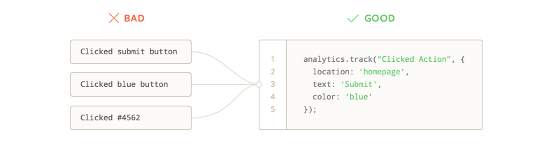

Let's face it, figuring out what events to track in Segment can feel overwhelming. Fortunately, we've helped 1000s of customers through this process and have amassed a ton of resources to help you get started. Whether you're a small team just getting your app off the ground, or a highly complex enterprise with 100s of stakeholders, these resources can help!

That being said, be prepared to invest time defining how you want to track data. Any investment in improving data quality will reap massive rewards, and compound over time by allowing your analytics teams to produce better insights, your marketing teams to run better campaigns and so much more.

## Define Business Objectives

While it may seem obvious, we recommend starting with your high level business objectives. More specifically, what are the measurable business outcomes you want to achieve this year. Are you looking to acquire new customers, activate new signups, drive incremental revenues among your current customer base, etc? Answering this question is best done by interviewing stakeholders who would consume the data in your organization. 

With these business goals in hand, you now need to map user actions to your business goals. For example, if one of your goals is to activate new signups, it's critical to understand the activities of your current customer base. What actions do people take before signing up? Are there specific actions that can predict a user signing up? 

As an example, here are some user actions that would likely lead to a sign up:

* Ad Campaign Clicked
* Link Clicked
* Article Completed
* Campaign Opened
* From Initiated
* Form Submitted
* User Signed Up 

While the above represents a small portion of the total user actions you will track, focusing on business objectives helps break up the overwhelmingness of data collection into smaller chunks. 

## Formalize Your Naming and Collection Standards 

With your business objectives documented, it's time to build a set of standards that you and your team will use when determining what to track. Our most successful customers limit their tracking plan to a minimal number of core events with rich properties to provide context. While we've generally seen more success with the "less is more" philosophy of tracking data, we've had plenty of customers take a more liberal "track more and analyze later" approach. Like everything, each alternative has pros and cons that are important to consider especially as it relates to your company's needs. 

Regardless of approach, here are some important notes to keep in mind:

* **Pick a casing convention:** We recommend _Title Case_ for event names and _snake_case_ for property names. Make sure you pick a casing standard and enforce it across your events and properties. 

* **Pick an event name structure:** As you may have noticed from our [specs](/docs/connections/spec/semantic/), we're big fans of the Object (`Blog Post`) + Action (`Read`) framework for event names. Pick a convention and stick to it!

* **Don't create event names dynamically:** Avoid creating events that pull a dynamic value into the event name (ex. `User Signed Up (11-01-2019)`)

* **Don't create events to track properties:** Avoid adding values to event names that could be a property. Instead, add values a property (ex. `"blog_post_title":"Best Tracking Plans Ever"`)

* **Don't create property keys dynamically:** Avoid creating property names like `"feature_1":"true"`,`"feature_2":"false"` as these are ambiguous and very difficult to analyze

## Create a Tracking Plan

Great! You're now ready to develop a Tracking Plan. Head over to the [What's a Tracking Plan article](/docs/protocols/data-quality/whats-a-tracking-plan/) to get started.