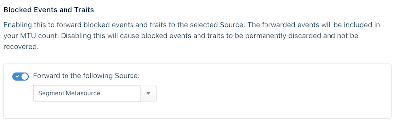



If you're concerned about permanently discarding blocked events, you can enable blocked event forwarding to a Segment Source. To set up forwarding, visit your Source settings tab and select which source you want to forward events to from the dropdown. We recommend creating a new Source for forwarded events to avoid contaminating production data. We recommend only enabling blocking when you feel confident about the quality of your data.

**Note: Only blocked events are forwarded to the source. Events with omitted traits are not forwarded. Instead, Segment inserts a `context.protocols` object into the event payload which contains the omitted properties or traits.**

**Billing Note: Events forwarded to another Source count towards to your MTU counts. Blocking and discarding events does not contribute to your MTU counts.**
