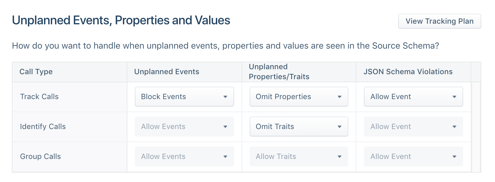



The Schema Configuration settings for each source can be used to selectively block events, or omit properties and traits from `.track()`, `.identify()` and `.group()` calls. Segment can permanently drop events that are not included in your Tracking Plan, depending on the settings you select. Segment can also block events with invalid properties or invalid property values.

To enable blocking, go to the **Settings** tab for your source, and click on **Schema Controls**. See below for detailed descriptions for each of the configuration settings.

**IMPORTANT: It's critical that you feel confident about the quality of your data before you enable blocking. This is a serious step that you should only do after you have resolved any violations that appear when you first connect a Tracking Plan to a Source.**



> success ""
> You can [export your Source Schema](/docs/connections/destination-data-control/#export-your-source-schema) as a CSV file to quickly audit events from your Tracking Plan.

## Track Calls - Unplanned Events
When you set this dropdown to Block Event, Segment drops any events that are not defined in your Tracking Plan. Only allowlisted `track` calls in your Tracking Plan flow through Segment to your Destinations.

For example, if you include a `Subscription Cancelled` event in your Tracking Plan, the example track call below would be blocked by Protocols because the event name does not match the event name casing in your Tracking Plan.

```js
    analytics.track('subscription_cancelled')
```

**IMPORTANT: Unplanned event blocking is supported across all device-mode and cloud-mode Destinations.**

## Track Calls - Unplanned Properties

Setting this dropdown to Omit Properties will ensure that properties not defined in your Tracking Plan are removed from the relevant event.

For example, if you include a single `subscription_id` property in the `Subscription Cancelled` event in your tracking plan, the example track call below would have the `subscription_name` property omitted by Protocols.

```js
    analytics.track('Subscription Cancelled', {subscription_id: '23r90jfs9ej', subscription_name: 'premium'})
```

**IMPORTANT: Unplanned property omission is ONLY supported in cloud-mode Destinations. Unplanned properties will not be omitted when sending to device-mode Destinations.**

## Track Calls - JSON Schema Violations
Setting this dropdown to Block Event will ensure that all events with JSON schema violations (i.e. missing required properties, incorrect property value data types, or invalid regex patterns) will be blocked. A less aggressive option is to select Omit from the dropdown which will simply remove the offending property from the event.

This is an advanced feature that requires extensive testing and a squeaky clean data set + tracking plan to enable. To get a sense of which events will be blocked, or properties omitted, go to the Violations view for a source and note all events with a violation. For example, if you added a `subscription_id` required property to your `Subscription Cancelled` event in your Tracking Plan, the below track call would be blocked by Protocols, or property omitted, depending on your setting.

```js
    analytics.track('Subscription Cancelled', {customer_type: 'enterprise'})
```

**IMPORTANT: JSON schema violation event blocking is ONLY supported in cloud-mode Destinations. Events with invalid properties will not be blocked from sending to device-mode Destinations.**

## Identify Calls - Unplanned Traits
Setting this dropdown to Omit Traits will ensure that traits not defined in your Tracking Plan are removed from the identify call. For example, if you specify three traits in your Tracking Plan (`name`, `email`, `join_date`), the below identify call would have the `first_name` property omitted by Protocols.

```js
    analytics.identify('fe923fjid', {email: 'roger@example.com', first_name: 'Roger'})
```

**IMPORTANT: Unplanned identify trait blocking is ONLY supported in cloud-mode Destinations. Events with invalid traits will not be blocked from sending to device-mode Destinations.**
