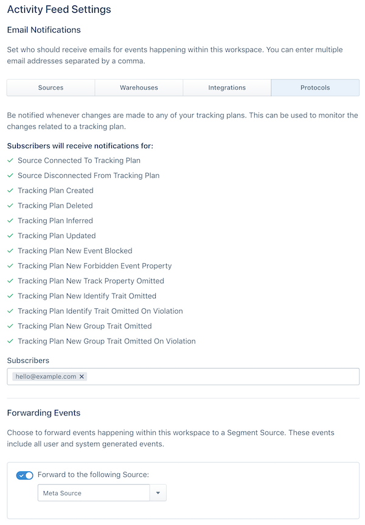

## Protocols Tracking Plan

### Do I need to add a Page Viewed event to my tracking plan?
Yes. To consolidate the views in the Schema tab, we automatically convert `analytics.page()` calls into `Page Viewed` events that appear in the Schema Events view. We recommend adding a `Page Viewed` event to your Tracking Plan with any properties you want to validate against. At this time, you cannot validate that a specific named page (`analytics.page('Homepage')`) has a specific set of required properties.

### How can I get notified when someone makes a change to my tracking plan?
Users can subscribe via email to a variety of Protocols specific alerts via the workspace Activity Feed settings. To enable, visit your workspace **Settings** > **Activity Feed Settings** > **Protocols**.

You can also forward alerts to a Segment source and send them to any cloud-mode Segment destination that accepts `analytics.track()` calls. Most customers forward these activity feed events to a data warehouse for analysis.

### How can I see who made changes to my Tracking Plan?
Each Tracking Plan includes a Changelog which shows which changes were made by which users. To view it, open a Tracking Plan, click the **...** button (also known as the dot-dot-dot, or ellipses menu) next to the Edit Tracking Plan button, and click **View Changelog**.

### How many Sources can I connect to a Tracking Plan?
The Tracking Plan to Source relationship is a one-to-many relationship. This means you can connect as many Sources to a Tracking Plan as you need. However we recommend connecting 1-3 Sources per Tracking Plan, because it's rare to have more than 3 Sources that share an identical set of events, especially when tracking events across platforms. For example, many of our mobile SDKs (iOS and Android) automatically collect events that would not make sense to collect in a web app. We recommend against including events in a Tracking Plan that would never be tracked in a Source.

### Can I duplicate a Tracking Plan in the Segment UI?
You cannot currently duplicate Tracking Plans in the Segment web app. Instead, we recommend using the [Tracking Plan API](/docs/protocols/apis-and-extensions/) to copy the underlying JSON schema from one Tracking Plan to another. You can also use our [Google Sheets uploader](https://docs.google.com/spreadsheets/u/1/d/1ZHGfNrCxBQbEyevmVxNoU0DGjb8cJMro1iwIRZLWjPw/copy) to duplicate events from one Tracking Plan into another.

### How do I handle versioning with mobile apps?
We currently support the ability to [create multiple versions of an event](/docs/protocols/tracking-plan/#tracking-plan-event-versioning) in a Tracking Plan. This is ideal for mobile apps, where a breaking change like adding a new required property to an event could cause all previous app versions out in the wild on user devices to generate violations. You must manually add a `context.protocols.event_version` property to the specific track call so that we can correctly validate the event against the defined version. You can learn more about [setting up Tracking Plan event versioning here](/docs/protocols/tracking-plan/#tracking-plan-event-versioning).

### How do I handle null property values?
In the Tracking Plan editor, click on the data type dropdown for a given property and toggle "Allow Null Values". Enabling null values means both the specified data type and `null` will be accepted as values for that property.

### Can I group specific events in a Tracking Plan?
Yes. [Tracking Plan Labels](/docs/protocols/tracking-plan/#add-a-label) are an excellent way to organize events in a Tracking Plan by priority, platform, product, or similar metadata for each event.

### How do I send someone a specific event or group of events to implement?
You can search in a Tracking Plan to find a specific event, and then copy the URL for the search results page and share it. You can also filter by label to share a group of events. The person you send the URL to must have access to the Workspace and tracking plan to see the results page. (See [the Access Management documentation](/docs/iam/) for more details.)

### Can I create a master Tracking Plan that supersedes all other Tracking Plans?
Yes! [Tracking Plan Libraries](/docs/protocols/tracking-plan/#tracking-plan-property-libraries) makes it easy to create groups of events or properties that can be easily imported into multiple Tracking plans.

## Protocols Validation

### How do I get notified when new violations are generated? Can I create custom violation notifications?
To receive a daily digest of current and new violations, please email protocols(at)segment.com with a link to your workspace and preferred email address(es) to deliver the violation email summaries to. You can also enable [violation event forwarding](/docs/protocols/tracking-plan/#violation-forwarding) to start delivering violations as `.track()` calls to a Segment Source. From there, you can forward the events to any Segment destination that accepts `.track()` calls.

## Protocols Enforcement

### Why can't I use the Schema to filter my events?
The schema functionality is a _reactive_ way to clean up your data, where the Tracking Plan functionality is a _proactive_, intentional way to clean and unify all future data. We've found that the best data driven companies invest the time required to build strong processes and controls around their data. The investment pays off exponentially.

That being said, there are plenty of scenarios where the reactive Schema functionality solves immediate needs for customers. Often times, customers will use both Schema Controls and Tracking Plan functionality across their Segment Sources. For smaller volume Sources with less important data, the Schema functionality often works perfectly.

### If I enable blocking, what happens to the blocked events? Are events just blocked from specific Destinations or the entire Segment pipeline?
Blocked events are blocked from sending to all Segment Destinations, including warehouses and streaming Destinations. When an Event is blocked using a Tracking Plan, it does not count towards your MTU limit. They will however count toward your MTU limit if you enable [blocked event forwarding](/docs/protocols/tracking-plan/#blocked-event-forwarding) in your Source settings.

### Do blocked and discarded events count towards my MTU counts?
Blocked events will not count towards your MTU counts as long as blocked event forwarding is disabled.

## Protocols Transformations

### Do transformations work with Segment replays?
If you create a destination scoped transformation and request a replay for that destination, the transformation will transform events into the destination. It's not recommended to request a replay to resend events to a destination as that will likely result in duplicate events in the destination.

### What can't I create multiple transformations of the same type for the same event?
To reduce the risk of creating circular and conflicting transformations, we only allow a single transformation to be created for each distinct source, event, destination and type pairing. That means you cannot create two **Rename track event** transformations for a `order_completed` event. This eliminates the possibility of different stakeholders creating conflicting transformations to satisfy their own needs. It also simplifies the Transformations list view, making it much easier to sort and filter by source, event, destination, etc.

### What can't I select multiple events or destinations in a single transformation?
In early transformations prototypes we allowed users to select multiple events and destinations for a single transformation rule. We realized however that this created a structure that was impossible to scale, and likely to generate unintended consequences. For example, if we allow multiple track events to be selected for a property name change, it'd be possible to create conflicting changes. Instead, by enforcing a single event, we can check to see if a transformation rule exists and smartly link you to that rule via a warning.

### What permissions are required to create and edit transformations?
With great power, comes great responsibility. Currently only workspace admins are allowed to create transformations.

### What permissions are required to view transformations?
All users with Protocols admin or readonly permissions can view transformations.

### Why can't we support transformations for device-mode destinations?
Transformations introduce advanced logic that at scale may impact performance of client-side libraries. We are exploring ways to maintain high performance while selectively supporting transformations in the clients. If you are interested in testing new functionality which supports device-mode destination transformations in analytics.js, please reach out to your account rep.

### Why do I need Protocols to use transformations?
Transformations are but one tool among many to help you improve data quality. We highly recommend that all customers interested in improving data quality start with a well defined Tracking Plan. The Tracking Plan serves as a roadmap for how you want to collect data. Without a clear roadmap, it's nearly impossible to build alignment around how transformations should be used to improve data quality, leading to more data quality issues than it solves.
