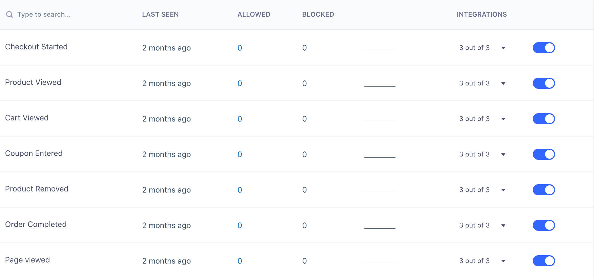




Segment Business plan customers can use Schema Controls to manage which events are allowed to pass through Segment and on to Destinations. These filters are a first-line defense to help you protect the integrity of your data, and the decisions made with it.

## Event filters

If you no longer want to track a specific event, you can either remove it from your code or, if you're on the Business plan, you can block track calls right from the Segment UI. To do so, click on the Schema tab in a Source and toggle the event to enable or block an event.





Once you block an event in Segment, we'll stop forwarding it to all of your Cloud and Device-mode Destinations, including your warehouses. You can remove the events from your code at your leisure. In addition to blocking track calls, Business plan customers can block all Page and Screen calls, as well as Identify traits and Group properties.

When an event is blocked, the name of the event or property is added to your Schema page with a counter to show how many events have been blocked. By default, data from blocked events and properties is not recoverable. You can always re-enable the event to continue sending it to downstream Destinations.

In most cases, blocking an event immediately stops that event from sending to Destinations. In rare cases, it can take **up to 6 hours** to fully block an event from delivering to all Destinations.


## Identify and Group Trait Filters

If you no longer want to capture specific traits within `.identify()` and `.group()` calls, you can either remove those traits from your code, or if you're on the Business plan, you can block specific traits right from the Segment UI. To do so, click on the Schema tab in a Source and navigate to the Identify or Group events where you can block specific traits.


**IMPORTANT: Blocked traits are not omitted from calls to device-mode Destinations.**

## Destination Filters

All customers can filter specific events from being sent to specific Destinations (except for warehouses) by updating their tracking code. Here is an example showing how to send a single message only to Intercom and Google Analytics:

```js
analytics.identify('user_123', {
  email: 'jane.kim@example.com',
  name: 'Jane Kim'
}, {
  integrations: {
    'All': false,
    'Intercom': true,
    'Google Analytics': true
  }
});
```

Destination flags are case sensitive and match the [Destination's name in the docs](https://segment.com/docs/connections/destinations/) (i.e. "AdLearn Open Platform", "awe.sm", "MailChimp", etc.).

Segment Business tier customers can block track calls from delivering to specific Destinations in the Segment UI. Visit a Source Schema page and click on the **Integrations** column to view specific Destination filters. Toggle the filter to block or enable an event to a Destination.


