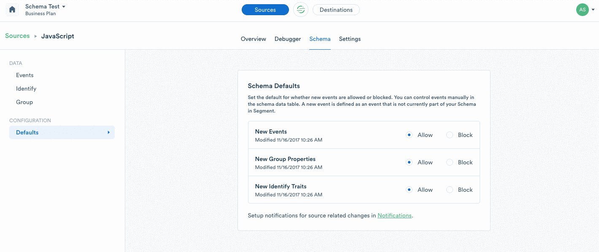

Segment Business plan customers can use Schema Controls to manage which events are allowed to pass through Segment and on to Destinations. These filters are a first-line defense to help you protect the integrity of your data, and the decisions made with it.

## Event filters

If you no longer want to track a specific event, you can either remove it from your code or, if you're on the Business plan, you can block track calls right from the Segment UI. To do so, click on the Schema tab in a Source and toggle the event to enable or block an event.


Once you block an event in Segment, we'll stop forwarding it to all of your Cloud and Device-mode Destinations, including your warehouses. You can remove the events from your code at your leisure. In addition to blocking track calls, Business plan customers can block all Page and Screen calls, as well as Identify traits and Group properties.

When an event is blocked, the name of the event or property is added to your Schema page with a counter to show how many events have been blocked. By default, data from blocked events and properties is not recoverable. You can always re-enable the event to continue sending it to downstream Destinations.

In most cases, blocking an event immediately stops that event from sending to Destinations. In rare cases, it can take **up to 6 hours** to fully block an event from delivering to all Destinations.


## Identify and Group Trait Filters

If you no longer want to capture specific traits within `.identify()` and `.group()` calls, you can either remove those traits from your code, or if you're on the Business plan, you can block specific traits right from the Segment UI. To do so, click on the Schema tab in a Source and navigate to the Identify or Group events where you can block specific traits.


**IMPORTANT: Blocked traits are not omitted from calls to device-mode Destinations.**

## Destination Filters

All customers can filter specific events from being sent to specific Destinations (except for warehouses) by updating their tracking code. Here is an example showing how to send a single message only to Intercom and Google Analytics:

```js
analytics.identify('user_123', {
  email: 'jane.kim@example.com',
  name: 'Jane Kim'
}, {
  integrations: {
    'All': false,
    'Intercom': true,
    'Google Analytics': true
  }
});
```

Destination flags are case sensitive and match the [Destination's name in the docs](https://segment.com/docs/connections/destinations/) (i.e. "AdLearn Open Platform", "awe.sm", "MailChimp", etc.).

Segment Business tier customers can block track calls from delivering to specific Destinations in the Segment UI. Visit a Source Schema page and click on the **Integrations** column to view specific Destination filters. Toggle the filter to block or enable an event to a Destination.


## Schema Defaults

Whether you're just about to implement a new spec or you have been tracking the same events for years, Schema Defaults make it easy to protect your data and fix data quality issues.

Schema Defaults offers a quick and easy way to prevent unexpected or erroneous events from reaching your destinations. When you set Schema Defaults to **Block**, Segment automatically prevents new calls from being sent downstream. You can activate this for new events—including `track`, `page`, and `screen` calls, or for new `identify` traits and `group` properties.

Locking your schema only takes a few seconds and prevents new rogue events from polluting your Destinations. To configure Schema Defaults, go to your source Settings page, and select **Schema Configuration** from the left-hand navigation.

### When should I lock my schema?

Here are a few signs you may be ready to lock your schema:

- You are concerned about developers implementing rogue events
- You want to actively approve which events are tracked and routed to your downstream Destinations
- You have created a tracking plan and want to use Segment to enforce it




### Overview of Schema Default settings

| Setting              | Allow                                                                | Block                             |
| -------------------- | -------------------------------------------------------------------- | --------------------------------- |
| New Events           | All new events are allowed in Segment and sent to all Destinations.| No new events are allowed in Segment or sent to your cloud and device-mode Destinations. Any event that is already being tracked and part of your Schema is not impacted. |
| New Group Properties | All new group properties are allowed in Segment and sent to all Destinations. | No new group properties are allowed in Segment or sent to your cloud-mode Destinations. Device-mode destinations **do** receive blocked traits. |
| New Identify Traits  | All new identify traits are allowed in Segment and sent to all Destinations.  | No new identify traits are allowed in Segment or sent to your cloud-mode Destinations. Device-mode destinations **do** receive blocked traits.|


### Schema Default Blocking support across connection modes

Track events blocked by Schema filters are prevented from delivering to both device-mode and cloud-mode Destinations. That means if you send a blocked event from a client side library like Analytics.js, it is not delivered to any device-mode Destinations.

Identify and group call traits blocked by Schema filters **only** blocked from delivering to cloud-mode Destinations. Device-mode destinations receive all traits regardless of whether they are blocked in Schema.


### What is considered a "new" event?

New events refer to events that have not previously been sent to a given Source. Let's say you've only sent the following events from your Javascript source:

- `Products Searched`

- `Product List Viewed`

- `Product List Filtered`

Your Schema Default setting does not block these three events because they are not considered new. You can manually block them, but your Schema Default setting does not change the status of these events. 

Here's what happens the first time a new event, `Promotion Viewed`, is sent to this Source:

- **Schema Default Set to Allow:** `Promotion Viewed` is allowed, which means the event is sent to all enabled Destinations.

- **Schema Default Set to Block:** `Promotion Viewed` is blocked, which means the event is not sent to any Destinations.


## Blocked Track Event forwarding

If you're concerned about permanently discarding blocked track events, you can forward blocked track events to a new Segment Source. To enable, go to Source Settings > Schema Configuration and select which Source you want to forward track events to from the drop down. We recommend [creating a new Source](https://segment.com/docs/guides/general/what-is-a-source/) for forwarded events to avoid contaminating production data.


**NOTE: Only blocked `.track()` events are forwarded to the source. `.identify()` and `.group()` events are not forwarded.**

**BILLING NOTE: Events forwarded to a Segment Source count towards your MTU counts. Blocking and discarding events do not contribute to your MTU counts.**

## Blocked event billing

Your bill is based on the number of Monthly Tracked Users (MTU). MTUs are the number of identified and anonymous users that you track with Segment. We only count users once per month, even if they perform multiple actions across your site or app. In most cases, blocked events have no impact on your MTU count as they are not stored or sent downstream. If you enable Blocked Event Forwarding, the forwarded events contribute to your MTU count.

## Blocked event notifications

While protecting the integrity of your data is helpful with event blocking and Schema Defaults, we offer proactive notifications to flag new blocked events so you can make any needed changes in your code or approve a new event.

Your workspace notifications alert you when a new event is blocked due to your Schema Defaults. You can enable notifications in the [Notification Settings](https://app.segment.com/goto-my-workspace/settings/notifications) of your workspace.
