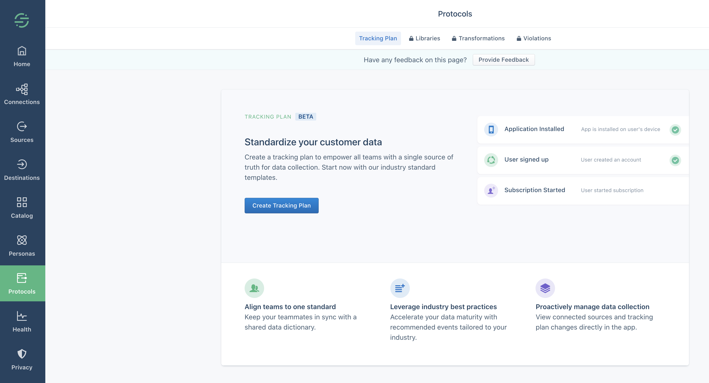
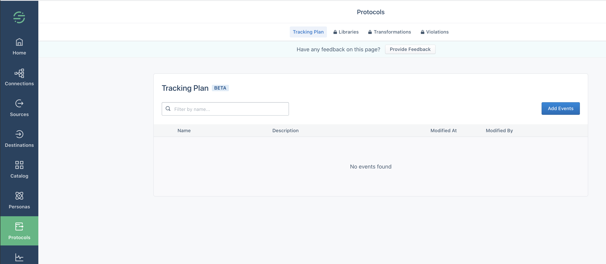
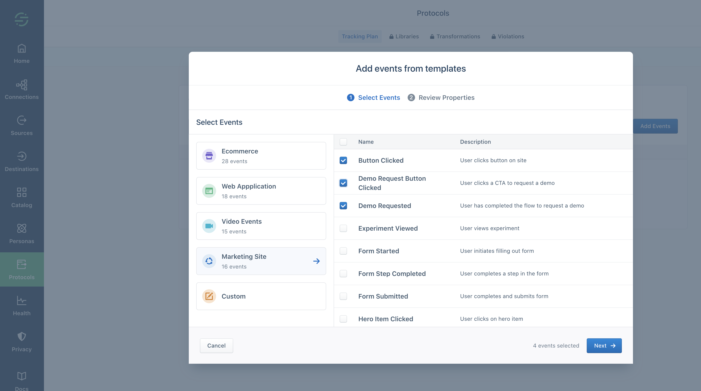
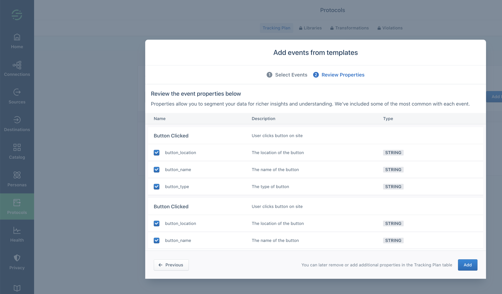
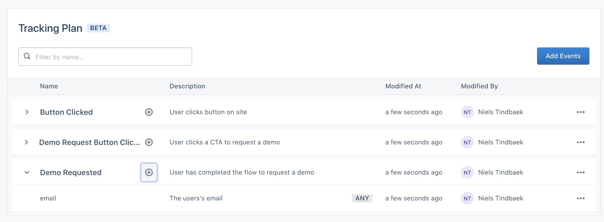
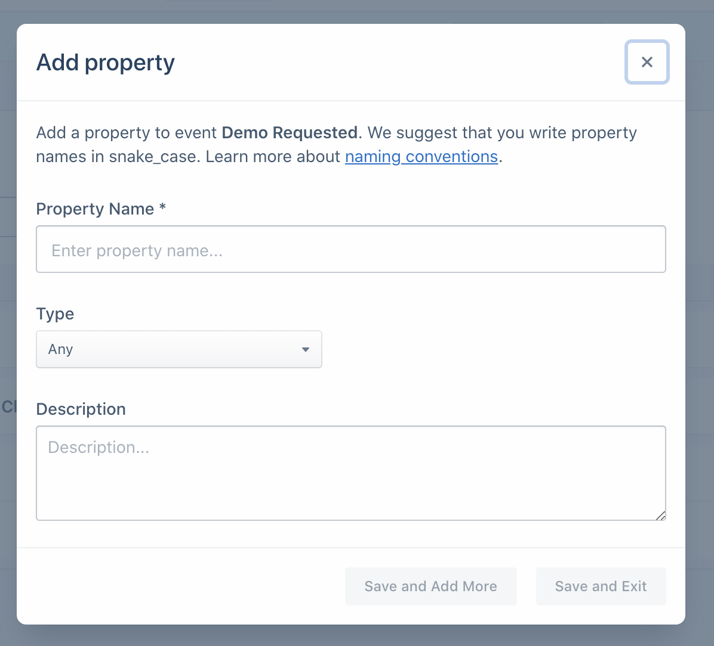
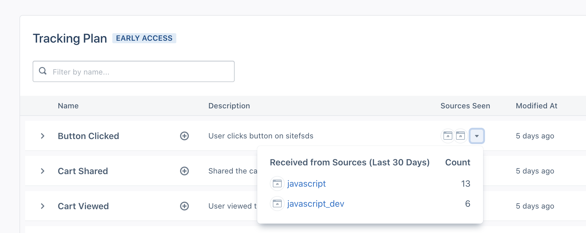

> info "Early Access Preview"
> The Segment Starter Tracking Plan is in early access preview. This means that it is currently under development, and its features and behavior might change before it is generally released. For more information, [contact us](mailto:beta@segment.com).

With Segment, you can track the myriad events that are important to your organization the way you want to track them - the possibilities are endless. But when you're just getting started, what do you track first? Over the years, we've helped countless organizations think through what they need to track, and recommended the best way to do it. With Segment tracking plans you can start out strong with some common Track events.

With Segment tracking plans you can choose from the most common Events, and create a personalized tracking plan for your workspace. Tracking plans help you and other people working in your organization to understand what data you're tracking, under what names, and which additional data (properties) are attached to each event type.

This is a great way to get a head start on your tracking, and also to monitor events coming into your workspace as you implement your Segment tracking.

### Starter tracking plan access

Only Workspace Owners can set up or edit the starter tracking plan.

You can use the **Tracking Plan Read-Only** role to allow workspace members to view the starter tracking plan, including the events and their properties, and code snippets for each. (When you upgrade to Personas, this role allows members to view additional tracking plans.)

You can add the Tracking Plan Read Only role to workspace members, or to groups that you use to grant workspace members access. To edit workspace member or group access, in your workspace navigate to **Settings > Workspace settings > Access management**.

## Set up a Segment starter tracking plan

To see your Tracking Plan, click **Protocols** in the left navigation. The first time you visit this section, the Segment App shows an explanation of tracking plans, which you can dismiss. Click **Create Tracking Plan** to get started.

From the screen that appears, click **Add Events** to add your first event to the tracking plan.

On the next page, you'll select the events that you need from the Segment Standard Events. These are organized by their [industry spec](http://segment.com/docs/connections/spec/), such as Ecommerce, Marketing, and so on. Click each industry or use case to see and select events from that group.

1. Choose a Spec section based on your industry/type of website
    **Tip!** You might want to check through all of the different specs for relevant events, just in case.
2. Select the events you want to use from the menu. You can also search for a specific event name you know you want to track.
    ℹ️ Don't see an event you want? [Tell us!](https://airtable.com/shrudcSPGUv1xynSc)
3. Click **Next** to review properties on the events.

The next screen shows the Events you chose and their properties. Properties are how you enrich the raw event data with useful context, which allows you to perform useful analysis and alerting. These standard events have a minimum set of properties based on what we know about the event type, and how it is usually used. You can add extra custom properties in the next step.

Expand each event to view its properties. If you decide you want to add or remove Events, click **Previous** to go back to the event list. When you're satisfied that you've selected Standard Events for all of the activities on your site, click **Add**.

When you click **Add**, Segment adds the events you selected to your Tracking Plan, and begins watching for data from any Sources connected to that workspace formatted as those Events.

## Customize Properties

You might want to add extra properties to the Segment standard events, for example to capture unique information about the user's action taken.

To add a custom property, click the **plus** icon next to the event that the property should be attached to.

In the dialog that appears, enter the name and type of the property, and add a description.

You can click **Save and add more** to add more than one property, or click **Save and exit** when you're satisfied that you've added all the properties you'll need.

## Monitor your Segment data flow

The Tracking Plan page shows an overview of the data that is arriving to your Segment workspace. The page information includes a **Name** and **Description** for each event that you expect to see in Segment, information about if Segment has _actually_ seen any data matching that event name yet, and information about who last modified the event in the tracking plan.

You can click each event in the table to expand it, view the event description, and view its properties and their descriptions. Property descriptions include the expected data type for each property.

The **Sending** column shows the number of Events Segment has seen with that description and format. You can expand this to see how many of the events Segment saw for Dev, Test, and Production sources. If you see a 0 in this column for all sources, this usually means that the event has not been implemented yet, or has not been implemented correctly.

At the far right of the table is a **…** (more) menu.
From this menu you can click **View Code Snippet** to see and copy a JavaScript snippet for the event, including its properties. This might be helpful if you're not sure how to implement or format the actual Track event.
The more menu also includes an **Edit** button, which allows you to edit the description of an event or property, and the name of any custom properties, and a **Delete** button, which deletes either the entire event, or an individual property from the event.

## Implementing Segment using your tracking plan

If you haven't yet implemented Segment tracking in your app or site, there are three easy ways to use the Tracking Plan to set up your implementation:

- **If you use Analytics.js and the [Visual Tagger](https://segment.com/docs/connections/sources/visual-tagger/)**, Segment loads your tracking plan so that you can simply tag the elements in your website with the Events that they should trigger.
- **You can download a JavaScript code snippet for each Event** in the tracking plan by clicking the **more (...)** menu. You can then paste these snippets into your site or app code and replace the example properties in these snippets with variables from your code.

<!--
> success ""
> **Tip**! If you are using [Typewriter](https://segment.com/docs/protocols/apis-and-extensions/typewriter/), you can export your tracking plan to a format Typewriter can use.
-->

## FAQ

### Can I track Page, Identify, or Group calls with the starter tracking plan?

No. The starter tracking plan only tracks events. If you need to track other types of calls, consider adding Protocols to your Segment plan.

### How do I disconnect a source?

The starter tracking plan is not connected to any specific source. <!--The Seen column shows a rollout of data from the Schema Tab of all your sources.-->

### Can I import a spreadsheet to my starter tracking plan?

Import from a spreadsheet is not available at this time.

### Can I import my Schema into my starter tracking plan?

Import from a Schema is not available at this time.

### How do I request a new Event type in the starter tracking plan?

[Contact us to request more Event types](https://airtable.com/shrudcSPGUv1xynSc) in the Starter tracking plan.

### What happens when I upgrade?

When you add Protocols to your Segment workspace, your starter tracking plan is converted to a full [Protocols tracking plan](/docs/protocols/tracking-plan/create/), which allows you to use additional features.


