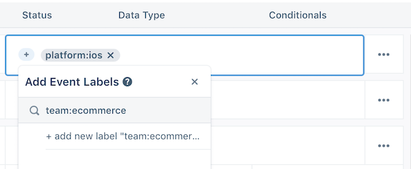
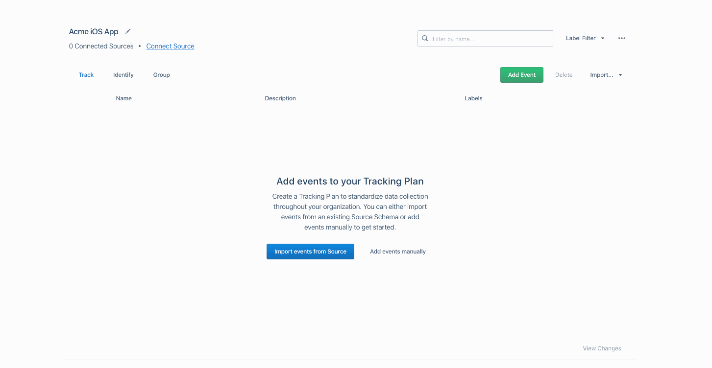
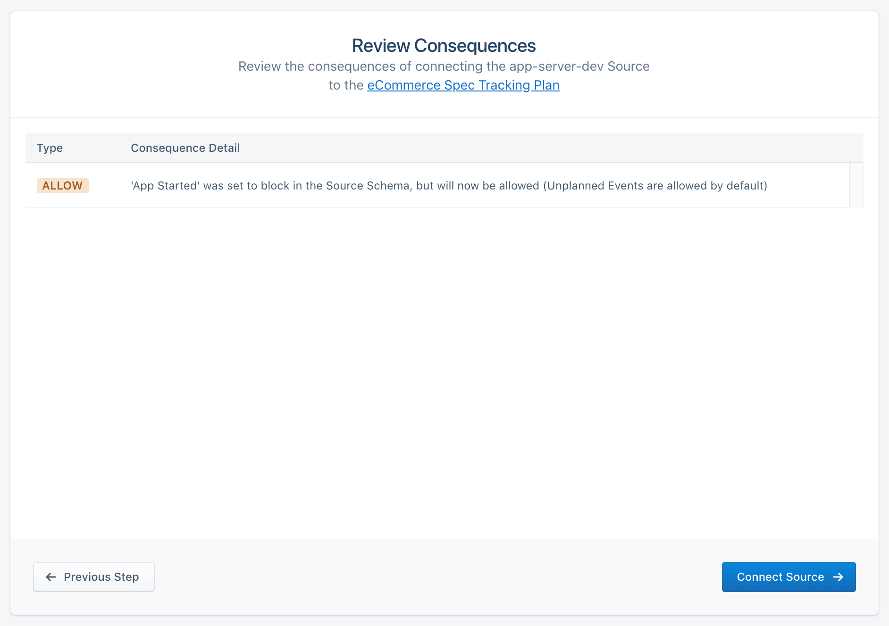
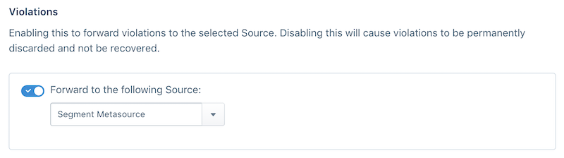

## What is a Tracking Plan?

A Tracking Plan is a data spec outlining the events and properties you intend to collect across your Segment Sources. Crafting a comprehensive Tracking Plan takes time and effort across a range of teams within your organization. It also requires a deep understanding of your business objectives. Once created, it becomes a highly valuable resource for both the instrumenting engineers and all consumers of the data flowing through Segment.

When building a Tracking Plan, we recommend starting with the key metrics that drive value for your business. Key metrics may include new user signups, top line revenue, product utilization and more. With key metrics defined, it becomes much easier to define which user actions help track or improve those key metrics. Each user action maps to a distinct event, or `.track()`  call, that you will track in Segment. `.identify()`, `.page()` and `.group()` calls can also be validated in the Tracking Plan.

The Segment Tracking Plan feature allows you to validate your expected events against the live events being delivered to Segment. Violations are generated when an event does not match the spec'd event in the Tracking Plan.

Tracking Plans are stored at workspace level, and can be connected to one or more Sources.


## Create a Tracking Plan

To create a new Tracking Plan, contact your Segment account team to enable the Protocols features in your workspace. Once enabled, you can click on Protocols in the left bar navigation to view your current Tracking Plans and create new ones.

To get started, click on **New Tracking Plan** in the top right. This will open a Tracking Plan editor view where you can add events, properties, traits and corresponding filters.

You will also see an option to infer a tracking plan from a source in your workspace. This option is great if you want to get started quickly with your current events. Note that we will do our best to infer data type, but often times cannot do so if multiple data types were sent for a specific property.


### Tracking Plan Columns
The Tracking Plan editor is organized as a spreadsheet to help you quickly add new events and properties, and edit the relevant fields for each. Similar to a spreadsheet, you can navigate across cells in a single event with your arrow keys and press enter to edit a cell.

| Column Name  | Column description   |
| ------------ | ------------------------------------------------------------------------------------------------------ |
| Name         | Specify the name of your event or property in this column.   |
| Description  | Enter a description for your event or property here. These descriptions are helpful for both engineers instrumenting Segment and consumers of the data. |
| Status       | Specify whether properties are required or optional. You cannot specify that a `.track()` call is Required because we are unable to validate when a `.track()` call should be fired. |
| Data Type    | Specify the data type of the property. Data type options include `any, array, object, boolean, integer, number, string`. |
| Conditionals | Enter simple regular expressions to validate property values. This currently only works when a property data type is set to `string`. For example, you can add pipe delimited strings to the regex column to generate violations when a property value does not match fall, winter or spring. |


### Add a new track call
Click on the **Add Event** button in the top right. A new row will be added. Click into the row to add an event name and description. The event name will be used to strictly validate the name passed in your `.track()` calls. Casing, spacing and spelling matter!

### Add a track call property
Click on the **(+)** button next to the event name to add a new property. A new row will be added below the event name. Click into the row to add the property name. You can use your keyboard arrow and enter keys to navigate across the cells, or use your mouse. Remember to specify the description, status, data type and conditional values when applicable.

### Add a track call object or array property
We support object and array data types in the Tracking Plan editor. These complex data structures have limited use cases and should be used sparingly as few Destinations are able to ingest the data structures. To add an object or array, create a new property row and set the Data Type to Object or Array. A **(+)** button will appear next to the property allowing you add key value pairs in the object, or objects to an array of objects.

### Add a label
You can apply `key:value` labels to each event to help organize your tracking plan. These labels are helpful when multiple teams are managing a single Tracking Plan, or if you want to specify a priority, platform, product, or similar meta-data for each event. You can filter by label from the Tracking Plan, Schema, Data Validation and Violations Summary views.

For consistency purposes, we *highly* recommend that you create a standard way of labeling events and share it with all parts of your organization that will use Segment.



### Filter track calls in the Tracking Plan
The Tracking Plan events can be filtered by keyword or by label. The applied filter generates a permanent link so you can share specific events with teammates. Label filters also persist after you leave the Tracking Plan.

### Edit underlying JSON Schema
Protocols uses [JSON Schema](https://json-schema.org/) to validate the JSON in Segment call payloads. Advanced users can edit the JSON schema directly in the Tracking Plan UI. Each distinct track event and corresponding properties will have a separate JSON Schema object. To edit the JSON schema for an event, click on the overflow menu to open the JSON schema editor.

### Extend the Tracking Plan
Many customers prefer to manage the Tracking Plan with outside tools and resources. [Click over to the APIs and extensions](/docs/protocols/apis-and-extensions/) section to learn more.

### Add identify or group traits
Similar to how you would add `.track()` calls to the Tracking Plan, you can define which traits you expect to see passed in `.identify()` or `.group()` calls. Navigate to the Identify or Group tab in your Tracking Plan and click the **(+)** button to add a new trait.

We recommend that you keep traits optional because `.identify()` and `.group()` should be called often, and pass only _new or changed_ traits, because our client-side libraries (analytics.js, iOS, Android) cache traits in local storage. [See the Identify Best Practices](/docs/guides/best-practices/what-are-best-practices-for-identifying-users/#when-and-how-often-to-call-identify) to learn more.

## Create a Tracking Plan Library

Tracking Plan Libraries make it easy to scale the creation of multiple Tracking Plans within your workspace. You can create libraries for track events or track event properties (Note: we do not currently support identify/group traits libraries). Editing Tracking Plan Libraries is identical to [editing Tracking Plans](/docs/protocols/tracking-plan/#create-a-tracking-plan).

Once created, you can import event or property Libraries into a Tracking Plan using a simple wizard flow.

To create a new Library:
1. In the left navigation, click **Protocols**
2. Click **Libraries** in the top navigation bar
3. Click **New Library** and follow the steps to create an event or property library


### Tracking Plan Event Libraries

Tracking Plan Event Libraries support Track events and associated properties. Event Libraries are helpful when you want to track a group of events consistently across tracking plans. For example, if you are an eCommerce company with multiple apps, you likely need to track [eCommerce Spec](/docs/connections/spec/ecommerce/v2/) events consistently across those sources. Instead of having to re-create the eCommerce spec across multiple tracking plans, simply create a library and import the events to each Tracking Plan.

### Tracking Plan Property Libraries

Tracking Plan property Libraries support Track event property groups. Property Libraries are helpful when you have many events in a Tracking Plan that share a common set of properties. For example, if you want to consistently include `order_id`, `currency`, `cart_id` and a `products` array of objects in your checkout flow events, you can create a Library with these properties including descriptions, data types and conditional filters.

### Importing Libraries into a Tracking Plan

Event and property libraries can be easily imported into a Tracking Plan. Enter the Draft mode for a Tracking Plan and click the **Import from Event or Property Library** dropdown. A wizard will appear allowing you to either add the events to a tracking plan, or add properties to selected events already in the tracking plan. After adding your events or properties, remember to merge your changes!



### Updating Libraries and Propagating Changes

Tracking Plan Libraries do not currently support syncing changes made to the Library down to the associated Tracking Plans. You can re-import a Library into a Tracking Plan which will overwrite and upsert new events or properties. Re-importing will **not** however remove properties or events removed from the library.

## Connect a Tracking Plan

With your Tracking Plan is complete, it's time to apply the Tracking Plan to one or more Sources. Select **Connect Source** from the right hand menu for your specific Tracking Plan.


From this menu, you will be redirected to a workflow to select a Source from your workspace. Note that a Source can only have one tracking plan applied to it. You *can't* select a Source that already has a Tracking Plan connected to it, but you *can* apply a Tracking Plan to multiple sources.

After selecting a Source, you will be shown the consequences of connecting your Tracking Plan. In many cases, there will be no consequences. However, if you've enabled Schema Defaults, events previously allowed will now be blocked if they are not included in the Tracking Plan. If you've blocked specific events, those events will now be allowed until you enable Blocking in the Tracking Plan settings.

**IMPORTANT: Make sure to read through the consequences of connecting a source!**




## Tracking Plan Event Violations

Upon connecting your Tracking Plan to a Source, you will be able to view violations grouped by event. To view violations, click on the Violations button located on the Schema tab in a Source. A filter can be applied to only show events with violations within the past 24 hrs, 7 days and 30 days.


To view detailed violations for an event, click on the specific event. Specific violations include:

- Missing required properties
- Invalid property value data types
- Property values that do not pass applied conditional filtering

In the event detail violations view, a filter can be applied to only show violations in the past 24 hrs, 7 days and 30 days.


To view a specific violation, simply click on the violation to view recent sample payloads that generated the violation. These payloads can then be used to help engineering quickly pinpoint the root cause and release a fix.

If you want to analyze or build custom alerts based on inbound violations, you can [enable violation forwarding here](/docs/protocols/tracking-plan/#violation-forwarding).


## Schema Configuration

The Schema Configuration settings for each source can be used to selectively block events, or omit properties and traits from `.track()`, `.identify()` and `.group()` calls. Segment can permanently drop events that are not included in your Tracking Plan, depending on the settings you select. Segment can also block events with invalid properties or invalid property values.

To enable blocking, go to the **Settings** tab for your source, and click on **Schema Controls**. See below for detailed descriptions for each of the configuration settings.

**IMPORTANT: It's critical that you feel confident about the quality of your data before you enable blocking. This is a serious step that you should only do after you have resolved any violations that appear when you first connect a Tracking Plan to a Source.**


### Track Calls - Unplanned Events
When you set this dropdown to Block Event, Segment drops any events that are not defined in your Tracking Plan. Only whitelisted `track` calls in your Tracking Plan flow through Segment to your Destinations.

For example, if you include a `Subscription Cancelled` event in your Tracking Plan, the example track call below would be blocked by Protocols because the event name does not match the event name casing in your Tracking Plan.

```js
    analytics.track('subscription_cancelled')
```

**IMPORTANT: Unplanned event blocking is supported across all device-mode and cloud-mode Destinations.**

### Track Calls - Unplanned Properties

Setting this dropdown to Omit Properties will ensure that properties not defined in your Tracking Plan are removed from the relevant event. For example, if you include a single `subscription_id` property in the `Subscription Cancelled` event in your tracking plan, the below track call would have the `subscription_name` property omitted by Protocols.

For example, if you include a single `subscription_id` property in the `Subscription Cancelled` event in your tracking plan, the example track call below would have the `subscription_name` property omitted by Protocols.

```js
    analytics.track('Subscription Cancelled', {subscription_id: '23r90jfs9ej', subscription_name: 'premium'})
```

**IMPORTANT: Unplanned property omission is ONLY supported in cloud-mode Destinations. Unplanned properties will not be omitted when sending to device-mode Destinations.**

### Track Calls - JSON Schema Violations
Setting this dropdown to Block Event will ensure that all events with JSON schema violations (i.e. missing required properties, incorrect property value data types, or invalid regex patterns) will be blocked. A less aggressive option is to select Omit from the dropdown which will simply remove the offending property from the event.

This is an advanced feature that requires extensive testing and a squeaky clean data set + tracking plan to enable. To get a sense of which events will be blocked, or properties omitted, go to the Violations view for a source and note all events with a violation. For example, if you added a `subscription_id` required property to your `Subscription Cancelled` event in your Tracking Plan, the below track call would be blocked by Protocols, or property omitted, depending on your setting.

```js
    analytics.track('Subscription Cancelled', {customer_type: 'enterprise'})
```

**IMPORTANT: JSON schema violation event blocking is ONLY supported in cloud-mode Destinations. Events with invalid properties will not be blocked from sending to device-mode Destinations.**

### Identify Calls - Unplanned Traits
Setting this dropdown to Omit Traits will ensure that traits not defined in your Tracking Plan are removed from the identify call. For example, if you specify three traits in your Tracking Plan (`name`, `email`, `join_date`), the below identify call would have the `first_name` property omitted by Protocols.

```js
    analytics.identify('fe923fjid', {email: 'roger@example.com', first_name: 'Roger'})
```

**IMPORTANT: Unplanned identify trait blocking is ONLY supported in cloud-mode Destinations. Events with invalid traits will not be blocked from sending to device-mode Destinations.**


## Blocked Event Forwarding

If you're concerned about permanently discarding blocked events, you can enable blocked event forwarding to a Segment Source. To set up forwarding, visit your Source settings tab and select which source you want to forward events to from the dropdown. We recommend creating a new Source for forwarded events to avoid contaminating production data. We recommend only enabling blocking when you feel confident about the quality of your data.


**Note: Only blocked events are forwarded to the source. Events with omitted traits are not forwarded. Instead, Segment inserts a `context.protocols` object into the event payload which contains the omitted properties or traits.**

**Billing Note: Events forwarded to another Source count towards to your MTU counts. Blocking and discarding events does not contribute to your MTU counts.**


## Violation Forwarding

Violations can be forwarded to a Segment Source to enable custom notifications, dashboards and further analysis in any Segment destination that accepts cloud-mode data. To set up forwarding, visit your Source settings tab and select which Source you want to forward events to from the dropdown. Similar to Blocked Event forwarding, we recommend creating a new Source for violations.




Violations will be sent to the selected Source as `analytics.track()` calls. The call payload will include the following properties, along with the `context.app` and `context.library` objects to aid in filtering violations.

```json
    {
      "context": {
        "app": null,
        "library": {
          "name": "analytics-node",
          "version": "2.1.0"
        }
      },
      "event": "Violation Generated",
      "integrations": {},
      "messageId": "sch-Vir1JNrorwlBmCHrHWuPJekMx5c59T7c",
      "properties": {
        "appVersion": "",
        "eventMessageID": "node-YhqA1DK9mgV55INDzOSd542fCFbIkc1o",
        "eventName": "Order Completed",
        "eventSentAt": "2018-08-23T21:35:02.85860964Z",
        "eventTimestamp": "0001-01-01T00:00:00Z",
        "eventType": "track",
        "sourceID": "dInN1HJ4bi",
        "sourceName": "Acme Store",
        "sourceSlug": "acme_store_test",
        "trackingPlanID": "rs_16KrwVbouFLrYbDkGh4LNslkrNp",
        "trackingPlanName": "Acme Ecommerce TP",
        "violationDescription": "properties.products is required",
        "violationField": "properties.products",
        "violationType": "Required"
      },
      "receivedAt": "2018-09-05T23:05:25.862826965Z",
      "timestamp": "2018-09-05T23:05:25.862826855Z",
      "type": "track",
      "userId": "schema-violations",
      "forwardedFromProject": "dInN1HJ4bi"
    }
```

**Billing Note: Enabling Violation forwarding generates one (1) additional MTU in your workspace, total. If you are on an API billing plan, you are charged for the increased API volume generated by the forwarded violations.**

**Schema and debugger Note:`Violation Generated` events do not appear in the source's Schema tab. They do appear as Violation Generated events in the debugger.**

## Clear Schema History

The schema tab within a source stores all events seen over the history of that source. If you find that there are stale or deprecated events in the schema that are no longer relevant, you can clear the schema of all events. This action will not delete any event data. As the current events flow through Segment, they will again appear in the Schema tab.


## Tracking Plan Event Versioning

Segment offers Tracking Plan event versioning if you use Protocols to manage mobile sources, or to help you centrally manage a Tracking Plan for multiple teams. With Event Versioning, you can create multiple versions of an event definition, and validate events using a version key included in the track event payload.

This can be especially helpful for mobile developers, who might have several released versions of their app sending data at the same time. For example, a new mobile app release might add a new required property to an event like `Order Completed`. In this scenario, if you updated the Tracking Plan, all  `Order Completed` events from your old mobile app versions would be invalid, because some customers won't have updated to the latest version yet. Instead, with event versioning, you can allow validation of both the old and new versions of an event at the same time. When you're ready to deprecate those old event versions, you can delete the version in your Tracking Plan.

As an example, let's say you want to add `subtotal` as a required property to your `Order Completed` event. You would start by adding the required property to the event in the Tracking Plan as shown in the example below.


Before we introduced event versioning, you would need to add the change to your tracking plan and any non-compliant events would immediately generate violations, and possibly be blocked depending on your [event blocking settings](/docs/protocols/tracking-plan/#event-blocking).

### Create a new event version
With event versioning, you can now create multiple versions of the event definition as shown in the example below. To create a new event version, click into the overflow menu for an event and select **Add Event Version**.


### Dynamically validate track events against an event version
To ensure the Track events you send to a Segment source are validated against the correct event version, you need to instrument your events to include a `context.protocols.event_version` key and version value. The version value must be passed as an integer, and should match the number shown in the Tracking Plan version tab. In the example below, the version number would be **2**.


Next, add the event version number to the context object. For [analytics.js](/docs/connections/sources/catalog/libraries/website/javascript) track calls, you would instrument the event as in the example below. Note how the JSON objects for `context`, `protocols`, and `event_version` are nested.

```js
analytics.track('Order Completed', {
  subtotal: 23,
  products: [{
    product_name: 'Air Balloon',
    product_id: '32rd9jfs'
  }],
  order_id: '2df90eiwc9wjec',
  revenue: 33
}, {
  context: {
    protocols: {
      event_version: 2
    }
  }
});
```

**Note: Protocols validates events against the oldest event version in the Tracking Plan for event payloads that are 1) missing the context.protocols.event_version key, or 2) contain an invalid/undefined event version (ex: event_version:3.2)**
