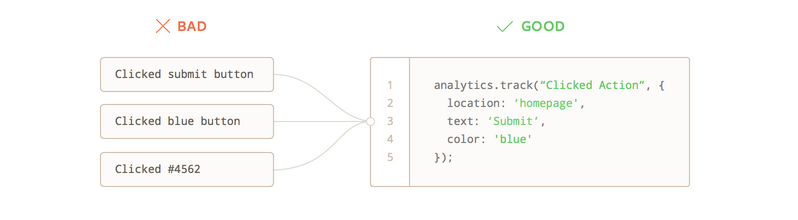

Let's face it, figuring out what events to track in Segment can feel overwhelming. Fortunately, we've helped 1000s of customers through this process and have amassed a ton of resources to help you get started. Whether you're a small team just getting your app off the ground, or a highly complex enterprise with 100s of stakeholders, these resources can help!

That being said, be prepared to invest time defining how you want to track data. Any investment in improving data quality will reap massive rewards, and compound over time by allowing your analytics teams to produce better insights, your marketing teams to run better campaigns and so much more.

## Data Tracking Philosophy

Tracking is about learning and taking action. Think about what you want to know about your product or customers. Think about what assumptions need to be tested or invalidated. Think about the unknowns. Here are some helpful questions to get started:

* What kind of events or data will shed light on the how your customers use your product?
* How do people discover, start using, and paying for your product?
* What are the most important steps in a customers journey?

## Define Business Objectives

While it may seem obvious, we highly recommend documenting your high level business objectives (see [Goals tab in Google Sheet Tracking Plan](https://docs.google.com/spreadsheets/d/1ZHGfNrCxBQbEyevmVxNoU0DGjb8cJMro1iwIRZLWjPw/view){:target="_blank"} template). More specifically, what are the measurable business outcomes you want to achieve this year. Are you looking to acquire new customers, activate new signups, drive incremental revenues among your current customer base, etc? Answering this question is best done by interviewing stakeholders who would consume the data in your organization.

With your business goals documented, you now need to map user actions to those business goals. For example, if one of your goals is to activate new signups, you want to think about which activities are related to a signup. Ask yourself, what actions do people take before signing up? Are there specific actions that can predict a user signing up?

As an example, you may end up with a list like the following:

* Ad Campaign Clicked
* Link Clicked
* Article Completed
* Campaign Opened
* Form Initiated
* Form Submitted
* User Signed Up

While the above represents a small portion of the total user actions you will track, focusing on business objectives helps break up the overwhelmingness of data collection into smaller chunks.

## Formalize Your Naming and Collection Standards

With your business objectives documented, it's time to build a set of standards that you and your team will use when determining what to track. Our most successful customers limit their tracking plan to a minimal number of core events with rich properties to provide context. While we've generally seen more success with the "less is more" philosophy of tracking data, we've had plenty of customers take a more liberal "track more and analyze later" approach. Like everything, each alternative has pros and cons that are important to consider especially as it relates to your company's needs.

Regardless of approach, here are some important notes to keep in mind:

* **Pick a casing convention:** We recommend _Title Case_ for event names and _snake_case_ for property names. Make sure you pick a casing standard and enforce it across your events and properties.

* **Pick an event name structure:** As you may have noticed from our [specs](/docs/connections/spec/semantic/), we're big fans of the Object (`Blog Post`) + Action (`Read`) framework for event names. Pick a convention and stick to it!

* **Don't create event names dynamically:** Avoid creating events that pull a dynamic value into the event name (ex. `User Signed Up (11-01-2019)`)

* **Don't create events to track properties:** Avoid adding values to event names that could be a property. Instead, add values a property (ex. `"blog_post_title":"Best Tracking Plans Ever"`)

* **Don't create property keys dynamically:** Avoid creating property names like `"feature_1":"true"`,`"feature_2":"false"` as these are ambiguous and very difficult to analyze



## Create a Tracking Plan

A [tracking plan](https://segment.com/blog/whats-a-tracking-plan) clarifies what events to track, where those events live in the code base, and why those events are necessary from a business perspective. Prior to Protocols, tracking plans typically lived in a spreadsheet. The tracking plan served as a project management tool to align an entire organization around data as the basis on which to make decisions. The tracking plan helps marketers, product managers, engineers, analysts, etc. get on the same page. It represents the single source of truth for what data to collect and why.

The tracking plan has been so instrumental in helping organizations reclaim their own data efforts that we invested years of product development to create [Protocols](/docs/protocols/).

In the following, we share how to build a tracking plan from the ground up using a Google Sheet template. Note that you can use any tool to create the tracking plan!

## Tracking Plan Google Sheets Template

To help you get started, we developed a Tracking Plan template in [Google Sheets](https://docs.google.com/spreadsheets/d/1ZHGfNrCxBQbEyevmVxNoU0DGjb8cJMro1iwIRZLWjPw/view). The template includes all of our semantic specs including [eCommerce](/docs/connections/spec/ecommerce/v2/), [B2B SaaS](/docs/connections/spec/mobile/), [Mobile](/docs/connections/spec/mobile/) and [Video](/docs/connections/spec/video/), and a collection of common properties.

We highly recommend you start by [defining your business objectives](/docs/protocols/tracking-plan/best-practices/#define-business-objectives), and have included a template in the **Goals** tab to guide that process.

With your business goals defined, start by defining how you want to track Page/Screen, Identify and Group events. Most customers use [default page tracking](/docs/connections/sources/catalog/libraries/website/javascript/#page) and skip over that tab. The identify tab is where you specify which user traits you intend to collect like `first_name`, `last_name`, `email`, etc. Read more about the [identify call below](/docs/protocols/tracking-plan/best-practices/#identify-your-users).

From there, we recommend you specify Track events in the **Track (Custom)** tab. Note that we pre-created events with varying numbers of grouped properties (1 Prop Event, 2 Prop Event, etc). While more challenging to manage at first, this structure allows you to use the **Minimize Rows** button at the top to organize and view all events.

Once completed, the Google Sheet tracking plan can be shared with your stakeholders to either review, comment, edit or simply reference for implementation. And if you decide to purchase Protocols in the future, you'll be able to upload the tracking plan into Segment [via the Config API](/docs/protocols/apis-and-extensions/#google-sheets-tracking-plan-uploader).

## Identify your users

The `.identify()` call is important, because it updates all records of the user with a set of traits. But how do you choose which traits to include?

Here is a sample `.identify()` call (with [analytics.js](https://segment.com/docs/connections/sources/catalog/libraries/website/javascript/)) for Segment:

```js
analytics.identify({
  name: 'Kanye West',
  email: 'kanye@iamawesome.com',
  login: 'kanyew',
  type: 'user',
  created: '2016-11-07T16:40:52.238Z',
});
```

The traits represent dimensions in your data that you can group or pivot on. For example, in the above, you can easily create cohorts of all types that are `users` or accounts created within a time window of your choosing.

## Define your Track events

After you've documented your [event naming and collection standards](/docs/protocols/tracking-plan/best-practices/#formalize-your-naming-and-collection-standards) it's time to add events to your tracking plan. We recommend starting with fewer events that are directly tied to one of your [business objectives](/docs/protocols/tracking-plan/best-practices/#define-business-objectives). This focused effort helps avoid a situation where you become overwhelmed by endless number of possible actions to track. As you get more comfortable, you can add more events to your tracking plan that can answer peripheral questions.

At Segment, we started out tracking these events:
- **User Signed Up**
- **Source Data Sent**
- **Subscription Started**


Then we added some peripheral events to to better understand how we're performing, for the following reasons:
- **User Invited**
   When users invite more people to their organization, it's a good indicator that they're engaged and serious about using the product. This helps us measure growth in organizations.
- **Destination Enabled**
   Turning on an destination is a key value driver for our customers.
- **Debugger Call Expanded**
   When we see that a certain customer has used the live event stream feature a number of times, we can contact them to see if we can help them debug.


For an ecommerce company, however, the main events might be something like:

- **Account Created**
- **Product Added**
- **Order Completed**


Note that Segment has a set of "reserved" event names specifically for ecommerce, called our [ecommerce spec](https://segment.com/docs/connections/spec/ecommerce/v2). Check it out to see which events we cover and how they are used in our downstream destinations.

For a community, on the other hand, there is an entirely different set of actions that indicate engagement, listed in the below pyramid. For example, a community like [GrowthHackers](https://growthhackers.com/) may want to track actions like:
- **Content Viewed**
- **Content Shared**
- **Comment Submitted**
- **Content Produced**
- **Content Curated**

With this, they're able to measure key metrics around engagement and understand how users are moving towards their ultimate conversion event: curation content for others. For more information, check out [this article](https://segment.com/blog/growthhackers-community-metrics/) from GrowthHackers about the events they track and why.

## Define your Track event properties

Each `.track()` call can accept an optional dictionary of `properties`, which can contain any key-value pair you want. These `properties` act as dimensions that allow your end tool to group, filter, and analyze the events. They give you additional detail on broader events.

As mentioned earlier, events should be generic and high level, whereas properties are specific and detailed. For example, at Segment, `Business Tier Workspace Created` is a horrible event name. Instead, we used `Workspace Created` with a `property` of `account_tier` and value of `business` :

```js
analytics.track('Workspace Created', {
  account_tier: 'business'
})
```

Similar to the traits in the `.identify()` call, the properties provide you a column that you can pivot against or filter on in your analytics tools or allow you to create a cohort of users in email tools.

There also shouldn't be any dynamically generated `key`'s in the `properties` dictionary, as each `key` will create a new column in your downstream tools. Dynamically generated `key`'s will clutter your tools with tons of data that will make it difficult and confusing to use later.

Here is Segment's `Lead Captured` `.track()` call:

```js
analytics.track(userId, 'Lead Captured', {
  email: 'email',
  location: 'header navbar'
  url: 'https://segment.com/'
});
```

The high level event is **Lead Captured** and all of the details are tucked into the `properties` dictionary. In our downstream tools, we'll be able to easily look at how many leads were captured in different locations on our site.

If you want to learn more about how properties are used by downstream tools, check out [The Anatomy of a Track Call](https://segment.com/academy/collecting-data/the-anatomy-of-a-track-call/).

Want a free consultation from our Customer Success Managers on how they simplify our customer's analytics? [Request a demo of Segment](https://segment.com/contact/demo).
