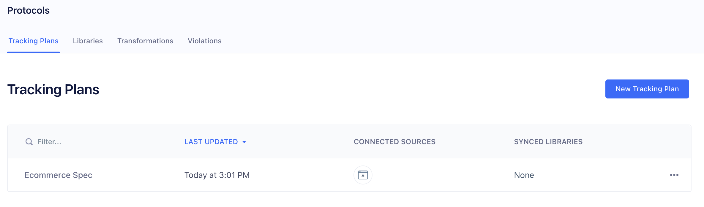
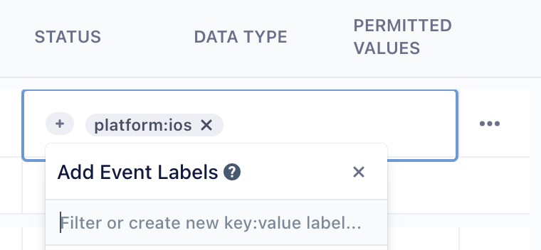
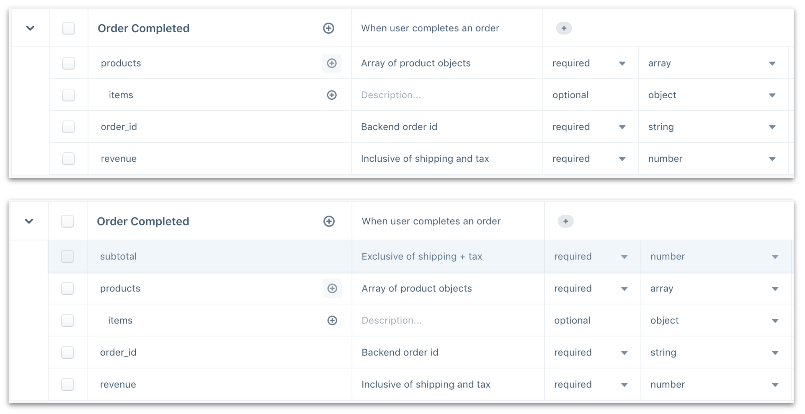
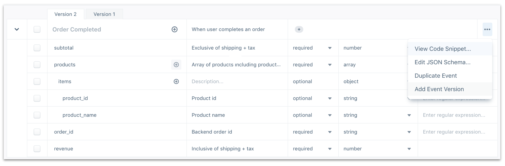
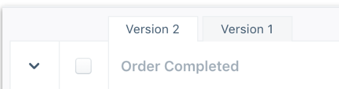

A Tracking Plan is a data spec outlining the events and properties you intend to collect across your Segment Sources. Crafting a comprehensive Tracking Plan takes time and effort across a range of teams within your organization, and a deep understanding of your business objectives. Once created though, the Tracking Plan becomes a highly valuable resource for both the engineers instrumenting Segment and all consumers of the data flowing through Segment. You can [learn more about data quality best practices](/docs/protocols/tracking-plan/best-practices/).

When building a Tracking Plan, it's best to start with the key metrics that drive value for your business. Key metrics may include new user signups, top line revenue, product use and more. With key metrics defined, it becomes much easier to define which user actions help track or improve those key metrics. Each user action maps to a distinct event, or `.track()` call, that you will track in Segment. The Tracking Plan can also validate `.identify()`, `.page()` and `.group()` calls.

The Segment Tracking Plan feature allows you to validate your expected events against the live events that are delivered to Segment. Violations generate when an event doesn't match the spec'd event in the Tracking Plan.

Tracking Plans are stored in workspaces and can be connected to one or more Sources.



## Create a Tracking Plan

To create a new Tracking Plan:
1. Contact your Segment account team to enable the Protocols features in your workspace.
2. Once enabled, click on **Protocols** in the left bar navigation.
3. Click **New Tracking Plan**.
4. Add events, properties, traits and filters in the Tracking Plan editor.
  - You'll see an option to import events and traits to your tracking plan from a source in your workspace. This option is great if you want to get started with your current events. Note that Segment infers data types, but often can't if several data types are sent for a specific category.

### Tracking Plan Columns
The Tracking Plan editor is organized as a spreadsheet to help you  add new events and properties, and edit the relevant fields for each. Like a spreadsheet, you can navigate across cells in a single event with your arrow keys and press enter to edit a cell.

| Column Name      | Details                                                                                                                                                                                                                                                                        |
| ---------------- | ------------------------------------------------------------------------------------------------------------------------------------------------------------------------------------------------------------------------------------------------------------------------------ |
| Name             | Specify the name of your event or property.                                                                                                                                                                                                                                    |
| Description      | Enter a description for your event or property. These descriptions are helpful for both engineers instrumenting Segment and consumers of the data.                                                                                                                             |
| Status           | Specify whether a property is required or optional. You can't require a `.track()` call because Segment is unable to verify when a `.track()` call should be fired.                                                                                                            |
| Data Type        | Specify the data type of the property. Data type options include `any, array, object, boolean, integer, number, string, Date time`. Note: Date time is required to be in ISO-8601 format                                                                                       |
| Permitted Values | Enter simple regular expressions to validate property values. This works when a property data type is set to `string`. For example, you can add pipe delimited strings to the regex column to generate violations when a property value does not match fall, winter or spring. |

> info ""
> The Status, Data Type, and Permitted Values columns appear as you add a track call property.

### Add a new track call
To add a new track call:
1. Click **Add Event** to add a new row.
2. Click into the row to add an event name and description. The event name strictly validates the name passed in your `.track()` calls. Casing, spacing and spelling matter!

### Add a track call property
To add a track call property:
1. Click on the **(+)** next to the event name to add a new row below the event name.
2. Click into the row to add the property name and also specify the description, status, data type and permitted values when applicable.
  - You can use your keyboard arrow and enter keys to navigate across the cells, or use your mouse.

### Add a track call object or array property
Segment supports object and array data types in the Tracking Plan editor. These complex data structures have limited use cases and should be used sparingly as some destinations aren't able to ingest the data structures. To add an object or array:
1. Create a new property row and set the Data Type to `Object` or `Array`.
2. Click the **(+)** next to the property name to add key value pairs in the object, or objects to an array of objects.

### Add a label
You can apply `key:value` labels to each event to help organize your tracking plan. These labels are helpful when multiple teams are managing a single tracking plan, or if you want to specify a priority, platform, product, or similar meta-data for each event. You can filter by label from the Tracking Plan, Schema, Data Validation and Violations Summary views.

For consistency purposes, it's best that you create a standard way of labeling events and share it with all parts of your organization that will use Segment.



### Filter track calls in the Tracking Plan
You can filter the Tracking Plan events by keyword or by label. The applied filter generates a permanent link so you can share specific events with teammates. Label filters also persist after you leave the Tracking Plan.

### Edit underlying JSON Schema
Protocols Tracking Plans use [JSON Schemas](https://json-schema.org/) to validate Segment event payloads. To support a broader range of validation use-cases, Segment lets you to edit your underlying JSON schema.

> warning ""
> Editing a JSON schema requires technical expertise. The [JSON schema documentation](https://json-schema.org/understanding-json-schema/index.html) and [JSON schema validator](https://www.jsonschemavalidator.net/) are helpful resources you can use.

You can edit the JSON schema for each track event listed in the tracking plan, and a common JSON schema definition that applies across all events.

#### Track event JSON schema
Each track event in the tracking plan has a separate JSON schema definition to validate the properties in that event. To edit, click on the overflow menu next to each event row in the Tracking Plan.

> info ""
> Advanced edits to the JSON schema are not visible in the Tracking Plan and make it harder for other users to understand the validation logic. Be sure to communicate to any other Protocols users that you are making changes in the validation logic.

#### Common JSON schema
The Tracking Plan also uses a common JSON schema definition that applies to the entire payload of every event sent from sources connected to the tracking plan.

The common JSON schema definition is unique for each tracking plan. An example use of this feature is to validate that all track, identify and page events sent to Segment include a `context.device.advertisingId` property. This validation ensures that every Segment call has a userId, anonymousId, and context object with a nested `"device": { "advertisingId": "e23sfsdf"}` object.

```json
{
    "$schema": "http://json-schema.org/draft-07/schema#",
    "type":"object",
    "properties": {
      "context": {
        "type": "object",
        "properties": {
          "device": {
            "type": "object",
            "properties": {
              "advertisingId": { "type": "string" }
            },
            "required": ["advertisingId"]
          }
        },
        "required": ["device"]
      },
      "anonymousId": {
        "type": "string"
      },
      "userId": {
        "type": "string"
      },
      "properties":{
        "type": "object",
        "properties": {
          "primary_business_unit": {
            "type": "string"
          }
        },
        "required": ["primary_business_unit"]
      },
      "traits":{
        "type": "object",
        "properties": {
          "first_name": {
            "type": "string"
          },
          "last_name": {
            "type": "string"
          },
          "email": {
            "type": "string"
          }
        },
        "required": ["email"]
      }
  },
  "required": ["context","anonymousId","userId","traits"]
}
```

To edit the common JSON schema:
1. Click the **(...)** at the top of the Tracking Plan editor and select **Edit Common JSON Schema**.
2. Enter your new JSON schema and click **Update JSON**.
3. Once you've saved and merged your JSON schema changes, go to the **Settings** tab for your source.
4. Click **Schema Configuration** in the navigation and go to the **Advanced Blocking Controls** section to define specific blocking behavior for common JSON schema violations.

To edit the common JSON schema using the Config API, you'll need to add your new JSON schema under the `"global"`: object.

> info ""
> [Negative lookahead regexes (`?!`)](https://www.regular-expressions.info/lookaround.html) aren't supported. This means you can't use regex to prevent matches with a specific following character or expression. But, you can use `not` in the regex of your JSON schema to generate violations when a property key or value doesn't match the provided regex pattern.

### Extend the Tracking Plan
Some customers prefer to manage the Tracking Plan with outside tools and resources. See the [APIs and extensions](/docs/protocols/apis-and-extensions/) section to learn more.

### Add identify or group traits
You can define which traits you expect to see passed in `.identify()` or `.group()` calls like how you would add `.track()` calls to the Tracking Plan. Navigate to the **Identify** or **Group** tab in your Tracking Plan and click the **(+)** button to add a new trait.

It's best to keep traits optional because `.identify()` and `.group()` are often called and pass only _new or changed_ traits, because Segment's client-side libraries (analytics.js, iOS, Android) cache traits in local storage. See the [Identify Best Practices](/docs/connections/spec/best-practices-identify#when-and-how-often-to-call-identify) to learn more.

## Tracking Plan Event Versioning

Segment offers Tracking Plan Event Versioning if you use Protocols to manage mobile sources, or to help you centrally manage a tracking plan for multiple teams. With Event Versioning, you can create multiple versions of an event definition, and validate events using a version key included in the track event payload.

This can be helpful for mobile developers who might have several released versions of their app sending data at the same time. For example, a new mobile app release might add a new required property to an event like `Order Completed`. In this scenario, if you updated the Tracking Plan, all  `Order Completed` events from your old mobile app versions would be invalid, because some customers won't have updated to the latest version yet. Instead, with event versioning, you can allow validation of both the old and new versions of an event at the same time. When you're ready to deprecate those old event versions, you can delete the version in your tracking plan.

For example, say you want to add `subtotal` as a required property to your `Order Completed` event. You would start by adding the required property to the event in the Tracking Plan as shown in the example below.



Before Segment introduced event versioning, you would need to add the change to your tracking plan and any non-compliant events would generate violations, and possibly be blocked depending on your [event blocking settings](/docs/protocols/enforce/schema-configuration/).

### Create a new event version
With event versioning, you can now create multiple versions of the event definition as shown in the example below. To create a new event version, click into the overflow menu for an event and select **Add Event Version**.



### Dynamically validate track events against an event version
To ensure the Track events you send to a Segment source validate against the correct event version, you need to instrument your events to include a `context.protocols.event_version` key and version value. The version value must pass as an integer, and should match the number shown in the Tracking Plan version tab. In the example below, the version number would be **2**.



Next, add the event version number to the context object. For [analytics.js](/docs/connections/sources/catalog/libraries/website/javascript) Track calls, you would instrument the event as in the example below. Note how the JSON objects for `context`, `protocols`, and `event_version` are nested.

```js
analytics.track('Order Completed', {
  subtotal: 23,
  products: [{
    product_name: 'Air Balloon',
    product_id: '32rd9jfs'
  }],
  order_id: '2df90eiwc9wjec',
  revenue: 33
}, {
  context: {
    protocols: {
      event_version: 2
    }
  }
});
```
> info ""
> **Note:** Protocols validate events against the oldest event version in the Tracking Plan for event payloads that are 1) missing the context.protocols.event_version key, or 2) contain an invalid/undefined event version (ex: event_version:3.2).
