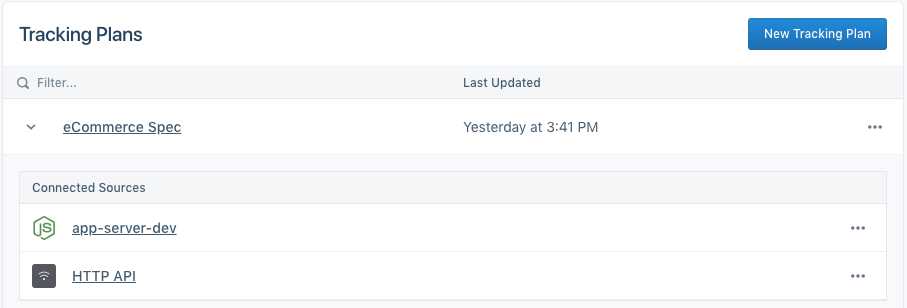

A Tracking Plan is a data spec outlining the events and properties you intend to collect across your Segment Sources. Crafting a comprehensive Tracking Plan takes time and effort across a range of teams within your organization, and a deep understanding of your business objectives. [Learn more about data quality best practices here](/docs/protocols/tracking-plan/best-practices/). Once created though, the Tracking Plan becomes a highly valuable resource for both the engineers instrumenting Segment and all consumers of the data flowing through Segment.

When building a Tracking Plan, we recommend starting with the key metrics that drive value for your business. Key metrics may include new user signups, top line revenue, product utilization and more. With key metrics defined, it becomes much easier to define which user actions help track or improve those key metrics. Each user action maps to a distinct event, or `.track()`  call, that you will track in Segment. `.identify()`, `.page()` and `.group()` calls can also be validated in the Tracking Plan.

The Segment Tracking Plan feature allows you to validate your expected events against the live events being delivered to Segment. Violations are generated when an event does not match the spec'd event in the Tracking Plan.

Tracking Plans are stored at workspace level, and can be connected to one or more Sources.




## Create a Tracking Plan

To create a new Tracking Plan, contact your Segment account team to enable the Protocols features in your workspace. Once enabled, you can click on Protocols in the left bar navigation to view your current Tracking Plans and create new ones.

To get started, click on **New Tracking Plan** in the top right. This will open a Tracking Plan editor view where you can add events, properties, traits and corresponding filters.

You will also see an option to infer a tracking plan from a source in your workspace. This option is great if you want to get started quickly with your current events. Note that we will do our best to infer data type, but often times cannot do so if multiple data types were sent for a specific property.

> info ""
> If your tracking plan is in a spreadsheet, use the [Google Sheets Uploader](/docs/protocols/apis-and-extensions/#google-sheets-tracking-plan-uploader) to import it to Protocols.


### Tracking Plan Columns
The Tracking Plan editor is organized as a spreadsheet to help you quickly add new events and properties, and edit the relevant fields for each. Similar to a spreadsheet, you can navigate across cells in a single event with your arrow keys and press enter to edit a cell.

| Column Name  | Column description   |
| ------------ | ------------------------------------------------------------------------------------------------------ |
| Name         | Specify the name of your event or property in this column.   |
| Description  | Enter a description for your event or property here. These descriptions are helpful for both engineers instrumenting Segment and consumers of the data. |
| Status       | Specify whether properties are required or optional. You cannot specify that a `.track()` call is Required because we are unable to validate when a `.track()` call should be fired. |
| Data Type    | Specify the data type of the property. Data type options include `any, array, object, boolean, integer, number, string`. |
| Conditionals | Enter simple regular expressions to validate property values. This currently only works when a property data type is set to `string`. For example, you can add pipe delimited strings to the regex column to generate violations when a property value does not match fall, winter or spring. |

### Add a new track call
Click on the **Add Event** button in the top right. A new row will be added. Click into the row to add an event name and description. The event name will be used to strictly validate the name passed in your `.track()` calls. Casing, spacing and spelling matter!

### Add a track call property
Click on the **(+)** button next to the event name to add a new property. A new row will be added below the event name. Click into the row to add the property name. You can use your keyboard arrow and enter keys to navigate across the cells, or use your mouse. Remember to specify the description, status, data type and conditional values when applicable.

### Add a track call object or array property
We support object and array data types in the Tracking Plan editor. These complex data structures have limited use cases and should be used sparingly as few Destinations are able to ingest the data structures. To add an object or array, create a new property row and set the Data Type to Object or Array. A **(+)** button will appear next to the property allowing you add key value pairs in the object, or objects to an array of objects.

### Add a label
You can apply `key:value` labels to each event to help organize your tracking plan. These labels are helpful when multiple teams are managing a single Tracking Plan, or if you want to specify a priority, platform, product, or similar meta-data for each event. You can filter by label from the Tracking Plan, Schema, Data Validation and Violations Summary views.

For consistency purposes, we *highly* recommend that you create a standard way of labeling events and share it with all parts of your organization that will use Segment.


### Filter track calls in the Tracking Plan
The Tracking Plan events can be filtered by keyword or by label. The applied filter generates a permanent link so you can share specific events with teammates. Label filters also persist after you leave the Tracking Plan.

### Edit underlying JSON Schema
Protocols Tracking Plans use [JSON Schemas](https://json-schema.org/) to validate Segment event payloads. To support a broader range of validation use-cases, Segment lets you to edit your underlying JSON schema.

> warning ""
> Editing a JSON schema requires technical expertise and should be done carefully. The [JSON schema documentation](https://json-schema.org/understanding-json-schema/index.html) and [JSON schema validator](https://www.jsonschemavalidator.net/) are helpful resources to get started.

You can currently edit the JSON schema for each track event listed in the Tracking Plan, and a common JSON schema definition that applies across all events.

#### Track event JSON schema
Each track event in the tracking plan has a separate JSON schema definition to validate the properties in that event. You can click on the overflow menu next to each event row in the Tracking Plan to edit.

> info ""
> Advanced edits to the JSON schema are not visible in the Tracking Plan and make it harder for other users to understand the validation logic. Be sure to communicate to any other Protocols users that you are making changes in the validation logic.

#### Common JSON schema
In addition to the event-specific JSON schema definitions, the Tracking Plan uses a common JSON schema definition which applies to the entire payload of every event that is sent from sources connected to the tracking plan.

The common JSON schema definition is unique for each tracking plan. An example use of this feature is to validate that all track, identify and page events sent to Segment include a `context.device.advertisingId` property.

To edit the common JSON schema, click the "more" menu (...) at the top of the Tracking Plan editor. Once you have edited, saved and merged your JSON schema changes, you can go to the **Settings** tab for your source, click the **Schema Controls** page and go to the **Advanced Blocking Controls** section to define specific blocking behavior for common JSON schema violations.

> info ""
> [Negative lookahead regexes (`?!`)](https://www.regular-expressions.info/lookaround.html) are not currently supported. This means you can’t use regex to prevent matches with a specific following character or expression. However you can use `not` in the regex of your JSON schema to generate violations when a property key or value does not match the provided regex pattern.

### Extend the Tracking Plan
Many customers prefer to manage the Tracking Plan with outside tools and resources. [Click over to the APIs and extensions](/docs/protocols/apis-and-extensions/) section to learn more.

### Add identify or group traits
Similar to how you would add `.track()` calls to the Tracking Plan, you can define which traits you expect to see passed in `.identify()` or `.group()` calls. Navigate to the Identify or Group tab in your Tracking Plan and click the **(+)** button to add a new trait.

We recommend that you keep traits optional because `.identify()` and `.group()` should be called often, and pass only _new or changed_ traits, because our client-side libraries (analytics.js, iOS, Android) cache traits in local storage. [See the Identify Best Practices](/docs/connections/spec/best-practices-identify/#when-and-how-often-to-call-identify) to learn more.

## Tracking Plan Event Versioning

Segment offers Tracking Plan event versioning if you use Protocols to manage mobile sources, or to help you centrally manage a Tracking Plan for multiple teams. With Event Versioning, you can create multiple versions of an event definition, and validate events using a version key included in the track event payload.

This can be especially helpful for mobile developers, who might have several released versions of their app sending data at the same time. For example, a new mobile app release might add a new required property to an event like `Order Completed`. In this scenario, if you updated the Tracking Plan, all  `Order Completed` events from your old mobile app versions would be invalid, because some customers won't have updated to the latest version yet. Instead, with event versioning, you can allow validation of both the old and new versions of an event at the same time. When you're ready to deprecate those old event versions, you can delete the version in your Tracking Plan.

As an example, let's say you want to add `subtotal` as a required property to your `Order Completed` event. You would start by adding the required property to the event in the Tracking Plan as shown in the example below.


Before we introduced event versioning, you would need to add the change to your tracking plan and any non-compliant events would immediately generate violations, and possibly be blocked depending on your [event blocking settings](/docs/protocols/enforce/schema-configuration/).

### Create a new event version
With event versioning, you can now create multiple versions of the event definition as shown in the example below. To create a new event version, click into the overflow menu for an event and select **Add Event Version**.


### Dynamically validate track events against an event version
To ensure the Track events you send to a Segment source are validated against the correct event version, you need to instrument your events to include a `context.protocols.event_version` key and version value. The version value must be passed as an integer, and should match the number shown in the Tracking Plan version tab. In the example below, the version number would be **2**.


Next, add the event version number to the context object. For [analytics.js](/docs/connections/sources/catalog/libraries/website/javascript) track calls, you would instrument the event as in the example below. Note how the JSON objects for `context`, `protocols`, and `event_version` are nested.

```js
analytics.track('Order Completed', {
  subtotal: 23,
  products: [{
    product_name: 'Air Balloon',
    product_id: '32rd9jfs'
  }],
  order_id: '2df90eiwc9wjec',
  revenue: 33
}, {
  context: {
    protocols: {
      event_version: 2
    }
  }
});
```

**Note: Protocols validates events against the oldest event version in the Tracking Plan for event payloads that are 1) missing the context.protocols.event_version key, or 2) contain an invalid/undefined event version (ex: event_version:3.2)**
