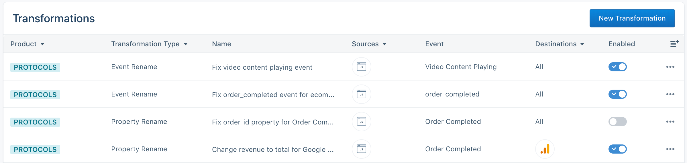
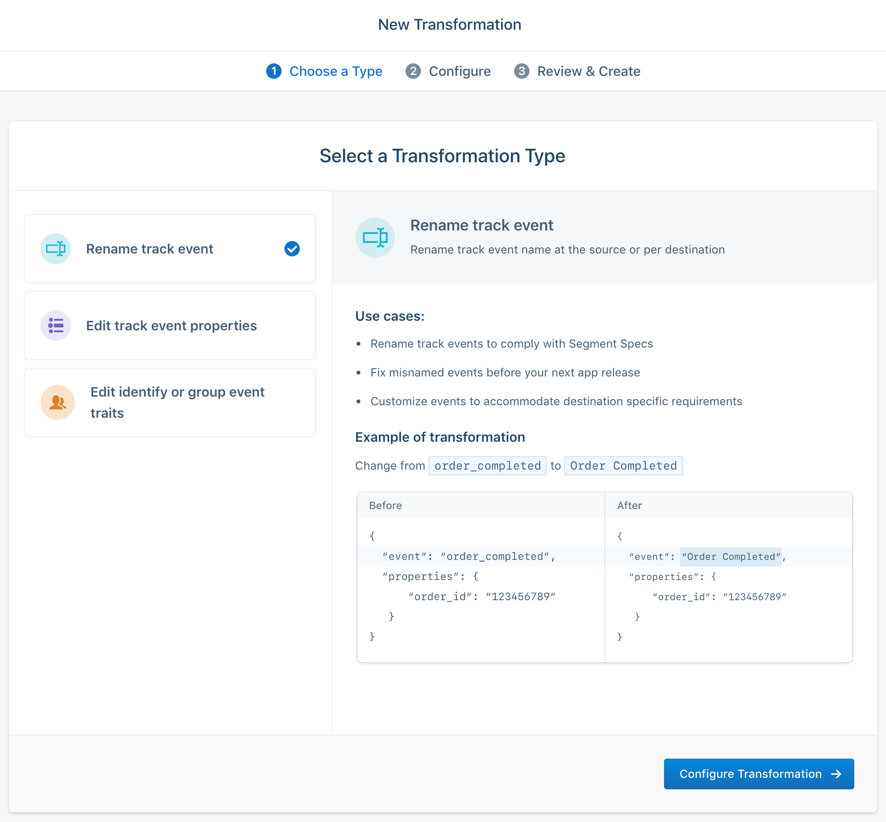
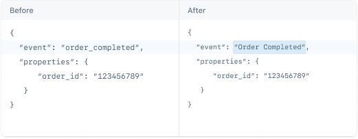
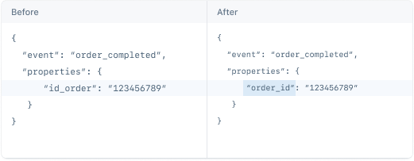
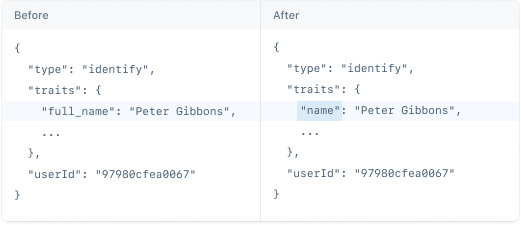
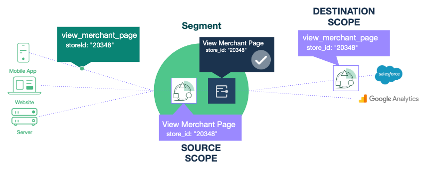

## What is a Transformation?

Transformations allow you to change data as it flows through Segment to either correct bad data or customize data for a specific destination. At this time, you can change event and property names to align events with your Tracking Plan, or to conform to a destination-specific requirement. For example, a Transformation could be created to change an event name from `completed_order` to `Order Completed` to conform to [Segment's ecommerce spec](/docs/connections/spec/ecommerce/v2/#order-completed).

**Transformations are very powerful and should be applied with care!**

Transformations _irrevocably_ change the event payloads flowing through Segment and immediately affect either all destinations, or a single downstream destination, depending on your settings.

> warning ""
> As soon as you apply a Transformation, the original tracking payloads are not easily recoverable.

Our goal is to make Transformations a powerful tool that complements a well structured Tracking Plan. Together, these features help your organization scale and achieve high data quality. For that reason we HIGHLY recommend that you start your data quality strategy with a clearly defined Tracking Plan. Without this critical component, the risk of creating conflicting or detrimental transformations increases.

### Other important notes

- **Transformations cannot be applied retroactively:** They only apply to data moving forward. However, you can manually extract and re-send (or even [Replay](/docs/guides/what-is-replay)) events through a source with an active destination Transformation, which will send the transformed events to your destinations.
- **Transformations are only available to Protocols customers:** If you are interested in this feature, contact your Account Executive or CSM to learn more about the Protocols package.
- **Source-level transformations are irrevocable:** When applied at the source, a transformation permanently changes the structure of the event. The original events are not easily recoverable or [Replayable](/docs/guides/what-is-replay). Assume that transformed data cannot be recovered.
- **Device-mode destinations are NOT supported:** Source scoped transformations will **only** apply to cloud-mode destinations, warehouses, and S3 destinations. Destination scoped transformations will **only** apply to cloud-mode destinations.

## View all Transformations

All Protocols Transformations are listed in the Transformations tab in the Protocols section. The list view supports filtering and sorting to organize transformations by transformation type, source, and destination.

Transformations can be enabled and disabled directly from the list view using the toggle.

Transformations can be deleted and edited by clicking on the overflow menu. When editing a Transformation, only the resulting event or property names, and Transformation name can be edited. If you want to select a different event or source, create a separate Transformation rule.

## Create a Transformation

To create a Transformation, navigate to the Transformations tab in Protocols and click **New Transformation** in the top right. A three-step wizard guides you through creating a transformation.

> info ""
> Workspace Owner or Source Admin permissions are required to create and edit transformations.
> Source Read-only permissions are required to view transformations.

### Step 1: Select the transformation type

To create a Transformation, you first need to select which type of transformation you want to create. For each transformation type, we display a description, use cases and example payload. Current transformation types include:

**Rename track event:** Rename track event name at the source or per destination

**Edit track event properties:** Rename multiple properties and/or change property data structure at the source or per destination

**Edit identify or group event traits:** Rename multiple traits and/or change trait data structure at the source or per destination

### Step 2: Set up the transformation

Depending on the transformation type you selected, relevant drop-down selectors and fields are presented to define how you want to transform the data.

> info ""
> Multiple transformations cannot be created for the same source + type + event + destination combo. This restriction blocks circular transformations (for example, `order_updated` to `orderUpdated` to `order_updated`), minimizes unexpected transformations, and enables easy filtering across each dimension.

Regardless of the type of transformation selected, first select a source. Each Transformation can only apply to a single source. While this makes it more difficult to apply transformations broadly, it ensures you are only transforming data relevant to the selected source.

After selecting the source, you will need to select a scope. Scope determines where the transformation will be applied.

> warning ""
> Source-scoped Transformations only apply to cloud-mode, S3, and data warehouse destinations.

* **Source scope:**
Events are transformed in all **active Segment cloud-mode destinations, warehouses, and S3 destinations.** This scope is best when you want to fix malformed events before sending them to all destinations. These transformations should be treated as a temporary solution to hold you over while your engineering team fixes the root event.

* **Destination scope:**
Events are transformed in ONLY the selected cloud-mode destination. **Device-mode destinations, S3, and data warehouses are not currently supported.** Use the Destination scope when you want to customize an event to the unique requirements of a destination. These transformations can exist permanently.

Depending on the type of transformation you selected, you will need to enter the relevant event, property, or trait mappings to create the transformation.

* **Select an Event:**
After you select the scope, use the search box to choose the event to transform. You can **only** select a single track event, identify or group call. If you are renaming the event, simply enter the new name in the provided text field.

* **Rename properties or traits:**
If you are renaming properties or traits within your selected event, click the **+ Add Property** button. A dropdown will appear that contains all properties/traits sent with the selected event. We currently support JSON Path notation to select nested objects (ex. `order.id` will select an `id` property nested in a `order` object). We do **not** yet support `.$.` notation to select a property in an array of objects.

After selecting a property/trait, select JSON Path or Simple String to change the property/trait. Simple string will change the name in-line, while JSON path allows you to move the property/trait in or out of an object.

### Step 3: Name the transformation and enable it

Finally, enter a descriptive name to act as a label for the transformation. This label helps you organize your Transformations, and we recommend making this descriptive and focused on the problem you're solving. For example `Fix misnamed order_completed event for ecommerce spec` is much better than `Map order_completed`.

In this step, you can also choose to keep the Transformation disabled, so you can and come back and edit it later. To update, enable, or disable a Transformation, click on the overflow menu and select **Edit Transformation**.
