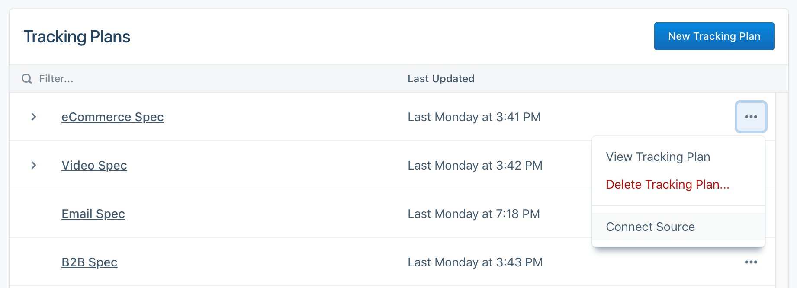
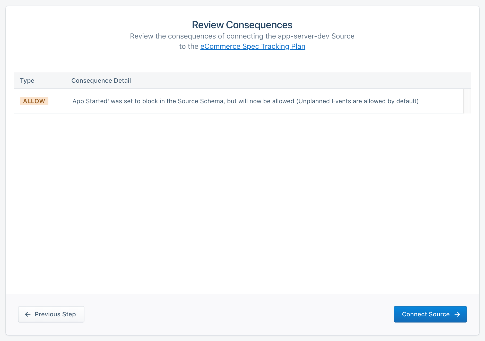
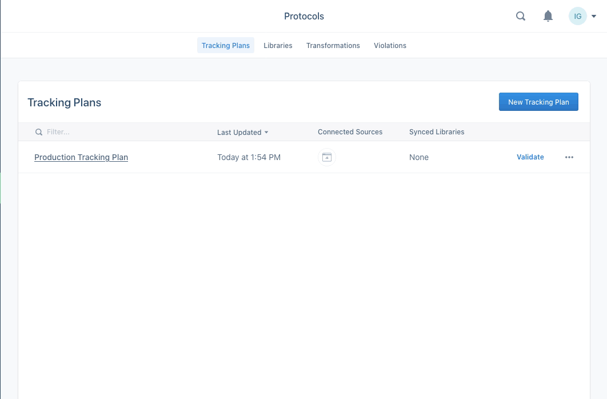



With your Tracking Plan is complete, it's time to apply the Tracking Plan to one or more Sources. Select **Connect Source** from the right hand menu for your specific Tracking Plan.

From this menu, you will be redirected to a workflow to select a Source from your workspace. Note that a Source can only have one tracking plan applied to it. You *can't* select a Source that already has a Tracking Plan connected to it, but you *can* apply a Tracking Plan to multiple sources.

After selecting a Source, you will be shown the consequences of connecting your Tracking Plan.

**IMPORTANT: Make sure to read through the consequences of connecting a source!**

## Disconnect Source from Tracking Plan

To disconnect the Source from the Tracking Plan, go to the Tracking Plan overview page, locate the column for the tracking plan you want to disconnect, then click the icon under the **Connected Sources**. In the settings that appear, click **Disconnect** next to the Source you want to disconnect.

