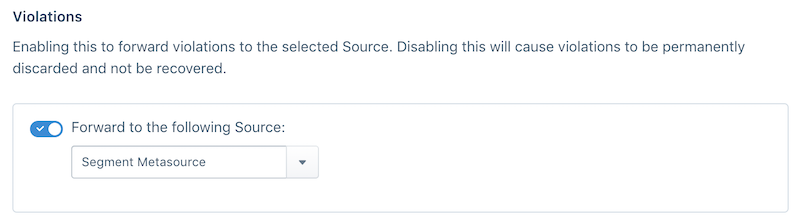




You can forward Violations (data that does not conform to your Protocols tracking plan) to a Segment Source to enable custom notifications, dashboards and further analysis in any Segment destination that accepts cloud-mode data. To set up forwarding, visit your Source settings tab and select which Source you want to forward events to from the dropdown. Similar to [Blocked Event forwarding](/docs/protocols/enforce/forward-blocked-events/), we recommend that you create a new Source for violations.




Violations are sent to the selected Source as `analytics.track()` calls. The call payload includes the following properties, along with the `context.app` and `context.library` objects to aid in filtering violations.

```json
    {
      "context": {
        "app": null,
        "library": {
          "name": "analytics-node",
          "version": "2.1.0"
        }
      },
      "event": "Violation Generated",
      "integrations": {},
      "messageId": "sch-Vir1JNrorwlBmCHrHWuPJekMx5c59T7c",
      "properties": {
        "appVersion": "",
        "eventMessageID": "node-YhqA1DK9mgV55INDzOSd542fCFbIkc1o",
        "eventName": "Order Completed",
        "eventSentAt": "2018-08-23T21:35:02.85860964Z",
        "eventTimestamp": "0001-01-01T00:00:00Z",
        "eventType": "track",
        "sourceID": "dInN1HJ4bi",
        "sourceName": "Acme Store",
        "sourceSlug": "acme_store_test",
        "trackingPlanID": "rs_16KrwVbouFLrYbDkGh4LNslkrNp",
        "trackingPlanName": "Acme Ecommerce TP",
        "violationDescription": "properties.products is required",
        "violationField": "properties.products",
        "violationType": "Required"
      },
      "receivedAt": "2018-09-05T23:05:25.862826965Z",
      "timestamp": "2018-09-05T23:05:25.862826855Z",
      "type": "track",
      "userId": "schema-violations",
      "forwardedFromProject": "dInN1HJ4bi"
    }
```

**Billing Note: Enabling Violation forwarding generates one (1) additional MTU in your workspace, total. If you are on an API billing plan, you are charged for the increased API volume generated by the forwarded violations.**

**Schema and debugger Note:`Violation Generated` events do not appear in the source's Schema tab. They do appear as Violation Generated events in the [debugger](/docs/connections/sources/debugger/).**
