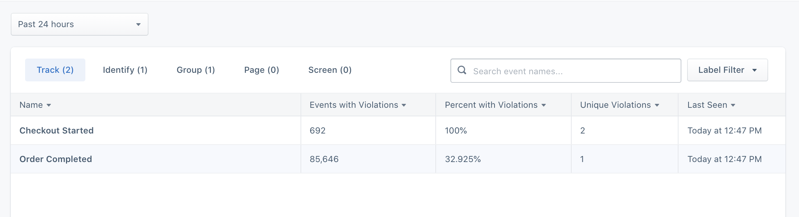



Upon connecting your Tracking Plan to a Source, you will be able to view violations grouped by event. To view violations, click on the Violations button located on the Schema tab in a Source. A filter can be applied to only show events with violations within the past 24 hrs, 7 days and 30 days.

To view detailed violations for an event, click on the specific event. Specific violations include:

- Missing required properties
- Invalid property value data types
- Property values that do not pass applied conditional filtering

In the event detail violations view, a filter can be applied to only show violations in the past 24 hrs, 7 days and 30 days.

To view a specific violation, simply click on the violation to view recent sample payloads that generated the violation. These payloads can then be used to help engineering quickly pinpoint the root cause and release a fix.

If you want to analyze or build custom alerts based on inbound violations, you can [enable violation forwarding here](/docs/protocols/validate/forward-violations/).

> warning ""
> Track violations use the `event` field for aggregation, while Page and Screen violations use the `name` field. If these are not properly implemented in your events, violations cannot be aggregated correctly.
