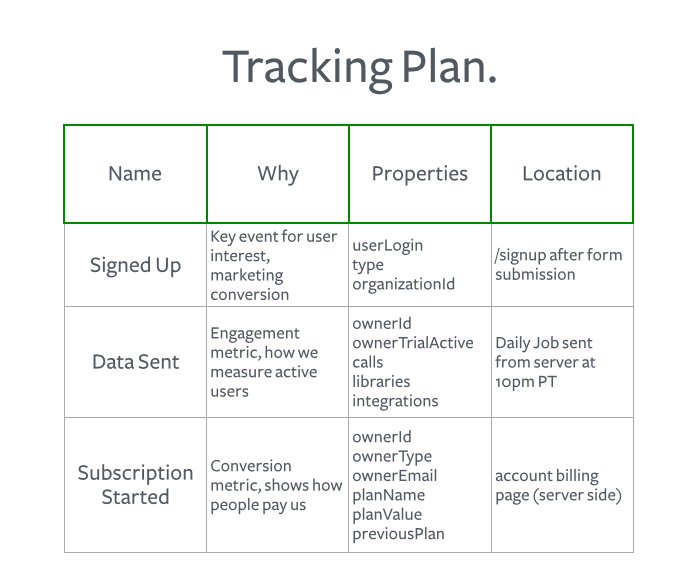

We've helped thousands of companies implement customer data tracking, and in that time we've observed that the companies that have the most success leveraging data have one thing in common: they use a tracking plan.

A [tracking plan](https://segment.com/blog/what-is-a-tracking-plan) clarifies what events to track, where those events live in the code base, and why those events are necessary from a business perspective. Typically a spreadsheet, this serves as both as a project management tool and as collateral to align the entire organization behind data as the basis on which to make decisions or deem a launch to be a success. This tool helps everyone—marketers, product managers, engineers, analysts—get on the same page. It represents the single source of truth for what data to collect and why.

The tracking plan has been such an instrumental document for helping organizations reclaim their own data efforts that our Customer Success Managers enforce creating one before writing a single line of tracking code. Having customers go through this invaluable exercise encourages them to think critically about what they want to learn, why they want to learn it, and how they want to use that data in their downstream tools. Afterwards, they track events with intent and are far more confident about making decisions and acting on the collected data.

In this tutorial, we'll share with you the underlying data philosophies that guide the creation of tracking plans, as well as a system for determining what events to include or exclude, and why.



## Data philosophies

We've distilled the tracking plan creation process to a handful of universal truths. The following principles guide the decisions behind determining which events to track and how to track them.

Everything is a funnel. In the same spirit that every message should have a CTA, every experience should lead a user towards conversion. Ultimately, how do people discover, start using, and paying for your product? What are the most important steps along the way? These are the crucial events you want to capture.

Tracking is about learning and taking action. Think about what you want to know about your product or customers. Think about what assumptions need to be tested or invalidated. Think about the unknowns. What kind of events or data will shed light onto any of those? Start with a list. For more information, check out this quick guide to translating what you want to know into a list of events.

Get organized. Pick a convention for naming your events and properties. Your eyes, brain, and new team members will thank you later. We like to use the Object Action naming framework, but so long as you are consistent with yours, you can choose whatever works best for you.

## Identifying your users

The `.identify()` call is important, because it updates all records of the user with a set of traits. But how do you choose which traits to include?

Here is a sample `.identify()` call (with [analytics.js](https://segment.com/docs/connections/sources/catalog/libraries/website/analytics.js/)) for Segment:

```js
analytics.identify({
  name: 'Kanye West',
  email: 'kanye@iamawesome.com',
  login: 'kanyew',
  type: 'user',
  created: '2016-11-07T16:40:52.238Z',
});
```

The traits represent dimensions in your data that you can group or pivot on. For example, in the above, you can easily create cohorts of all types that are `users` or accounts created within a time window of your choosing.

## Selecting your events

Tracking is about learning and taking action. Which events will help you understand your funnels? Which events represent trigger points that help you define your marketing automation?

The events you track should demonstrate a strong transfer of value, either from you to your user, or vice versa. For instance, a user providing an email address represents the user transferring value to you. Another example is a key activation event. For us at Segment, that event would be "Project Data Sent" for Segment, which indicates that the customer is using a core service of Segment's product. For an ecommerce consumer company like Postmates, that might be "Order Placed".

The tracked events should be generic and high-level. There should never be any event names that are dynamically generated. This will only clutter the data for all of your analytics and marketing tools downstream, rendering them difficult to use. Instead, for capturing more specific, detailed information, use properties.

Lastly, we recommend starting with fewer events that cover your most crucial questions and learnings. Once you're comfortable, you can add more events to your tracking plan that can answer peripheral questions.

At Segment, we started out tracking these events:
- **Signed Up**
- **Project Data Sent**
- **Subscription Started**


Then we added some peripheral events to to better understand how we're performing, for the following reasons:
- **User Invited**
   When users invite more people to their organization, it's a good indicator that they're engaged and serious about using the product. This helps us measure growth in organizations.
- **Destination Enabled**
   Turning on an destination is a key engagement metric.
- **Debugger Call Expanded**
   When we see that a certain customer has used the live event stream feature a number of times, we reach out to see if we can help them debug.


For an ecommerce company, however, the main events might be something like:

- **Account Created**
- **Product Added**
- **Order Completed**


Note that Segment has a set of "reserved" event names specifically for ecommerce, called our [ecommerce spec](https://segment.com/docs/connections/spec/ecommerce/v2). Check it out to see which events we cover and how they are used in our downstream destinations.

For a community, on the other hand, there is an entirely different set of actions that indicate engagement, listed in the below pyramid. For example, [GrowthHacker's](https://growthhackers.com/) funnel of actions from least to most engaged are:
- **Watching**
- **Sharing**
- **Commenting**
- **Producing**
- **Curating**


With this, they're able to measure key metrics around engagement and understand how users are moving towards their ultimate conversion event: curation content for others.


This is Charlene Li's set of user engagement events for communities. For more information, check out [this article](https://segment.com/blog/growthhackers-community-metrics/) from GrowthHackers about the events they track and why.

## Selecting your properties

Each `.track()` call can accept an optional dictionary of `properties`, which can contain any key-value pair you want. These `properties` act as dimensions that allow your end tool to group, filter, and analyze the events. They give you additional detail on broader events.

As mentioned earlier, events should be generic and high level, whereas properties are specific and detailed. For example, at Segment, `Business Tier Workspace Created` is a horrible event name. Instead, we used `Workspace Created` with a `property` of `tier` and value of `business` :

```js
analytics.track('Workspace Created', {
  tier: 'business'
})
```

Similar to the traits in the `.identify()` call, the properties provide you a column that you can pivot against or filter on in your analytics tools or allow you to create a cohort of users in email tools.

There also shouldn't be any dynamically generated `key`'s in the `properties` dictionary, as each `key` will create a new column in your downstream tools. Dynamically generated `key`'s will clutter your tools with tons of data that will make it difficult and confusing to use later.

Here is Segment's `Lead Captured` `.track()` call:

```
analytics.track(userId, 'Lead Captured', {
  email: 'email',
  location: 'header navbar'
  url: 'https://segment.com/'
});
```

The high level event is "Lead Captured" and all of the details are tucked into the `properties` dictionary. In our downstream tools, we'll be able to easily look at how many leads were captured in different locations on our site.

If you want to learn more about how properties are used by downstream tools, check out ["](https://segment.com/academy/collecting-data/the-anatomy-of-a-track-call/)[The Anatomy of a Track Call"](https://segment.com/academy/collecting-data/the-anatomy-of-a-track-call/).

## Achieving data-informed growth

Figuring out which events should be tracked, determining where to put the code, and outlining the business reasons for tracking each event helps get everybody on the same page with regards to using data for learning and growth. A tracking plan not only assists in implementation and project management, but also convinces all stakeholders of the importance of collecting the right data while forcing them to think critically about setting success goals for a product or feature launch.

[Check out an example of a Segment customer's tracking plan by downloading one from Mention.](http://learn.segment.com/tracking-plan/).

Want a free consultation from our Customer Success Managers on how they simplify our customer's analytics? [Request a demo of Segment](https://segment.com/contact/demo).
