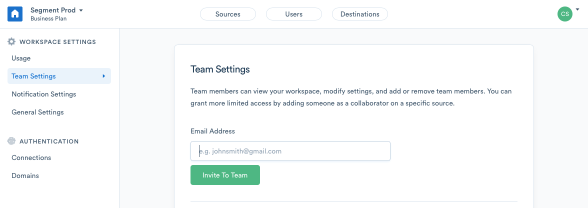
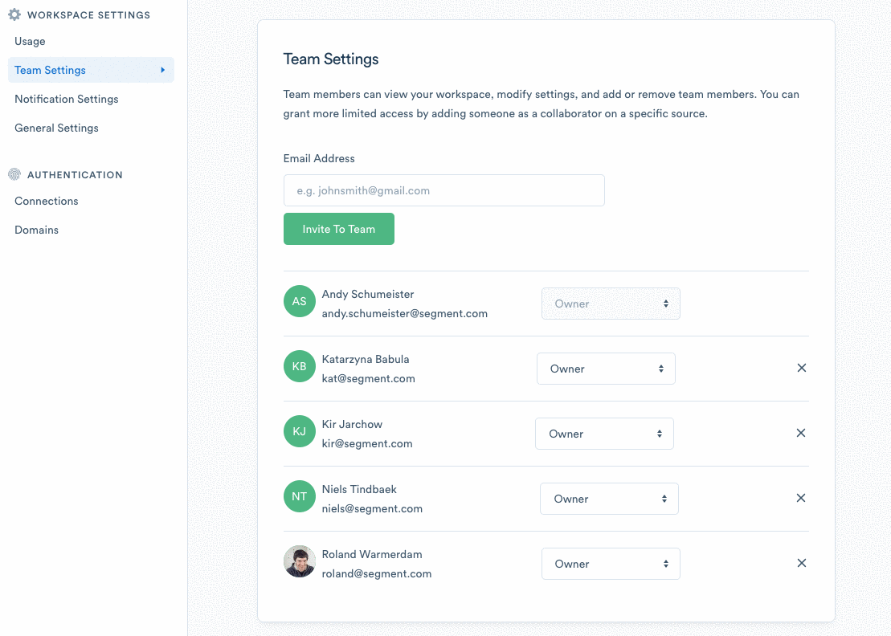
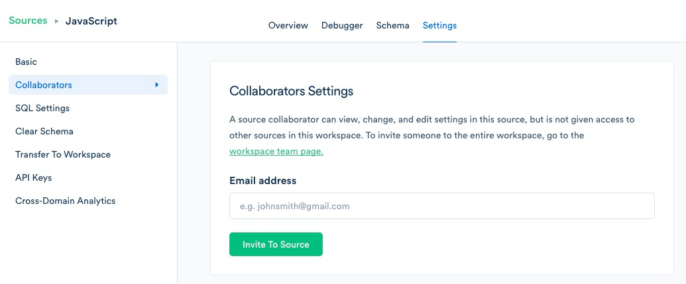

**This section is being deprecated, refer to [IAM](/docs/segment-app/iam) going forward**

If you are on our Team or Business plan you can add a Team member in your workspace team page and inviting any team members by email. If you are on a Free plan you will need to upgrade to invite more than one Team member to the account. 

### Workspace Owners

A workspace owner has read/write access to all settings and Sources inside of a workspace.

Owners must sign up for a personal account before gaining access to the workspace they were added to. They'll get an invite email if they don't have a Segment account yet.

To add new owners to a workspace, go to your [workspace settings](https://segment.com/goto-my-workspace/settings/team). You can also access this from the account dropdown in the menu when you are logged into your account.

Remember, every owner in a workspace has full read/write access to every Source within that workspace.

### Workspace Read-Only Members

Business Tier Workspaces can add team members with Read-Only permissions to their workspaces. These users may access any Source or sub-resource to see their layout, settings, and live data flow in the debugger, but they may not create or update **any** resources in your workspace.

To update your team members' roles, go to Workspace Settings > Team Settings, and select the appropriate role. 

### Source Collaborators

You can invite Source Collaborators to any Source(s) to which you have access. An invitation gives the user complete access to that Source and its settings but not the ability to see other sources in your account or workspace. The user would also not be able to see any workspace, account, or billing details.

To add a Source Collaborator, navigate to the Settings page for a given Source, and click Collaborators from the left-hand menu.

## Team Management with Single Sign On

If you are on a Business plan and elect to use Single Sign On, by assigning team members access to Segment in your identity provider, you are granting them implicit access to your workspaces **as a read-only member.**

Segment supports "Just-In-Time" user provisioning using SSO. Any users with access to the application as defined in your IDP will be able to seamlessly create an account the very first time they log in. All auto-provisioned users are created as read-only members.

Admins may then promote new auto-provisioned read-only members to owners as they see fit.

Segment does not support programmatic de-provisioning at this time, but if your workspace has SSO enabled, any user that cannot authenticate using your IDP will not be granted authorization to view or edit your workspace or the Sources, Destinations, etc. within it.
