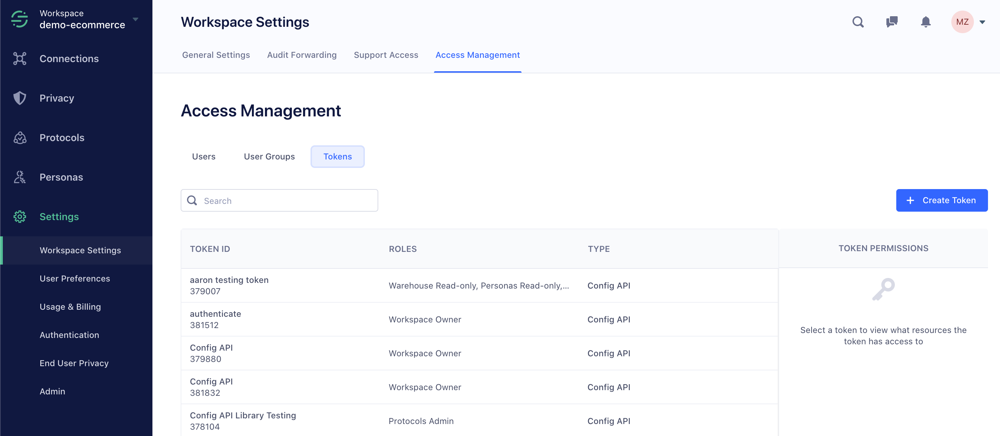

## Team Members

A Segment *Team Member* is an individual with access to a workspace. A Segment user can be associated with one or more workspaces, either as an `owner` or `member` of each.
  - **Workspace Owners** have access to, and manage all aspects of the workspace.
  - **Workspace Members** are given access via a set of *roles* corresponding to specific *resources* within the workspace.
Check out the [roles documentation](/segment-app/iam/roles) for a complete list of roles.

## User Groups

A *User Group* is a set of Team Members with a set of shared policies. A Segment Team Member can be a member of one or many Groups. All roles in the Segment App are additive. Group membership may be assigned in addition to individual roles for a single team member. For example: a single user could inherit roles from a Group definition AND have access to additional resources via individually assigned roles.

## Tokens

Tokens are generated to programmatically access Segment resources via our [Segment Public API](/config-api).

## Resources

Resources are the building blocks of Segment:
  - Workspaces
  - Sources
  - Destinations
  - Warehouses
  - Personas Spaces
  - Protocols Tracking Plans

## Labels

Workspace owners can assign users access to groups of resources by using Labels. Labels can be assigned to Sources and Personas Spaces.

To create or configure labels, go to the **Labels** tab in your workspace settings. Only workspace Owners can manage labels for the entire workspace.

  LINKS:

  - [Label-based Access Management](/docs/iam/labels/)
  - [Labels Best Practices](/docs/iam/labels/)

## Roles

A role is used to give a user access to resources within a workspace. Roles are additive, and can be combined to configure a custom policy for a Team Member or a Group. A policy is at least one role plus one resource applied to an individual user or group.
