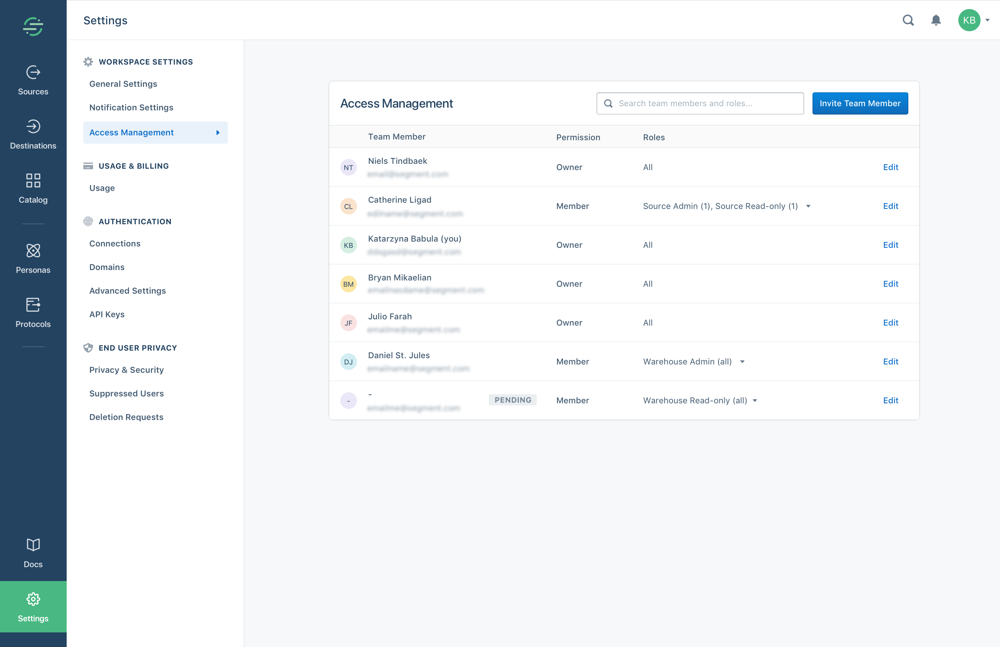

**Improved access management is rolling out to all customers in March and April 2019, and might not be available in your workspace yet. See the [changelog below](#changelog) for more information.**

Access management lets workspace owners manage which users can access different parts of their Segment workspaces.

Access is scoped to a workspace. A Segment user is associated with one or more workspaces, either as an `owner` or `member` of each.
Users access their Segment account with either email/password credentials, or by using Single Sign On.

`Owners` manage all aspects of the workspace, and `members` can have access to specific products and resource types.

| Connections           | Protocols             | Personas             |
|-----------------------|----------------------------------------------|
| Source admin          | Protocols admin       | Personas admin       |
| Source read-only      | Protocols read-only   | Personas user        |
| Warehouse admin       |                       | Personas read-only   |
| Warehouse read-only   |                       |                      |

Check out the [Roles documentation](/docs/iam/roles/) for more details.

You can grant Source roles to specific resource instances (for example you could give a member `Source admin` access for the `iOS Prod` source only) or to all current and future instances. A user with access to all current and future instances can also create new instances.

The other roles apply to all resource instances within the product area (Warehouses, Tracking Plans, Pesonas Audiences/Traits).
These roles will become more granular very soon.

## Changelog

The access management system documented here is rolling out to all customers during March and April 2019.
You'll receive an email once your workspace has been migrated.

As a part of this update, your teammates will be migrated to updated roles with access rights that are equivalent to what they had previously. While the role names may have changed, the access levels remain the same:

| Existing user role    | New user role         | Change in access     |
|-----------------------|----------------------------------------------|
| Workspace owner       | Workspace owner       | No changes           |
| Workspace read-only   | Workspace read-only teammates will be granted access to the following roles:<ul><li>Source read-only (all Sources and connected streaming Destinations)</li><li>Warehouse read-only (all warehouses)</li><li>Protocols read-only &ast;</ul>| No change|
| Source collaborator   | Source admin          | No longer able to invite other users |

&ast; If product is available in your workspace

The main difference is that we've consolidated all users in the same place, so you will no longer have to manage source collaborators in each source. That also means source collaborators can no longer invite other users.
