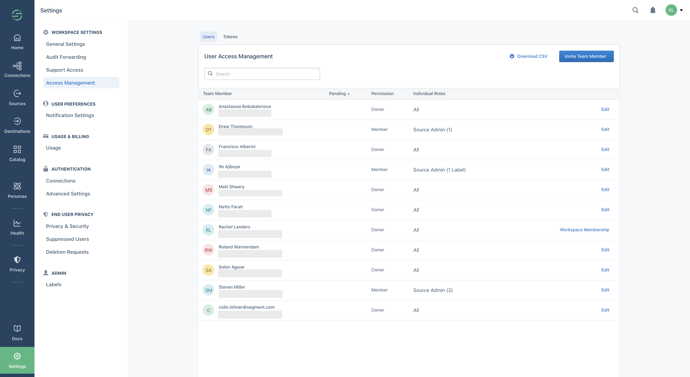

Access management lets workspace owners manage which users can access different parts of their Segment workspaces.



Access is scoped to a workspace. A Segment user is associated with one or more workspaces, either as an `owner` or `member` of each.
Users access their Segment account with either email/password credentials, or by using Single Sign On.

`Owners` manage all aspects of the workspace, and `members` can have access to specific products and resource types.

* Note: All Segment workspaces have access to the Workspace owner and Source admin roles. Additional roles are only available to Segment Business Tier accounts.

| Connections           | Protocols             | Personas             |
|-----------------------|----------------------------------------------|
| Source admin          | Protocols admin       | Personas admin       |
| Source read-only      | Protocols read-only   | Personas user        |
| Warehouse admin       |                       | Personas read-only   |
| Warehouse read-only   |                       |                      |

Check out the [Roles documentation](/docs/iam/roles/) for more details.

You can grant Source roles to specific resource instances (for example you could give a member `Source admin` access for the `iOS Prod` source only) or to all current and future instances. A user with access to all current and future instances can also create new instances.

The other roles apply to all resource instances within the product area (Warehouses, Tracking Plans, Personas Audiences/Traits).
These roles will become more granular very soon.

_Note: If you are on a Free or Team plan, only the `workspace owner` and `source admin` roles are available._

## Exporting a workspace's user list
*Workspace Owners* may download a .csv of users within a workspace and their corresponding roles directly from the Access Management page in the Segment App.
