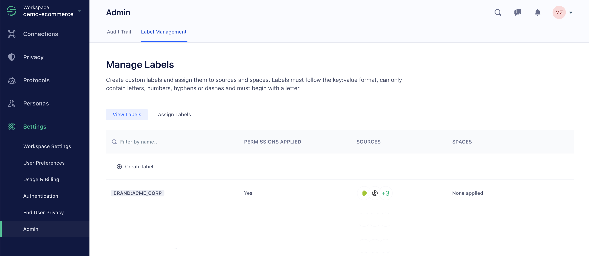
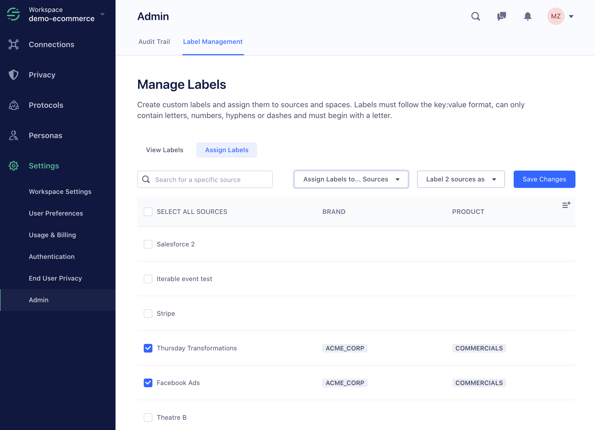



Labels allow workspace owners to assign permissions to users to grant them access to groups. Groups represent collections of Sources, or collections of Personas spaces.

To create or configure labels, go to the **Labels** tab in your workspace settings. Only workspace Owners can manage labels for the entire workspace.

> note ""
> All workspaces include labels for `Dev` (development) and `Prod` (production) environments. Business Tier customers can create an unlimited number of labels.

## Custom Environments

By default, all workspaces include labels for Dev (development) and Prod (production) environments. Workspace owners can configure what these labels are applied to, and can create up to five custom environments.

Labels must be in `key:value` format, both the key and value must begin with a letter, and they can only contain letters, numbers, hyphens or dashes.

To apply labels to Sources and Personas spaces, click the **Assign Labels** tab from the Labels screen. In the screen that appears, select the Sources and Personas spaces to apply the label to.

Once a label is in use (either assigned to a resource or used to restrict permissions on a user), the label cannot be deleted. You must first manually remove the label from any resources and permissions before you can delete it.

> note ""
> **Note**: While only Workspace Owners can bulk-edit labels, Source and Space admins can edit the labels on the sources and spaces they have access to. To do this, go to the **Settings** tab for each item.

Workspace owners can also grant specific [Roles](/docs/segment-app/iam/roles/) access to specific labels. For example, you might give a Source Admin access to only Sources that have the `Prod` label.

Permissions can then be assigned to users in Access Management by label, on the Source Admin, Source Read-Only, Personas Admin, Personas User and Personas Read-Only users.

## Custom Labels

> note ""
> **Note**: All Segment workspaces can create up to five custom labels. Additional label types (in addition to environment labels) are available to Segment Enterprise Tier accounts.

To create additional custom labels, a workspace owner can create new key types in the Labels screen. The workspace owner can customize any combination of labels to mirror how resources should be partitioned in their organization. For example, some organizations may prefer to restrict access on their Sources and Personas Spaces by brand or product area while other organizations may find it more useful to restrict their resources by tech stack or engineering department.

When you create a new key, it becomes available in the Sources page as a column type that can be used to organize sources.

## Labels FAQ

##### Where can I create labels?
Workspace owners can create labels for sources and Personas spaces from the Segment workspace **Settings** -> **Admin** -> **Labels**.

##### What resources can I assign a label to?

Labels currently only apply to Sources and Personas Spaces.

##### Where can I assign labels?

Workspace owners can assign bulk assign labels to sources and Personas spaces using the "Assign Labels" tab in the **Labels** screen. Source admins and Personas space admins can edit the labels on their individual resources in the "Settings" tab.

##### Where can labels be used?

Once a label has been created and has been assigned to resources within the workspace, workspace owners can use these labels to restrict permissions on user access, restrict which sources can be connected to a Personas space through a Connection Policy, and organize sources by viewing these labels as columns in the Sources page.

##### Can I delete a label?

Workspace owners can only delete a label if it is not being used (either assigned to a resource or used to restrict permissions on a user). First, manually remove the label from any resources or user permissions.

##### Can I rename a label?

No, a label cannot be renamed. If you need to rename a label, we recommend you create the new label, and then assign it to all resources named the old label before deleting the old label.

##### Can I assign a resource multiple values from the same category?
(for example, a source as both brand:A and brand:B))

No, you can only assign one value per category. This is to ensure there is no confusion in logic around permissions. For example, if a user is assigned permission to brand:A, it would be unclear to the workspace owner if this user gets access to a source labeled both `brand:A` and `brand:B` or only sources with the sole label `brand:A`.

##### How does assigning a user permissions based on labels work?
Labels are additive, so you can only further restrict a user's permissions by adding more labels. If a user has access to everything labeled environment:production, we assume no restrictions on any other category of label. This user has less restricted permissions than another user who has access to everything with `environment:production` AND `region:apac`.

For example, if the following sources had these set of labels:

| Source | Labels                              |
| ------ | ----------------------------------- |
| A      | `environment:prod`, `product:car`   |
| B      | `environment:prod`, `product:truck` |
| C      | `environment:dev, product: car`     |

Then the following through users with Source Admin restricted with Labels will only have access to the following Sources:

| User  | Source Admin with Labels            | Access to Sources |
| ----- | ----------------------------------- | ----------------- |
| Sally | `environment:prod`                  | A, B              |
| Bob   | `environment:prod`, `product:truck` | B                 |
| Jane  | `product: car`                      | A, C              |

##### Can I grant a user permissions with OR statements?
You can only assign one set of additive labels on a per-user basis. However, to give a user who needs access to all sources labeled `brand:a` or `brand:b`, we recommend that you use Group permissions and assign this user to two separate groups, where one group has Source Admin access to `brand:a` and the other has Source Admin access to `brand:b`.
