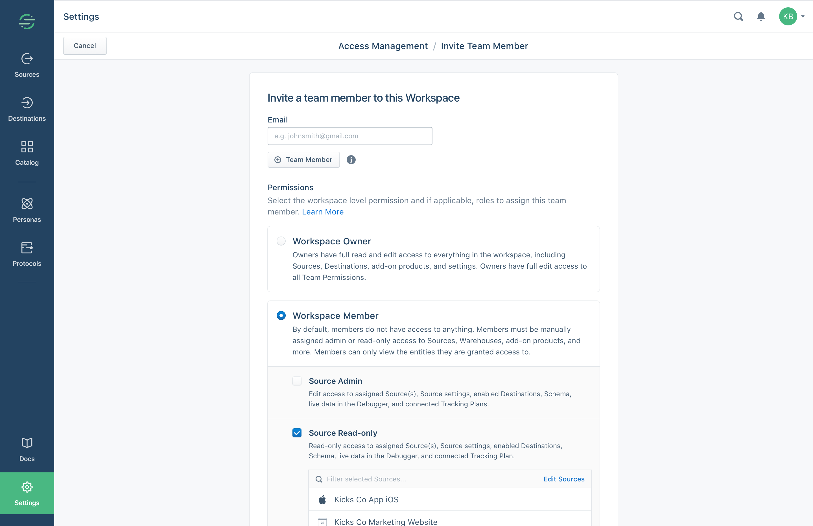
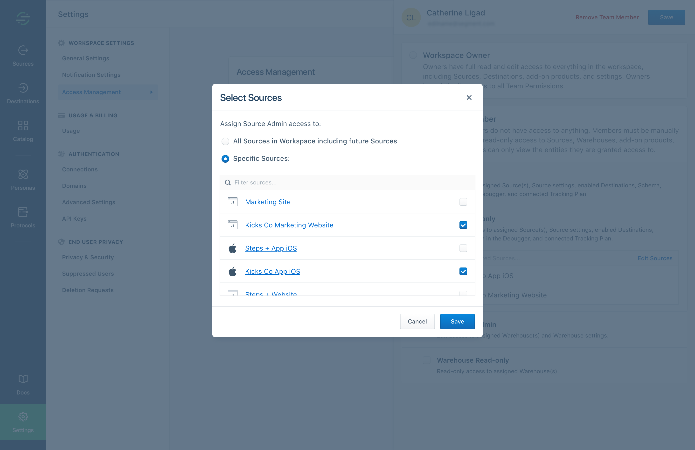
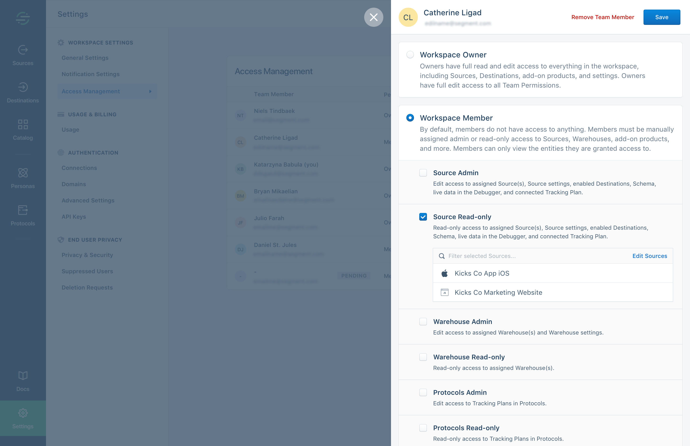

This page explains how to add members to your team's workspace, how to change their permissions, and how to remove them.

## Invite a new team member

1. Navigate to the **Workspace settings** then to **Access management**. (Only Workspace owners can access this section.)

   
2. Click **Invite Team Member**.
3. Enter the user's email address and choose their roles.

   _Note: If you are on a Free or Team plan, only the `workspace owner` and `source admin` roles are available._
   

4. Click **Edit Sources** to pick individual sources (or warehouses, tracking plans, etc. depending on the role)
   

## Change a team member's access

1. Navigate to **Access management**. Search by name or email to locate the member.
   

2. Review the current permissions in the table.
3. Click the member to see details.
   

4. Select or deselect roles, and choose the specific sources/warehouses/tracking plans to grant access to.

  _Note: you can also grant the role for all current and future resources. For admin roles, this includes the ability to create new resources._
  

## Remove a team member

Open the member details and click **Remove Team Member** at the top.

