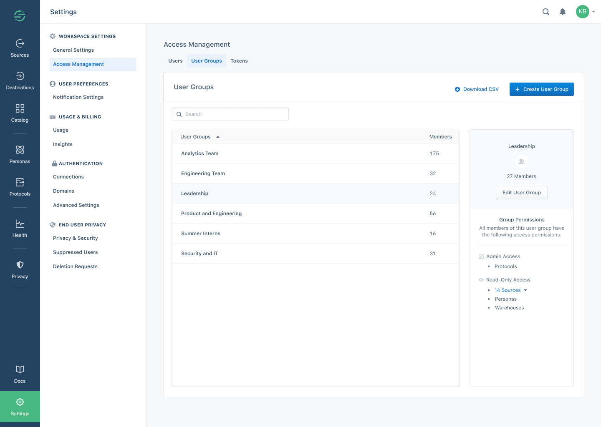
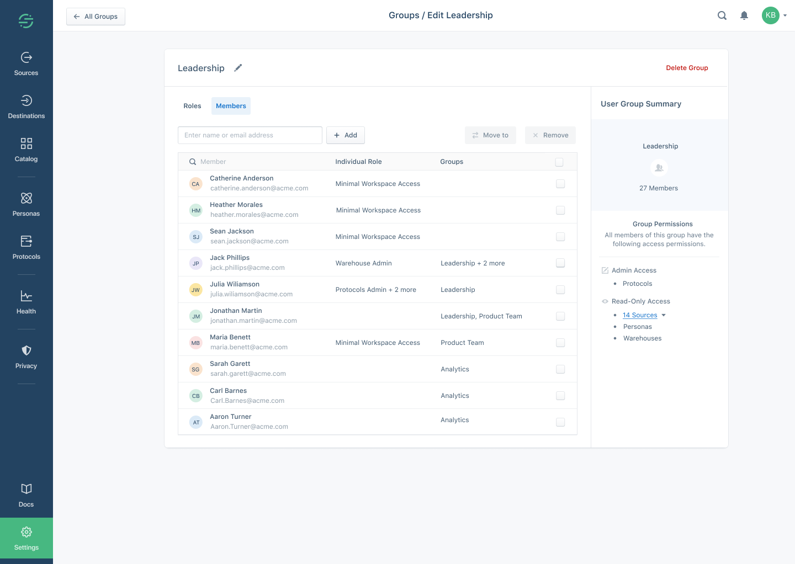



This page explains how to add [Team Members](/docs/segment-app/iam/concepts/#team-members) and [User Groups](/docs/segment-app/iam/concepts/#user-groups) to your team's workspace, how to assign them [roles](/docs/segment-app/iam/roles), and how to remove them.

> info ""
> **Note**: Only Workspace Owners can change a workspace's Access Management settings.

## Invite a new team member

> info ""
> **Note**: Workspaces that are on Free or Team plans can only grant the `workspace owner` and `source admin` roles.

1. Navigate to the **Workspace settings** then to **Access management**. (Only Workspace owners can access this section.)
2. Click **Invite Team Member**.
3. Enter the user's email address and choose their roles, OR assign them to a user group (if available).
4. Select the roles to grant to the user, and choose any specific resources to grant them access to. See the [Roles documentation](/docs/segment-app/iam/roles/) for more information.

## Change a team member's access

1. Navigate to the **Workspace settings** > **Access management** and click the **Users** tab.
2. Enter the user's name or email to search for their member record.
2. Review the current permissions in the table.
3. Click the member to see details.
4. Select or deselect roles, and choose the specific resources to grant access to.

> success ""
> **Tip**: You can also grant the role for all current and future resources. For admin roles, this includes the ability to create new resources.

## Create a new User Group

Workspace Owners can manage permissions for groups of team members who should have similar access using "user groups".

1. Navigate to the **Workspace settings** > **Access management** and click the **Groups** tab.
2. Click **Create User Group**.
3. Enter a name for the group.
4. Select or deselect roles, and choose the specific resources to grant the group access to.
5. Add team members to the group.
   You can search by name or email to locate the team member(s).
6. Review the group permissions in the panel on the right, and click **Create User Group** to save the new group.

## Add a team member to a User Group

You can make changes to group membership from two places in the Segment App: From the Edit Team Member page (the user's individual access page), and from the Edit User Group page, where you can see all members of the group.

To add a team member from the **Edit Team Member** page:
1. Navigate to the **Workspace settings** > **Access management** and click the **Members** tab.
2. Select the team member you would like to add to the group.
3. Click **Add User Group**.
4. Select the user group(s) to add the team member to.
5. Click **Save**.

> success ""
> **Tip**: This method is best when adding a *single* team member to one or more user groups.

To add a team member from the **Edit User Group** page:
1. Navigate to the **Workspace settings** > **Access management** and click the **Groups** tab.
2. Select the User Group you want to add new users to.
3. Click **Edit User Group** in the panel on the right.
4. Click the **Members** tab and click **+ Add**.
5. Add team members to the group. Search by name or email to locate the team member(s).
6. Click **Save**.

> success ""
> **Tip**: This method is best when adding more than one user to a single user group at the same time

## Remove a team member from a User Group

1. Navigate to the **Workspace settings** > **Access management** and click the **Groups** tab.
2. Select the User Group you would like to modify.
3. Click **Edit User Group** in the panel on the right.
4. Navigate to the **Members** tab and select the team members you would like to remove.
5. Click **Save**.

## Remove a team member from your workspace

Open the member details and click **Remove Team Member** at the top.

## Team Management with Single Sign On

If you are on a Business plan and choose to use Single Sign On (SSO), you grant implicit access to your workspace by assigning team members access to Segment from your identity provider. By default, you grant these users **minimal workspace access**.

Segment supports "Just-In-Time" user provisioning using SSO. Any users with access to the application as defined in your IDP can seamlessly create a Segment account when they first log in. By default, all automatically-provisioned users created this way are created as Workspace Members with Minimal Workspace Access.

Once they have been created, Workspace Owners can update these users' access from the **Access Management** page in the Segment App.

Segment does not support programmatic de-provisioning at this time. However, if your workspace uses SSO, a user that cannot authenticate to your IDP cannot view or edit any of your workspaces or their contents.

## Request Access

If you are a [workspace member](/segment-app/iam/roles), you might encounter a section of the Segment App that you do not have access to view. If you need expanded permissions, you can request access directly in the Segment App. Once submitted, Access requests are sent to all workspace owners by email.

To review an access request, workspace owners click the link in the access request email to go to their workspace's Access Management Settings. The requestor's access request message appears on the Segment Access Management page, and the workspace owner can adjust the user's permissions. The access request message disappears after the permissions are updated.
