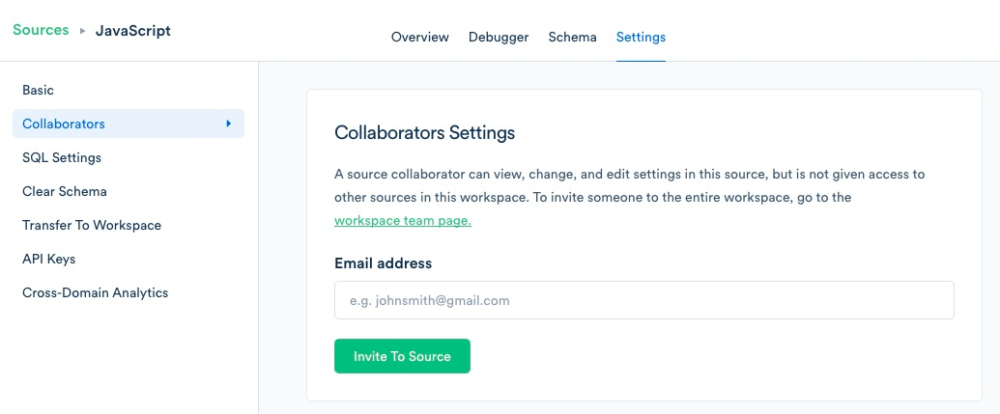

## What do team members have access to?
Is there special permissioning to allow access to only certain sources?

> warning "Deprecated"
> **This section is being deprecated, refer to [IAM](/docs/segment-app/iam/) going forward**

All team members on an account have access to make changes anywhere in the workspace. If you would like to have special permissioning to specific Sources we do offer this as a feature on our Business Tier plans, contact our sales to to learn more! 

## Business Tier Only — Permission Levels

At present, Business Tier workspaces can have **Owners,** **Read-Only Members,** and **Source Collaborators. **

**Workspace Owners** have full access to the workspace with the ability to view and update settings and create, view, update, and delete sub-resources like Sources and Destinations. 

**Read-Only Members** can view any Source or sub-resource to see their layout, settings, and live data in the Debugger, but they cannot create or modify any Sources or Destinations. Read-Only Members can also view workspace settings, but cannot modify any settings.

**Source Collaborators** can be added on a per-Source basis and have full access to the Source with the ability to view and update settings and create, view, update, and delete Destinations on the Source.

To update your team members' roles, go to Workspace Settings > Team Settings, and select the appropriate role. 

To add a Source Collaborator, navigate to the Settings page for a given Source, and click Collaborators from the left-hand menu.

