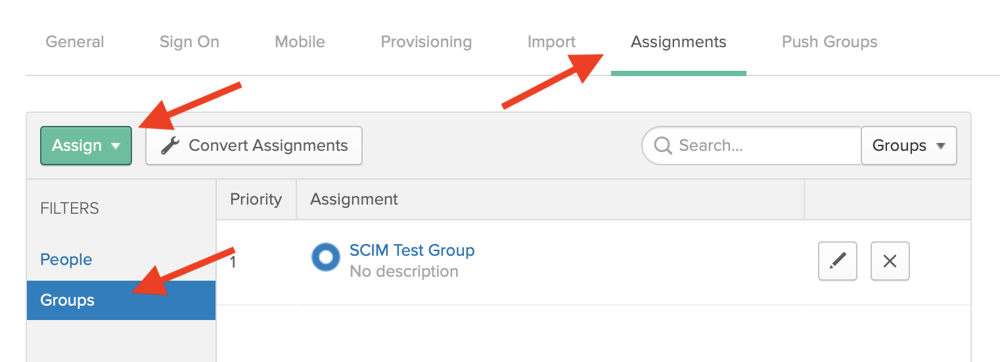
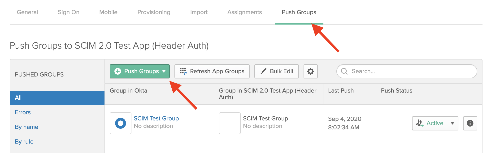



The SCIM specification is designed to make managing user identities in cloud-based applications like Segment easier. SCIM allows your Identity Provider (IdP) to manage users and groups within your Segment workspace.

Most IdPs offer SCIM, and it complements SAML. You can think of SAML as a way for your employees to authenticate and SCIM as a way to make sure they have the appropriate permissions.

## Requirements

Before you start, remember that SSO is only available to Business Tier customers, and that only workspace owners may configure SSO connections.

To set up SCIM, you must first create an SSO connection. Once you [create your SSO connection](https://segment.com/docs/segment-app/iam/sso/), log back in to Segment using SSO.

## Configuration Instructions

Segment officially supports [Okta](#okta-set-up-guide), [Azure AD](#azure-ad-set-up-guide), and [OneLogin](#oneLogin-set-up-guide). Each link includes specific set up instructions for that IdP. You should read the [features](#features) section of this page to understand which features of SCIM Segment supports.

You may still be able to use SCIM with another Identity Provider (IdP) by adapting the following instructions.

### Base URL

Your IdP needs to know where to send SCIM requests. The Segment base URL is: https://scim.segmentapis.com/scim/v2

### API Key

The other value you need is an API key (sometimes referred to as an Authorization Header). To generate one, go to **Settings > Advanced Settings** in the Segment app, and find the **SSO Sync** section. Click **Generate SSO Token** and copy the generated token. Use this token for the API key or Authorization Header in your IdP.

This page is located as part of the settings sidebar: https://app.segment.com/CUSTOMER_WORKSPACE_SLUG/settings/advanced

## Features

It's important to remember that Segment has a multi-tenant user/workspace relationship, meaning that users can be part of more than one workspaces. In most cases these workspaces are all related to a single customer (for example, a single company might have individual workspaces for different brands or subsidiaries). However, some users can be members of workspaces for different Segment customers, such as with contractors or consultants.

Because of this, Segment must balance the autonomy of our users with the desired level of control of a workspace owner.

## Creating Users

Even though Segment users exist separately from workspaces, your IdP can create a new Segment user or add an existing Segment user to your workspace using the same IdP workflow. This process is transparent to the IdP and to you as the customer. In other words, you don't need to know if a user exists before adding them to your workspace.

If the person you want to add does not have a Segment account, your IdP will create one. If the person already has a Segment account, you can still add them to your Workspace using your IdP, but it **does not create a new Segment account**.

You can create new users and set their `userName` (email) and `displayName` (single value field that represents a user's full name) using your IdP.

If a user already has a Segment account, you can add them using their email address using your IdP. However, Segment ignores the `displayName` sent by the IdP, and instead uses the name chosen by the user when they created their account.

## Updating User Attributes

Segment user profiles only contain a `userName` (email) and `displayName`. Once you create a user, you cannot update these attributes using SCIM. They can only be updated by the user through the Segment UI.

## Deleting or Deactivating Users

Segment workspace owners _cannot_ **delete** Segment workspace member accounts using SCIM, the web UI, or the Segment API. A user must delete their own account using the Segment app. Workspace owners _can_ **remove members from the workspace** using SCIM, the web UI, or the Segment API.

Some IdPs want to set users as "inactive" or "active." Segment does not have an "inactive" state for user accounts. Similar functionality can be achieved by removing a user from your workspace. Setting an existing Segment user to "active" is similar to adding that user to the workspace.

When your IdP updates a user to set `active: false`, or attempts to delete a user, Segment removes the user from your Segment workspace. If your IdP attempts to create a user with an existing email, or set `active: true` on an existing user, Segment adds that existing user account to your workspace.

Any Segment group memberships **must be reassigned** when a user is removed and re-added from your workspace. Newly added workspace users have the "Minimal Workspace Access" permission by default. The "Minimal Workspace Access" role does not have access to any sources, destinations, etc.

This reassignment might happen automatically depending on how you configured your IdP. If the user was assigned groups using your IdP, your IdP should automatically re-add the user within Segment. For this reason, Segment **strongly** recommends that you create groups in your IdP, push them into Segment, and maintain an active link between your IdP and Segment.

## Creating Groups

Your IdP can create new groups in Segment using SCIM. All groups created using SCIM start with "Minimal Workspace Access." The "Minimal Workspace Access" permission does not have access to any sources, destinations, etc. To add more permissions to a group you must use the Segment web app.

## Updating Groups

Your IdP can add or remove workspace members from existing groups via SCIM. Your IdP can also update Segment group names.

## Deleting Groups

Your IdP can use SCIM to delete groups from your Segment workspace. Deleting a group in Segment does **not** remove its members from your workspace. To remove members from the workspace, unassign the users from Segment from your IdP, then Segment removes them from the workspace.

## Attribute Mapping

When you integrate Segment SCIM and your IdP you might need to map attributes for users. The only attributes that Segment SCIM supports are `userName` and `displayName`. You should leave any existing mapping for the `email` SAML attribute, which you might have set up during your initial SSO set up. This mapping supports SAML authentication, and is separate from setting up SCIM, but may be within the same page depending on your IdP.

You'll need to map an email (IdP) to `userName` (Segment). Depending on your IdP this attribute might be called `email` or `mail`. If your IdP uses emails for usernames, you can map `userName` (IdP) to `userName` (Segment).

If your IdP supports the `displayName` attribute, you can map it directly to the Segment `displayName` attribute. If it does not, most IdPs can create a "macro mapping" which allows you to map more than one field to a single field in Segment.

For example, you might map `{firstName} {lastName}` from your IdP to `displayName` in Segment. If your IdP doesn't support this, you can map `firstName` (IdP) to `displayName` (Segment).

## Okta Set up Guide

1. [Complete the Okta Set up Guide for SSO](https://saml-doc.okta.com/SAML_Docs/How-to-Configure-SAML-2.0-for-Segment.html?baseAdminUrl=https://segment-admin.oktapreview.com&app=segment&instanceId=0oata15py1n3kQUo50h7)
2. Click **Provisioning**, then click **Configure API Integration** and select **Enable API Integration**.
3. [Generate an API key](#api-key), then copy and paste this value into the **API Token** field in Okta, and click **Save**.

   

4. Next, select **To App** in the left sidebar of the **Provisioning** tab. Click **Edit** and select both **Create Users** and **Deactivate Users**. Click **Save**.
5. Click the **Assignments** tab. You can now assign people or groups. Before you continue, read through the [features section](#features) in this doc to make sure you understand how groups work. Segment recommends that you assign users to the Segment app by Okta group. This allows you to manage which groups in your organization can authenticate to Segment. You can also assign users individually.

   

6. Once you assign your users, push the assigned Okta groups to Segment.

   

7. Next, go to the Segment app and assign permissions to these groups.

> success ""
> **Tip**: You can also link Okta groups to an existing group from in the Segment app using the Okta UI.

## Azure AD Set up Guide

Instructions for configuring Azure AD can be found on the Microsoft Docs website.

1. [Complete the Azure AD Set up Guide for SSO](https://docs.microsoft.com/en-us/azure/active-directory/saas-apps/segment-tutorial)

2. [Complete the Azure AD Set up Guide for SCIM](https://docs.microsoft.com/en-us/azure/active-directory/saas-apps/segment-provisioning-tutorial)

## OneLogin Set up Guide

Instructions for configuring OneLogin can be found on the OneLogin Docs website.

1. Add and configure the Segment SSO integration from within the OneLogin application

2. [Complete the OneLogin Set up Guide for SCIM](https://onelogin.service-now.com/support?id=kb_article&sys_id=a7833cd7db3a30501c167e77f4961923)
