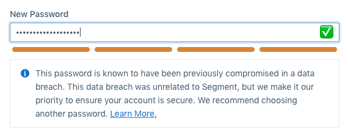

Picking a strong password is one of the most important things you can do to protect your account.

### Under the Hood

When you first create a Segment account, or when you reset or change the password of an existing account, you'll see some tools which Segment uses to help you choose a strong password. We use [zxcvbn](https://blogs.dropbox.com/tech/2012/04/zxcvbn-realistic-password-strength-estimation/) to show your password strength, and [Have I Been Pwned](https://haveibeenpwned.com/Passwords) to notify you if your password has been found in any data breaches. Your password is never stored in plaintext, and is securely stored using the [bcrypt](https://en.wikipedia.org/wiki/Bcrypt) password hashing function in our database.

### General Guidance

Here are some general password guidelines:

*   Use a password manager like [1Password](https://1password.com) or [LastPass](https://www.lastpass.com) to generate and store passwords.

*   Passwords should be 8 or more characters. Consider using pass-phrases (for example,  `customer data infrastructure`), combinations of random characters (for example,  `9;ske%t!u9jdckd#s>`), or other strategies that are difficult to guess, such as `icOnsTent CaPitaliZation`.

*   Use a different password for every website. If you use the same password on multiple websites and one is breached, your accounts on all of these websites may be affected.

*   Do not share your password with anyone, even your co-workers. Once shared, they may use that password on another site or share it with another co-worker without telling you. If one of them leaves the company they will still be able to take actions under your account.

### Has my password been compromised?

If you see a message that says "This password is known to have been previously compromised in a data breach", it means that the password you typed has been used before, and was in a database that was compromised and put on the internet. This does **not** mean that Segment has been compromised, or that someone has accessed your Segment account. Check out [Have I Been Pwned](https://haveibeenpwned.com/Passwords) for more information, and choose a different password.

