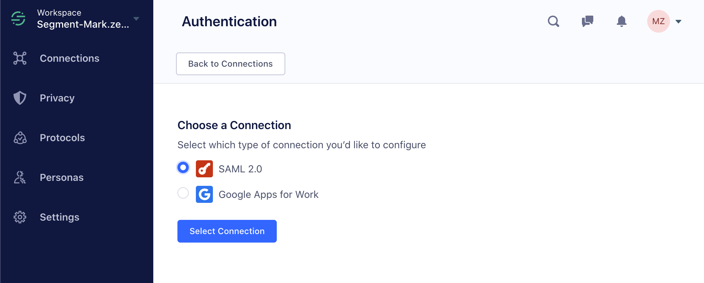

Segment supports Single Sign On for Business Tier accounts. You can use any SAML-based Identity Provider (IDP), for example Okta, Bitium, OneLogin, or Centrify, or use GSuite to serve as your identity provider, delegating access to the application based on rules you create in your central identity management solution.

With SSO, you have centralized control over your users' ability to authenticate or not in your IDP, and can also enforce rules like two-factor auth or password rotation at the IDP level.

You can configure as many IDP connections to your workspace as you'd like in order to support IDP-initiated authentication. This allows seamless migration from one system to a new one, for example if your organization switched IDP vendors or switched from GSuite to a dedicated SAML IDP like Okta or OneLogin.

To enable SSO-based login from the Segment login page (app.segment.com/login), you must first verify that you own the domain, and connect it to your organization's Segment account. Once you have done that, SSO users from your domain can use the Segment login page to access your default Segment workspace.

 The Segment login page can only be connected to one workspace. To use your IDP with multiple workspaces, you will have to initiate login to the other workspaces from the IDP instead of through the login portal.

## Setup — SAML

Segment's SSO configuration is entirely self-service; we don't require any back and forth with our team in order to test and enable the feature on your workspace. However, we are here to help! don't hesitate to [get in touch](https://segment.com/help/contact/) if you run into any questions or issues.

To get started, go to your workspace settings and choose the "Connections" tab under "Authentication" and click "Add New Connection." Follow the steps to create a SAML connection.

## Prepare your IDP for the connection.

To get started, you'll need to create an application in your IDP. We're in the process of rolling out officially supported apps with the most popular IDPs, but in the meantime you can create a custom SAML-based application.

Your provider will ask you for a few things from Segment, which we provide in the setup flow:

### A few gotchas to look out for:

*   For GSuite configurations, make sure the Start URL field in Service Provider Details is left blank.

*   Different IDPs have different nomenclature for the Audience URL. Some call it "Audience URI," some call it "Entity ID", some call it "Service Provider Entity ID." It's likely there are only two required fields without correct defaults, and they correspond to the SSO URL and Audience URL values above.

*   In all IDPs we've worked with, the default NameID option is the correct one. Make sure it's using the emailAddress schema.

*   In all IDPs we've worked with, the default connection encryption options are the correct ones. (Signed Response & Assertion Signature with SHA256, Unencrypted Assertions).

*   Different IDPs store records of your employees differently. The only attribute mapping we require is to make sure you're sending `email` . In Okta this is at `user.email`. In Duo this is `mail`.

*   Make sure you've enabled "send all attributes" (not just NameID) if applicable for your IDP.

*   No RelayState is required. This is also sometimes called `Target`.

Once you've created the application in your IDP, you can come back to Segment and click "Next".

## Configure Segment to Talk to Your IDP.

Your IDP will provide a URL and x.509 certificate. Copy them into their respective fields in Segment.

Once you do that, click "Configure Connection." you're all set!

## Test your connection with IDP-initiated SSO.

Back at the connections page, make sure your connection is enabled with the switch on the right.

You can now test via IDP-initiated SSO (by clicking login to Segment from within your IDP) is working correctly. If not, please double check the IDP configuration gotchas section above.

## Setup — GSuite

GSuite configuration is incredibly simple with Segment. To get started, go to your workspace settings and choose the "Connections" tab under "Authentication" and click "Add New Connection." Follow the steps to create a "Google Apps For Work" connection.

You simply enter your domain (or, if you've verified it already, choose it from the dropdown) and then click the resulting link to authorize the connection.

## Enabling Segment-initiated login

Segment supports "interruption" on the login page for emails that match your workspace's domain.

In order to enable this, you'll need to verify your domain with Segment. To do that, go to the "Domains" tab under "Authentication" in the workspace settings page.

Enter your domain and click "Add Domain." When you click verify, you're given two options to verify your domain, either via a meta tag to add to your `/index.html` at the root or a DNS txt record that you can add via your DNS provider. Once you do so and click verify, you're ready to go!
> note ""
> **Note**: domain tokens expire 14 days after they are verified.

## FAQ

**Do you support automatic user provisioning?**

Segment supports "just in time" user permissioning; new users who authenticate via your IDP are automatically created in Segment as read-only members.

If the user already exists in Segment then we will associate your IDP identity with your existing Segment user account.

**Do you support automatic user de-provisioning?**

No. However, since any non-owners must log in with SSO to access your workspace, once you remove their authorization in your IDP they will no longer be able to access your workspace.

**Will my users lose access to their other workspaces when I enable SSO?**

Segment allows users to own their own workspaces. While your IDP authentication will ensure that any non-owners must have logged in with SSO to access _your workspace_, they can still log into Segment with username and password to access their own workspaces.

**Can I still invite people outside the organization?**

Workspace owners can invite additional owners with any domain via the traditional invite mechanism.
If the workspace is configured to require SSO, and the user is not on your IdP, you can add an Exemption under Workspace Settings > Authentication > Advanced Settings.

**How do I configure SSO to access multiple workspaces?**
If you would like to use SSO for multiple workspaces, your admin has to configure access to each workspace as a separate app in your identity provider.
