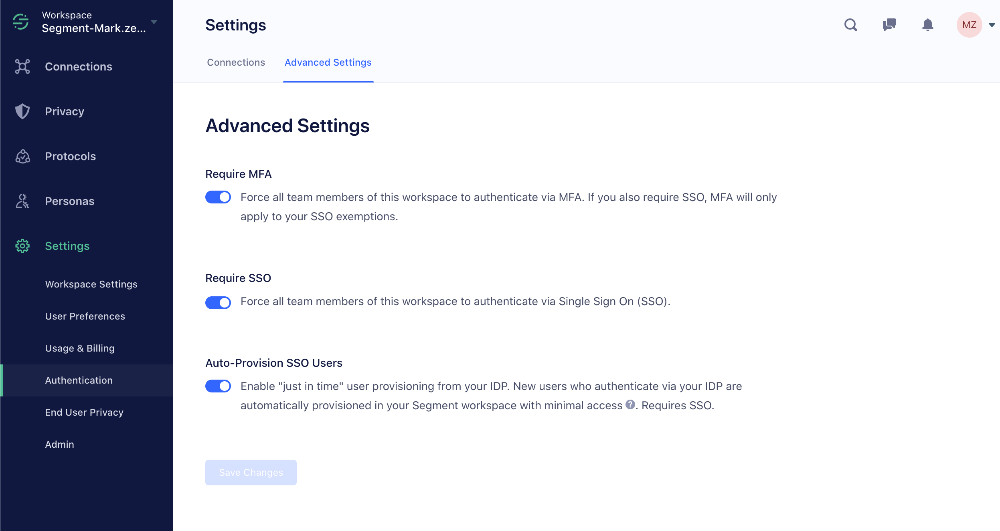

Segment supports Single Sign On for Business Tier accounts. You can use any SAML-based Identity Provider (IdP), for example Okta, Bitium, OneLogin, or Centrify, or use GSuite to serve as your identity provider, delegating access to the application based on rules you create in your central identity management solution.

With SSO, you have centralized control over your users' ability to authenticate or not in your IdP. You can also enforce rules like two-factor authentication or password rotation at the IdP level.

You can configure as many IdP connections to your workspace as needed to support IdP-initiated authentication. This allows seamless migration from one system to a new one, if, for example, your organization switches IdP vendors or switches from GSuite to a dedicated SAML IdP like Okta or OneLogin.

To enable SSO-based login from the Segment login page (app.segment.com/login), you must first verify that you own the domain, and connect it to your organization's Segment account. Once you have done that, SSO users from your domain can use the Segment login page to access your default Segment workspace.

The Segment login page can only be connected to one workspace. To use your IdP with multiple workspaces, you will have to initiate login to the other workspaces from the IdP instead of through the login portal.

## Set up — SAML

Segment's SSO configuration is entirely self-service. Additionally, Segment has prebuilt connections with [Okta](https://www.okta.com/integrations/segment/){:target="_blank"}
, [OneLogin](https://www.onelogin.com){:target="_blank"}, and [Microsoft Entra ID](https://learn.microsoft.com/en-us/entra/identity/saas-apps/segment-tutorial){:target="_blank"}
 which can help you get set up faster. [Reach out to support](https://segment.com/help/contact/){:target="_blank"} if you run into any questions or issues.

To get started, go to your workspace settings and navigate to **Authentication > Connections > Add new Connection**. Follow the steps to create a SAML connection.

## Prepare your IdP for the connection.

Segment officially supports apps for Okta, Microsoft Entra ID, and OneLogin. Next, find Segment in your IdP's app catalog, and follow the set up instructions they provide.

If you're using a different IdP, you must create a custom SAML-based application.

Your provider will ask you for a few things from Segment, which Segment provides in the setup flow:

### A few gotchas to look out for:

- For GSuite configurations, make sure the `Start URL` field in Service Provider Details is left blank.

- Different IdPs have different names for the Audience URL. Some call it "Audience URI", some call it "Entity ID", some call it "Service Provider Entity ID." It's likely there are only two required fields without correct defaults, and they correspond to the `SSO URL` and `Audience URL` values above.

- In all IdPs Segment works with, the default `NameID` option is the correct one. Make sure it's using the `emailAddress` schema.

- In all IdPs Segment works with, the default connection encryption options are the correct ones. (Signed Response & Assertion Signature with SHA256, Unencrypted Assertions).

- Different IdPs store records of your employees differently. The only attribute mapping Segment requires is to make sure you're sending `email` . In Okta this is at `user.email`. In Duo this is `mail`.

- Make sure you've enabled "send all attributes" (not just NameID) if applicable for your IdP.

- No `RelayState` is required. This is also sometimes called `Target`.

Once you create the application in your IdP, you can come back to Segment and click "Next".

## Configure Segment to Talk to Your IdP.

Your IdP provides a URL and x.509 certificate. Copy them into their respective fields in Segment.

Then, click "Configure Connection."

You're all set.

## Test your connection with IdP-initiated SSO.

Back at the connections page, make sure your connection is enabled with the switch on the right.

You can now test using IdP-initiated SSO (by clicking login to Segment from within your IdP) is working correctly. If not, double check the IdP configuration gotchas section above.

## Require SSO.

For most customers, Segment recommends requiring SSO for all users. If you do not require SSO, users can still log in with a username and password. If some members cannot log in using SSO, Segment also supports SSO exceptions.

These options are off by default, but configurable on the "Advanced Settings" page.

## Setup — GSuite

To configure GSuite for use with Segment, go to your workspace settings and choose the "Connections" tab under "Authentication" and click "Add New Connection." Follow the steps to create a "Google Apps For Work" connection.

You simply enter your domain (or, if you've verified it already, choose it from the dropdown) and then click the resulting link to authorize the connection.

## Enabling Segment-initiated login

Segment supports SSO on the login page for emails that match your workspace's domain.

In order to enable this, you'll need to verify your domain with Segment. To do that, go to the "Domains" tab under "Authentication" in the workspace settings page.

Enter your domain and click "Add Domain." When you click verify, you're given two options to verify your domain, either using a meta tag to add to your `/index.html` at the root, or a DNS text record that you can add through your DNS provider. Once you do so and click verify, you're ready to go.

> note ""
> Domain tokens expire 14 days after they are verified.

## Configuring SSO to access multiple workspaces
To configure SSO for multiple workspaces, your admin must configure access to each workspace as a separate app in your identity provider. You are unable to use verified domain(s) across multiple workspaces and will encounter the following error if you add a domain that is already verified in another workspace:

> warning ""
> **Warning**: This domain has already been claimed.

Once your admin has configured separate apps for each workspace in your IdP, the end-users can log in to the IdP and click on the relevant app for the workspace you are trying to access. This is also referred to as IdP-initiated SSO.

Two limitations do exist when multiple workspaces are configured to SSO access:
- Users will only be able to log in to the domain-verified workspace on Segment’s login page.
- Users must switch workspaces using IdP-initiated SSO, as they are unable to switch directly using the Segment UI.

## Okta setup

The Okta/Segment SAML integration supports the following features:

- IdP-initiated SSO
- SP-initiated SSO
- JIT (Just-in-time) provisioning

For more information on these features, visit the [Okta Glossary](https://help.okta.com/en-us/content/topics/reference/glossary.htm){:target="_blank"}.

### Configuration steps

To set up the Okta/Segment SAML integration, you'll first carry out several steps in Segment, then finish in Okta.

#### Segment steps

Follow these steps in Segment to set up the Okta/Segment SAML integration:

1. Log in to Segment as an administrator.
2. Navigate to **Settings > Authentication > Connections**, then click **Add new Connection**.
3. Select **SAML 2.0**, then click **Select Connection**.
4. On the **Configure IDP** page, copy your Customer ID, which you'll find after `?connection=` in the **Single Sign-on URL** field. You'll need this ID for a later step. 
    - For example, if your Single Sign-On URL is `https://acme.domen.com/login/callback?connection=a1b2c3d4`, your Customer ID is `a1b2c3d4`.
5. Click **Next**.
6. On the **Configure Connection** page, enter your SAML 2.0 Endpoint and Public Certificate. You can generate both in your Okta Admin Dashboard. After you've entered both, click **Next**.
7. (Optional:) Enter your domain, click **Add Domain**, then click **Verify**.
    -  When you click verify, Segment gives you two options to verify your domain: using a meta tag to add to your `/index.html` file at the root, or a DNS TXT record that you can add through your DNS provider. Domain tokens expire 14 days after they are verified.
    - **Carry out Step 7 only if you want to enable SP-initiated flow**, otherwise click **Skip**.
8. Return to **Settings > Authentication > Connections** and toggle the **Active** switch to enable your SAML configuration.

#### Okta steps

Finish setting up the Okta/Segment SAML integration by carrying out these steps in Okta:

1. In Okta, select the **Sign On** tab for the Segment SAML app, then click **Edit**.
2. Enter the Customer ID you copied in Step 4 of the Segment steps.
3. For **Application username format**, select **Email**.
4. Click **Save**.

You've now completed setup.  For SP-initiated SSO, follow these steps:

1. Go to `https://app.segment.com`.
2. Enter your email, select **Single Sign-On**, then click **Log In**.

## SSO Frequently Asked Questions



Segment supports "just in time" user permissioning; new users who authenticate using your IdP are automatically created in Segment as minimal-access (read-only) members. If the user already exists in Segment then Segment associates the IdP-identity with the existing Segment user account. Segment also supports user provisioning and role mapping [using SCIM](/docs/segment-app/iam/scim/).


Yes, users can be automatically de-provisioned [if you use SCIM](/docs/segment-app/iam/scim/).



Segment allows users to own their own workspaces. While your IdP authentication will ensure that any non-owners must have logged in with SSO to access _your workspace_, they can still log into Segment with a username and password to access their own workspaces.



Workspace owners can invite additional owners with any domain using the traditional invite mechanism. If the workspace is configured to require SSO, and the user is not on your IdP, you can add an Exemption under **Workspace Settings > Authentication > Advanced Settings**.



To use SSO for multiple workspaces, your admin must configure access to each workspace as a separate app in your identity provider.


