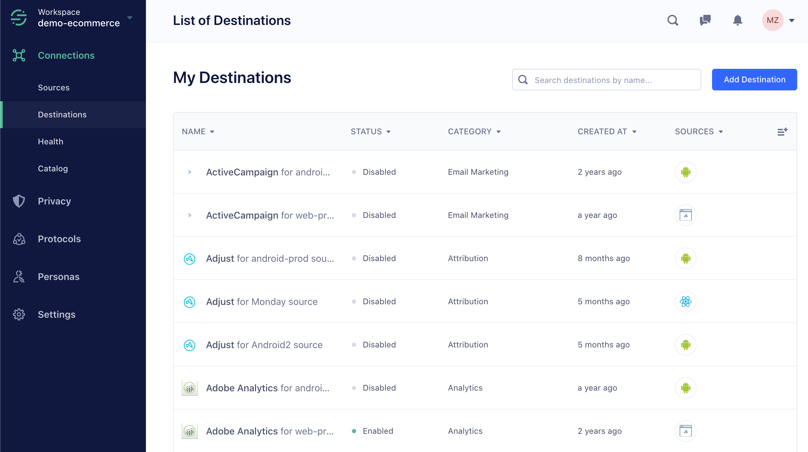
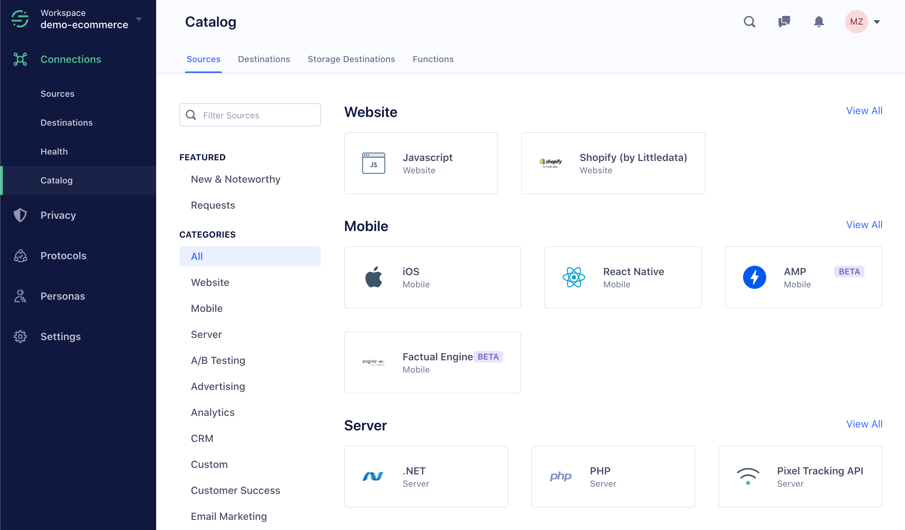
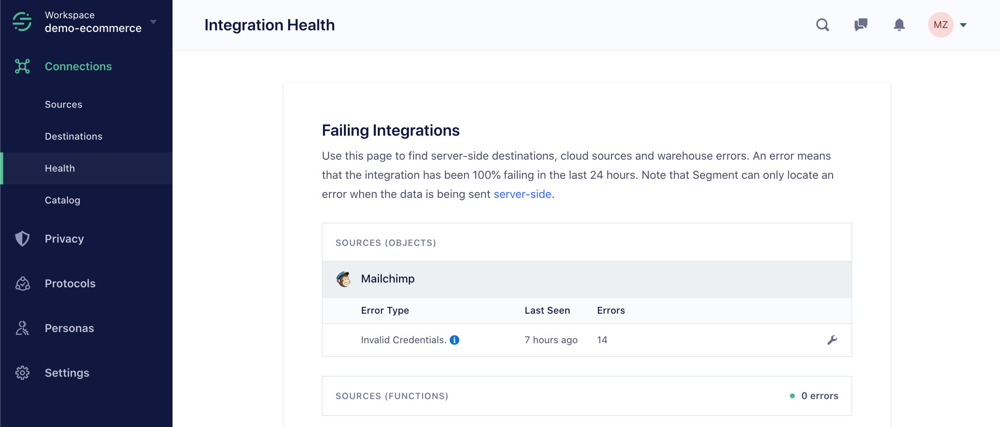

When you first log in, you go to your workspace. (If you're a member of several workspaces, you get to choose which one to go to.) Workspaces organize sets of sources and destinations into a central location.



### What's a Workspace?



## Workspace Overview page

This is a Segment workspace.

The first thing you see is a graph of the sources and destinations you have connected to Segment. Sources send data to your workspace: these are your mobile apps, server sources, and website-based sources. Destinations are tools which get the data, and can also include warehouses, which just store large amounts of data for later reuse and analysis.

The graph on this overview page includes lines which can show you which sources send data to which destinations. If this is the first time you're looking at your workspace and you haven't set it up yet, it won't look quite like this.

In the left navigation bar, you see the main parts of the Segment application: [Sources](/docs/connections/sources/), [Destinations](/docs/connections/destinations/), [Privacy](/docs/privacy/), [Engage](/docs/engage/), and [Protocols](/docs/protocols/), if your subscription includes them.

You can also find the Catalog in the left navigation, which lists the sources you can collect data from, and the destinations you can send data to.

You can always click the Segment logo in the top left corner to get back to the Overview page.

## Sources

The Sources tab lists everything that is sending data to your Segment workspace. Sources are organized by type: website, mobile, sever, or by cloud-app type, like CRM or payments.

Each source has a status and a list of destinations. A source's status tells you whether or not the source is sending data to Segment, and how long it's been since Segment last saw data from the source. The source's destinations list shows you which destinations are receiving data from that source. You can expand them for more detail.

## Destinations

The Destination tab lists all of the destinations connected to your workspace. These are sorted into categories like analytics, email marketing, and other tool types. The list also shows whether or not Segment is sending data to that tool, or if the tool is enabled or disabled.

## The Segment Integration Catalog

Next up is the Catalog. The catalog includes a list of all [sources](/docs/connections/sources/) and [destinations](/docs/connections/destinations/) available in Segment. You can search either by category or name. When you click on a catalog tile, the tile shows instructions on how to connect the tool to your Segment workspace.

The Catalog is always growing, so check out the "New and Noteworthy" section from time to time to see what's new.

## Engage and Protocols

If you have Engage or Protocols enabled in your workspace, you'll see sections for those too. Engage helps you use your Segment data to build audiences and better understand your users, and Protocols helps you structure and maintain the format of the data you send through Segment.

These features are fairly advanced, but you can learn more about them by [requesting a demo](https://segment.com/contact/sales/), or reading more in the [Engage documentation](/docs/engage/), and the [Protocols documentation](/docs/protocols/).

## Segment Settings

The **Workspace Settings** tab shows more information about your workspace, including your team settings, GDPR requests, and so on. You might not have access to edit these settings.

The **User Preferences** tab shows your individual account settings, including Notification settings. 

The **Activity Notifications** feature in Notification settings provides alerts for specific workspace activities when enabled. These alerts keep you updated on actions taken by other workspace users, excluding activities you initiate. This ensures you're only alerted to actions you're not directly involved in.

The **Usage** tab shows how many API calls or [Monthly Tracked Users (MTUs)](/docs/guides/usage-and-billing/mtus-and-throughput/#how-does-segment-calculate-mtus) your workspace has used this month - which can be important for keeping an eye on your Segment bill.

## Health

The **Health** tab lists any repeated or consistent errors, which can help alert you to misconfigurations or data issues which you can correct.

Issues on the Health tab are sorted by Sources, Destinations, Warehouses, and again by type.

If errors are present, they're sorted by type and include information about how long ago they were last seen and how many times they've occurred. You can click the wrench icon on an individual error line to view the Event Delivery tool and see the erroring payload and response. You can also disable or delete the erroring integration from this menu.

## Privacy Portal

The Privacy Portal allows you to inspect data coming into your Segment account, check it for Personally Identifying Information (PII), classify it based on how sensitive the information is, and then determine which categories of data to send to different destinations. Read more about these tools in the [Privacy Portal documentation](/docs/privacy/portal/).

## Adding an additional Workspace

Select your workspace name in the top left corner of the Segment app. Then select view workspaces at the bottom of the modal that opens.

After clicking 'View all workspaces', you be directed to a page that has all your workspaces to create a New Workspace.

