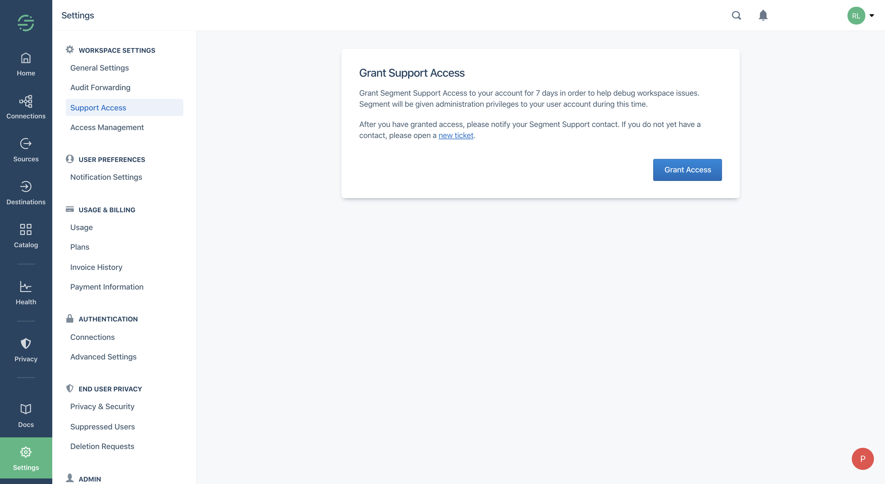
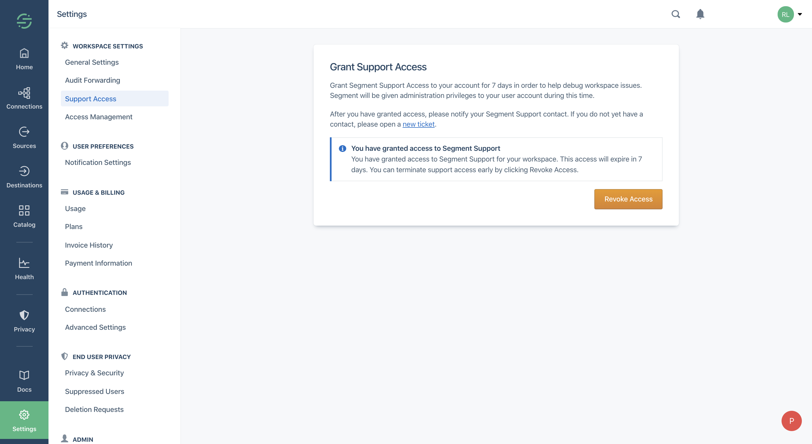

You can contact Segment Product Support by [submitting a ticket](https://segment.com/help/contact/).

If you submit a particularly tricky ticket to our Segment Support Engineers, we might ask you to grant temporary access to your Segment account so we can troubleshoot your issue. Once granted access, a Segment Support Engineer can access your account for up to 7 days. You can also revoke Support Access at any time. This option is always available to you, but you only need to grant access when it is recommended by a Segment Support Engineer.
> note ""
> *Note*: Support Access is not available for workspaces using forced-SSO at this time.

## Granting a Segment Support Engineer access to your account
Support Access is available for all Segment Workspace Owners and can be found under your [Workspace Settings](https://app.segment.com/goto-my-workspace/settings/support-access).

Click **Grant Access** to allow a Segment Support Engineer to access your account.

When Segment Support no longer needs access to your account, simply revoke access at any time.

_The Segment Settings page before granting Support Access_

_The Segment Settings page after granting Support Access_

**What can a Segment Support Engineer do in my account?**
When you grant Support Access, the Segment Support Engineers can do everything that you can do in your workspace.

## How do I know it's working?

Workspace Owners of Business Tier workspaces can view any Support Access actions in the [Audit Trail](/docs/segment-app/iam/audit-trail). You can see and monitor:

- **Support Access Granted** - you enabled Support Access in your Workspace Settings
- **Support Login** - a Segment Support Engineer accessed your workspace with your account
- **Support Access Revoked**  - you revoked Support Access from your account
