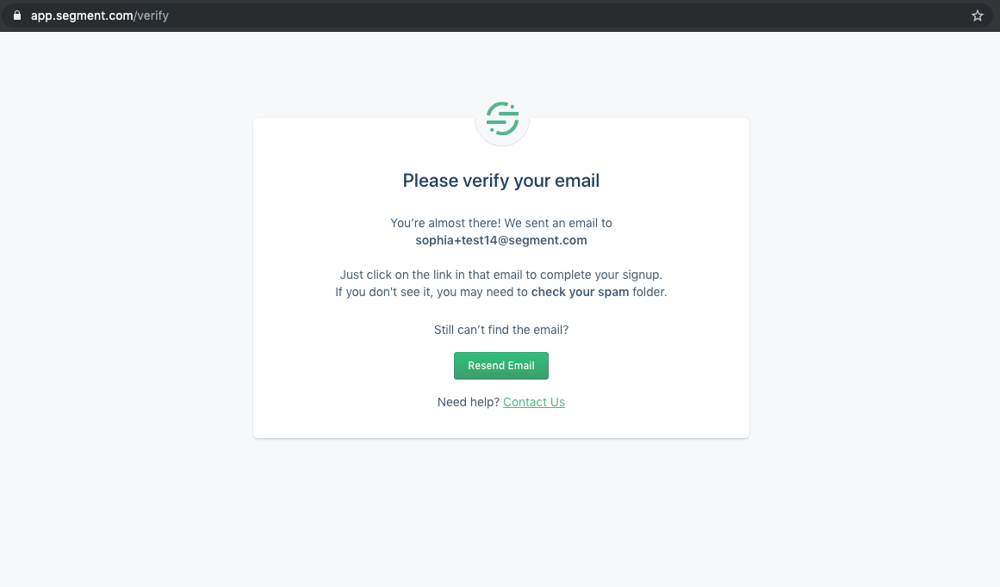

Before you can use your Segment account, you first need to verify your email address. We automatically send a verification message to the address you used to sign, but you can re-send the verification email if you didn't receive it.

If a team member invited you to a Segment workspace, your email is automatically verified if you set up your account from the link in the invitation email.

### Troubleshooting why you didn't get the verification email

You should receive a verification email from Segment within 20 minutes of signing up for a Segment account.

If you don't receive the verification email, check out some of the suggestions below:

1. **Typos**: Check the spelling of your email address. If the spelling is incorrect, sign up again using the correct spelling of the address.

2. **Spam or Junk Folder**: Check your Spam or Junk folder. Verification emails may be filtered directly into your email provider's spam or junk mail folder. Your ISP or corporate domain may be configured to deliver commercial mail to this folder by default.

3. **Web Browser Needs a Refresh**: Try requesting another verification email, and refresh the page of your email web browser.

4. **Blocked or Bounced Address**: If you tried to verify a specific email address but did not receive the verification email, your ISP or corporate domain may have blocked the email. If you haven't received _any_ Segment emails, try verifying an alternative email address or get help.

5. **Role, Group, or Alias Address**: Some role addresses can be verified, but many can't, because more than one person may have access to a role email address (such as `admin` or `dev-ops` emails). You should use a personal email address for your contact and billing address.
