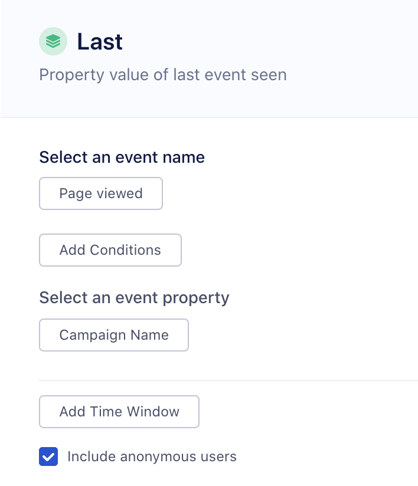
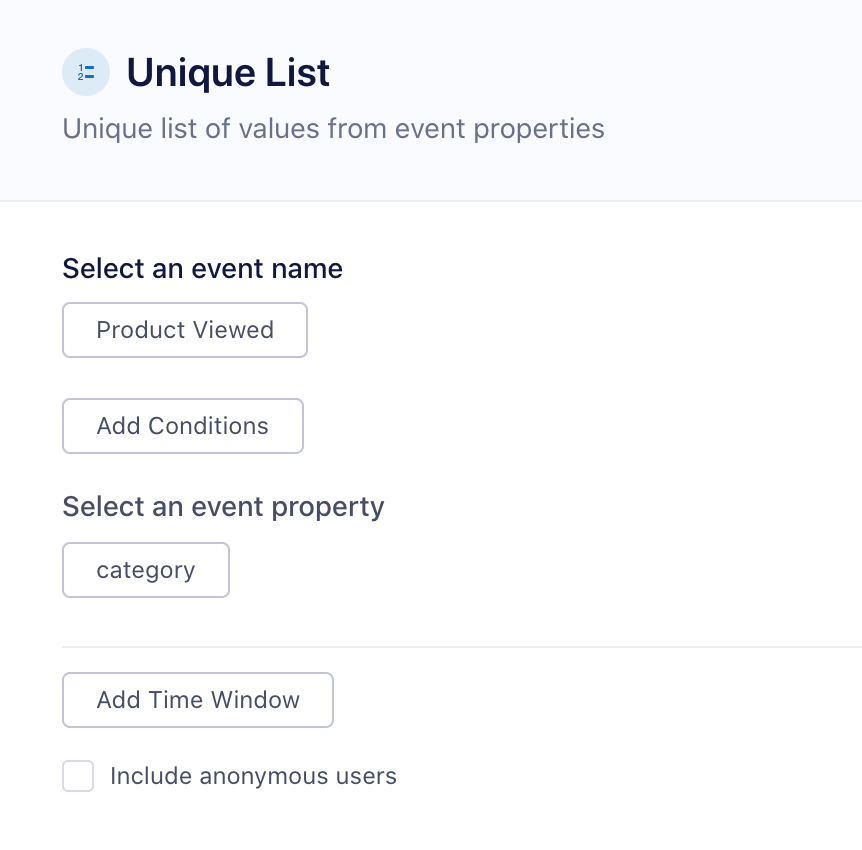
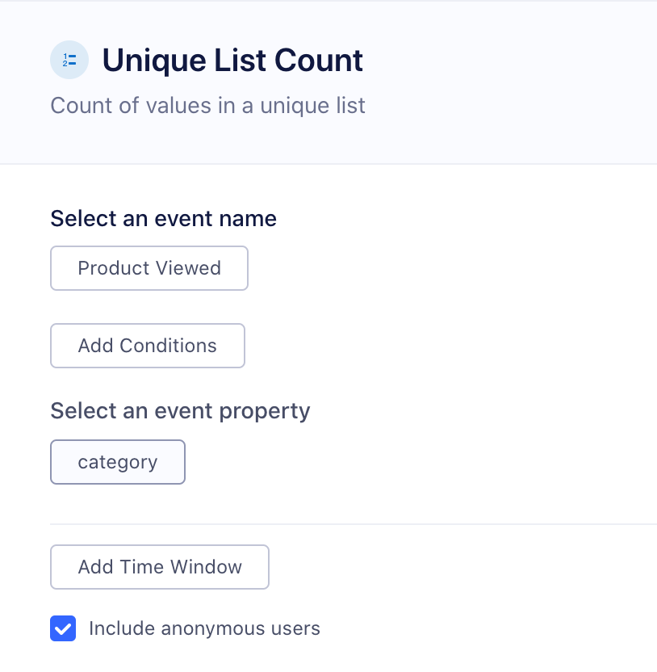

> info ""
> Beginning August 18, 2023, new Unify Plus users can access Computed Traits in Unify. 

Computed Traits allow you to quickly create user or account-level calculations that Segment keeps up-to-date over time. These can be computations like the `total_num_orders` a customer has completed, the `lifetime_revenue` of a customer, the `most_frequent_user` to determine which user is most active in an account, or the `unique_visitors_count` to assess how many visitors from a single domain. These computations are based on your events and event properties that you are sending through Segment on the [Page](/docs/connections/spec/page/) and [Track](/docs/connections/spec/track) calls.

> warning "Starting June 2nd, 2025, disabled batch computed traits don't automatically backfill data when re-enabled"
> If you disable and re-enable a batch computed trait, Segment does not automatically create a backfill. Any data Segment receives during the disabled period is not sent to your Destination after you re-enable your trait. If you want to backfill your data, you must reach out to [Segment Support](mailto:friends@segment.com) to request a resync.
>
> Segment is releasing this feature on a phased rollout plan, and expects this to be available to all customers by July 18, 2025.



## Types of computed traits

Segment currently supports the following types of computed traits:
- [Types of Computed Traits](#types-of-computed-traits)
  - [Event Counter](#event-counter)
  - [Aggregation](#aggregation)
  - [Most Frequent](#most-frequent)
  - [First](#first)
  - [Last](#last)
  - [Unique List](#unique-list)
  - [Unique List Count](#unique-list-count)
  - [Predictions](/docs/unify/traits/predictions/)
  - [Recommended Items](/docs/unify/traits/recommended-items/)
- [Conditions](#conditions)
- [Connecting your Computed Trait to a Destination](#connecting-your-computed-trait-to-a-destination)
- [Editing Realtime Traits](#editing-realtime-traits)
- [Accessing your Computed Traits using the Profiles API](#accessing-your-computed-traits-using-the-profiles-api)
- [Downloading your Computed Trait as a CSV file](#downloading-your-computed-trait-as-a-csv-file)


> warning "Event Properties per Computed Trait limit"
> Segment limits the number of Event Properties on each Computed trait to 10,000. If your Computed Trait exceeds this limit, Segment will not persist any new Event Properties and will drop new trait keys and corresponding values.

### Event counter

An Event Counter trait stores a count of an **event** over a period of time. For example, you can create a trait called `number_logins_90_days` based on a `User Logged In` event. You can also use event properties to only specific types of events.

User-level examples:
- Orders Completed Last 30 Days
- Pricing Page Views Last 30 Days

Account-level examples:
- Total Logins by Account 30 Days
- Emails Opened by Account 90 Days


### Aggregation

An aggregation computes a **sum, average, minimum, or maximum** of a numeric **event property**. A good example is a `sum_cosmetics_revenue_90_days` if you're sending an `Order Completed` event with a `revenue` property. In the example we're refining the revenue even further based on another event property: `category = 'cosmetics'`. Note that you can only compute an aggregation trait for event properties that have a numeric value.

User-level examples:
- Order Revenue Last 14 Days
- Max Ride Distance Last 60 Days

Account-level use cases
- Total Minutes Watched 30 Days
- Avg Order Size Last 180 Days


### Most frequent

A most frequent user-level computed trait will return the **most common value** for an **event property**.  This is helpful to create traits like `preferred_product_viewed`  or `most_commonly_viewed_category` that tell you what a user's preferred product, or content category might be. Note that the most frequent computed trait requires the event property to have been tracked at least twice. In the case of a tie, Segment returns the first alphabetical value. For account-level computed traits, you can also return the most frequent **user trait**. This is helpful when you want to determine which user has performed an event the most frequently. For example, you might to return the email of the user in an account most actively viewing your app.

User-level examples:
- Favorite Blog Post
- Top Purchase Category

Account-level examples:
- Most frequent product viewed
- Most active user


### First

The first user-level trait returns the first event property value Segment has seen. This is common for creating traits like `first_page_visited` based on the page name. For accounts, the first computed trait could also return a trait like `first_user_signup`, to calculate the first user to use your product.

User-level examples:
- First seen timestamp
- First utm parameter

Account-level examples:
- First email opened
- First user signup


### Last

The last trait returns the last event property value Segment has seen. This is common for creating traits like `last_utm_campaign` to help you calculate last-touch attribution for paid advertising.

User-level examples:
- Last seen at
- Last utm parameter

Account-level examples:
- Last unsubscribe timestamp
- Last user active




### Unique list

Unique list computed traits will output a **list of unique values** in alphabetical order for an **event property**. This is helpful to understand the different types of products or content that a customer or users in an account have interacted with or purchased. Customers are creating traits like `unique_product_categories_viewed` and sending them to email marketing tools and accessing them through the Profiles API for in-app personalization.

Example use cases:
- Unique products purchased
- Unique categories
- Unique games played




### Unique list count

Unique list count computed traits will output a **count of the unique list of values** for an **event property**. Customers are creating traits like `unique_product_categories_viewed_count` to understand the variety of products that a customer is viewing. At the account-level, customers are creating traits like `unique_visitors_count` to calculate the number of unique visitors by ip address.

User-level examples:
- Unique products viewed count
- Unique categories count

Account-level examples:
- Unique products viewed
- Unique visitors count




## Conditions

All computed trait types support a common "Add Conditions" section. Conditions defined here restrict the messages considered when calculating the final value of the computed trait by looking at a property of the events. For example, you could limits events to only those where "price" is greater than 30.00 or where "page.url" contains "pricing".

The following operators are available:
- equals
- not equals
- less than
- greater than
- less than or equal
- greater than or equal
- contains
- does not contain
- starts with
- ends with
- exists
- not exists
- before date
- after date
- equals one of
- contains one of

## Connecting your computed trait to a destination

Segment sends user-level computed Traits to destinations using the [Identify call](/docs/connections/spec/identify/) for user traits, or using the [Track call](/docs/connections/spec/track/) for event properties. Segment includes the trait value and property in the Identify and Track calls.

For example, the name of a computed trait is added to the user profile as a trait, and the trait's value is set to the value of the computed trait. Segment sends an Identify or Track call when the trait is computed, depending on the destination configuration. If a computed trait counts the number of times a user visits your pricing page, and the user visits your pricing page five times, Segment sends an Identify call with the property `pricing_page_visits: 5`.

See [Computed trait generated events](/docs/engage/using-engage-data/#computed-trait-generated-events) to learn more. The trait name corresponds to the _snake_cased_ name that you see in the trait settings, for example `most_viewed_page_category`. See the [list of Engage-compatible destinations](/docs/engage/using-engage-data/#compatible-engage-destinations).

For account-level computed traits, you have the option to send either a [Group](/docs/connections/spec/group/) call and/or an [Identify](/docs/connections/spec/identify/) call. Group calls will send one event per account, whereas Identify calls will send an Identify call for each user in the account. This means that even if a user hasn't performed an event, Segment will still set the account-level computed trait on that user. As most marketing tools are still based at the user level, it is often important to map this account-level trait onto each user within an account. See [Account-level Audiences](/docs/engage/audiences/account-audiences) for more information.

> warning "Computed Traits can only be sent to Event destinations"
> When Engage sends a computed trait to an [Event destinations](/docs/engage/using-engage-data/#event-destinations), it uses an Identify call to send user traits and a Group call to send account-level computed traits.


## View compute status

After you create a computed trait, use the Overview page to view a compute progress bar, current [status](/docs/engage/audiences#compute-statuses), number of users with the trait, connected destinations, and more. For real-time traits, click **Refresh Trait** to update the current number of users with the trait.  

> info "Viewing compute progress"
> When you create a real-time computed trait, you'll see a progress bar, computed percentage, and status updates. For existing traits that you edit, Segment displays the compute status but not the progress bar or percentage.

## Editing realtime traits

Segment supports the editing of real-time Traits, which allows you to make nuanced changes to existing Traits in situations where cloning or building from scratch may not suit your use case.

To edit a real-time Trait, follow these steps:

1. In your Unify or Engage space, select the **Computed Traits** tab.
2. Select the realtime Trait you want to edit.
3. Select the **Builder** tab and make your edits.
4. Preview the results, then select **Save Computed Trait** to confirm your edits.

Segment then processes your Trait edits. While the edit task runs, the trait remains locked and you can't make further changes. Once Segment incorporates your changes, you'll be able to access your updated Trait.


> warning ""
> It is not possible to edit a trait to convert it from real-time to batch, or vice-versa. If the computation type needs to be changed, you will need to recreate the trait with the appropriate conditions.

## Accessing your computed traits using the Profiles API

You can access your computed traits using the Profile API by querying the `/traits` endpoint. For example, you can query for the `emails_opened_last_30_days` with the following GET request:

```
https://profiles.segment.com/v1/spaces/<workspace_id>/collections/users/profiles/email:john.doe@segment.com/traits?include=emails_opened_last_30_days
```

returns:
```json
    {
        "traits": {
            "emails_opened_last_30_days": 255
        },
        "cursor": {
            "url": "",
            "has_more": false,
            "next": "",
            "limit": 100
        }
    }
```
**Traits**
You can query a user's traits (such as `first_name`, `last_name`, and more):

`https://profiles.segment.com/v1/spaces/<space_id>/collections/users/profiles/<external_id>/traits`

By default, the response includes 20 traits. You can return up to 200 traits by appending `?limit=200` to the querystring. If you wish to return a specific trait, append `?include={trait}` to the querystring (for example, `?include=age`). You can also use the ``?class=audience​`` or ``?class=computed_trait​`` URL parameters to retrieve audiences or computed traits specifically.

You can read the [full Profile API docs](/docs/unify/profile-api/) to learn more.

## Deleting computed traits

When computed traits are deleted, any user that had a value for that trait will now have a custom trait on the Unify profile. 

## Downloading your computed trait as a CSV file

You can download a copy of your trait by visiting the computed trait overview page.

Computed Trait CSVs are generated on demand. Before you can download the CSV, you will need to generate it. There are three different options for formatting:
- **Unformatted:** Contains three columns. The first contains the user or account key, the second contains the trait value and the third is a JSON object containing the external IDs. Generating this CSV is by far the fastest of the three options. [Download example unformatted CSV](/docs/engage/files/trait_csv_format_a.csv)
- **Distinct columns for unique external IDs (with indexed columns for ID types with multiple values):** Contains the same first three columns as the unformatted CSV. Additional columns are added for each distinct external ID type. When a single row has more than one value for a given external ID type, for example a user with three email addresses, _additional columns with indexed headers are added_, (`email`, `email_1`, `email_2`). [Download example formatted CSV with indexed columns](/docs/engage/files/trait_csv_format_b.csv)
- **Distinct columns for unique external IDs (with additional rows for ID types with multiple values):** Contains the same first three columns as the unformatted CSV. Additional columns are added for each distinct external ID type. When a single row has more than one value for a given external ID type, for example a user with two email addresses, _additional rows are added with the first three columns repeated (user or account key, trait value and external IDs JSON)._ [Download example formatted CSV with additional rows](/docs/engage/files/trait_csv_format_c.csv)
<table>
    <tr>
        <td></td>
        <td width="45%">Generating a CSV can take a substantial amount of time for large traits (around 30 seconds for a formatted CSV with 1 million rows). For CSVs that are expected to take over 20 seconds, the Segment app displays an estimated generation time. After clicking Generate, it is recommended that you leave the modal and page open while the CSV is created.
        (If the trait recalculates between when you click Generate and when you download the file, regenerate the file. The CSV is a snapshot from when you clicked Generate, and could be outdated.)</td>
    </tr>
</table>

> warning ""
> You can't add account traits and identifiers using the CSV downloader with account level audiences. This is because every row listed in the CSV file is a user, and since account traits and identifiers only exist on accounts, they wouldn't exist as a user's custom trait and appear on the CSV.
