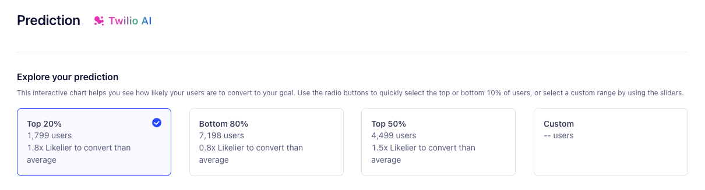
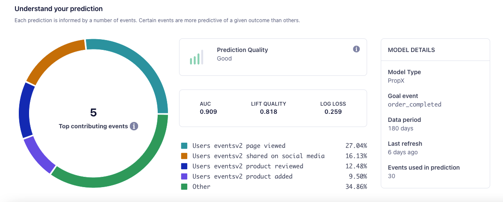

## Working with Predictions in Segment

Segment creates Predictions as Computed Traits, with scores saved to user profiles as a percentage cohort. For example, `0.8` on a user's profile indicates that the user is in the the cohort's 80th percentile, or the top 20%. 

Once you've selected a cohort, you can use Predictions in concert with other Segment features:

- [Audiences](/docs/engage/audiences/), which you can create with predictions as a base. As part of Engage, Segment also offers prebuilt [Suggested Predictive Audiences](/docs/unify/traits/predictions/suggested-predictive-audiences/).
- [Journeys](/docs/engage/journeys/); use Predictions in Journeys to trigger [Engage marketing campaigns](/docs/engage/campaigns/) when users enter a high-percentage cohort, or send promotional material if a customer shows interest and has a high propensity to buy.
- [Destinations](/docs/connections/destinations/); send your Predictions downstream to [Warehouses](/docs/connections/storage/warehouses/), support systems, and ad platforms.

### Prediction tab

Once Segment has generated your prediction, you can access it in your Trait's **Prediction** tab. The Prediction tab gives you actionable insight into your prediction. 

The **Explore your prediction** section of the Prediction tab visualizes prediction data and lets you create Audiences to target. An interactive chart displays a percentile cohort score that indicates the likelihood of users in each group to convert on your chosen goal. You can choose the top 20%, bottom 80%, or create custom ranges for specific use cases.

You can then create an Audience from the group you've selected, letting you send efficient, targeted marketing campaigns within Journeys. You can also send your prediction data to downstream destinations.
 
#### Model statistics

The Predictions tab's **Understand your prediction** section provides insights into the performance of the underlying predictive model. This information helps you understand the data points that contribute to the prediction results.

The Understand your prediction dashboard displays the following model metrics:

- **AUC**, or Area under [the ROC curve](https://en.wikipedia.org/wiki/Receiver_operating_characteristic){:target="_blank"}; AUC lands between 0 and 1, where 1 is a perfect future prediction, and 0 represents the opposite. Higher AUC indicates better predictions. 
- **Lift Quality**, which measures the effectiveness of a predictive model. Segment calculates lift quality as the ratio between the results obtained with and without the predictive model. Higher lift quality indicates better predictions.
- **Log Loss**; the more a predicted probability diverges from the actual value, the higher the log-loss value will be. Lower log loss indicates better predictions.
- **Top contributing events**; this graph visually describes the events factored into the model, as well as the associated weights used to create the prediction.

## Predictions use cases

Predictions offer more value in some situations than others. This sections covers common scenarios where predictions have high impact, as well as others where alternative approaches may be more appropriate.

### Marketing opportunities

- **Improve ad targeting**; build targeted audience segments based on predictive behavior. 
- **Optimize campaign performance**; reduce customer acquisition costs (CAC), and improve customer lifetime value (LTV) by building campaigns that target customers most likely to purchase or perform another desired action.
- **Power more personalization**; With Predictions, you can deliver the right message at the right time. You can create targeted customer Journeys with personalized offers and recommendations that boost conversion and promote upsell and cross sell.
- **Win back unengaged customers**; Predictions let you identify unengaged customers you can re-engage with personalized winback campaigns.

### Data science use cases

- **Model improvement**; You can extract Predictions from Segment and use them to improve proprietary machine learning models.
- **Testing experiences**; data teams can validate and strengthen existing machine learning models by testing proprietary models against Segment's out-of-the-box models.
- **Save time on predictive modeling**; data science teams can use Segment's predictive models, freeing up time to building other in-house models like inventory management and fraud alerting.

### When to use a prediction

Predictions are most effective in the following situations: 

- **When your desired outcome is difficult to measure and not clearly defined**, like activation, retention, engagement, or long-term value Journeys.
- **When your product has more than 100,000 average monthly users**; smaller sample sizes lead to less accurate statistical conclusions.
- **When you need to save time building cohorts**; Predictions lets marketers access and take action on predictive data without the help of data science teams, while also giving data teams out-of-the-box machine learning models they can use in downstream tools.

### When other approaches work better

Predictions may not be as beneficial in the following situations:

- **When you sell limited but highly-priced items**, like enterprise software, complex medical machines, and so on; this also applies if you're in the B2B sector.
- **When you don't yet have enough data**; your model could produce errors if, for example, your target is too new and lacks sufficient data. Waiting a month could allow Segment to gather more predictive data.

## Frequently asked questions



Segment uses a binary classification model that uses decision trees.



Once Segment creates your prediction, you can check the model statistics page, where Segments shows you how the model was created. Segment also maintains automated systems that monitor model performance and will alert you if your model is not predictive.



Trait creation depends on the amount of data, but Segment expects predictions to be completed in around 24 hours. For larger customers, however, this could take 48 hours. Predictions shows a status of `In Progress` while computing; Segment updates this status when customers are scored.



These data science statistics measure the effectiveness of Segment's predictions when tested against historical data. For more information, refer to [ROC Curve and AUC](https://developers.google.com/machine-learning/crash-course/classification/roc-and-auc){:target="_blank"}, [The Lift Curve in Machine Learning](https://howtolearnmachinelearning.com/articles/the-lift-curve-in-machine-learning/){:target="_blank"}, and [Intuition behind log-loss score](https://towardsdatascience.com/intuition-behind-log-loss-score-4e0c9979680a){:target="_blank"}.



The Prediction Quality Score factors AUC, log loss, and lift quality to determine whether Segment recommends using the prediction. A model can have a score of Poor, Fair, Good, or Excellent.



The created trait value represents the user's percentile cohort. This value refreshes every seven days. If you see `0.85` on a user's profile, this means the user is in the 85th percentile, or the top 15% for the prediction.



Segment rebuilds the machine learning model every 30 days.



Every seven days.



You can have 10 active predictions.



Yes. Keep the following in mind when you work with Predictions:

- **Predictions made for more than 100 million users will fail.** Segment recommends making predictions only for non-anonymous users, or, as an alternative, use the Starting Cohort to narrow down the audience for which you want to make a prediction.
- **Predictions may not work as intended if you track more than a thousand unique events in your workspace.** If this applies to your use case, [contact Segment Support](https://segment.com/help/contact/){:target="_blank"} for help with removing unused events, which will allow you to create predictions.


