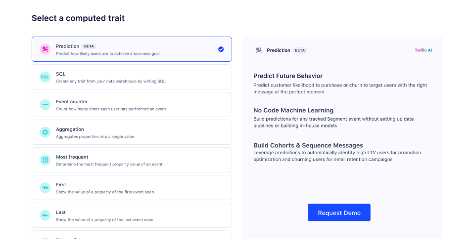

> info ""
> Predictive Traits is in public beta.

Predictive Traits, Segment's artificial intelligence and machine learning feature, lets you predict the likelihood that users will perform any event tracked in Segment. 

With Predictive Traits, you can identify users with, for example, a high propensity to purchase, refer a friend, or use a promo code. Predictive Traits also lets you predict a user's lifetime value (LTV).

Segment saves Predictive Traits to user profiles, letting you build Audiences, trigger Journeys, and send data to downstream Destinations.

On this page, you'll learn how to build a Predictive Trait.

## Access and build Predictive Traits

To create Predictive Traits, you'll first request demo access, then build a Predictive Trait.

### Request Predictive Traits access

Follow these steps to access Predictive Trait:

1. Navigate to **Engage > Audiences > Computed traits** or **Unify > Traits**. Select **Create computed trait**.
2. Select **Request Demo** to access Predictive Traits.

### Build a Predictive Trait

Once your Workspace is enabled for Predictive Traits, follow these steps to build a Predictive Trait:

3. In the Trait Builder, select **Predictive Traits**, choose the Trait you want to create, then click **Next**.
    - Choose **Custom Predictive Goal**, **Likelihood to Purchase**, or **Predicted Lifetime Value**.
4. (For custom Predictive Goals) Add a condition(s) and event to predict, then select **Calculate**. If you're satisfied with the available data, select **Next**.
5. (Optional) Connect a Destination, then select **Next**.
6. Add a name and description for the Trait, then select **Create Trait**.

In the next section, you'll learn more about the three available Predictive Traits.

## Choosing a Predictive Trait

Segment offers three Predictive Traits: Custom Predictive Goals, Likelihood to Purchase, and Predicted LTV.

### Custom Predictive Goals

Custom Predictive Goals require a starting cohort, target event, and quality data.

#### Starting cohort

When you build a Custom Predictive Goal, you'll first need to select a cohort, or a group of users, for which you want to make a prediction. Traits with small cohorts compute faster and tend to be more accurate. If you want to predict for an entire Audience, though, skip cohort selection and move to selecting a target event.

#### Target event

The target event is the Segment event that you want to predict a user's likelihood to perform. Predictions work better when many customers have performed the event.

#### Data requirements

Segment doesn't enforce data requirements for predictions. In machine learning, however, data quality and quantity are critical. Segment recommends that you make predictions for at least 50,000 users and choose a target event that at least 5,000 users have performed in the last 30 days. 

You can create predictions outside of these suggestions, but your results may vary.

### Likelihood to Purchase

Likelihood to Purchase is identical to Custom Predictive Goals, but Segment prefills the **Order Completed** event, assuming it's tracked in your Segment instance. 

If you don’t track Order Completed, choose a target event that represents a customer making a purchase.

### Predicted Lifetime Value

Predicted Lifetime Value predicts a customer's future spend over the next 90 days. To create this prediction, select a purchase event, revenue property, and the currency (which defaults to USD). The following table contains details for each property:

| Property        | Description                                                                                                                  |
| --------------- | ---------------------------------------------------------------------------------------------------------------------------- |
| Purchase event  | Choose a target event that represents a customer making a purchase. For most companies, this is usually **Order Completed**. |
| Purchase amount | Select the purchase event property that represents the total amount. For most companies, this is the **Revenue** property.   |
| Currency        | Segment defaults all currencies to USD.                                                                                       |

#### Data requirements

Predicted LTV has strict data requirements. Segment can only make predictions for customers that have purchased two or more times. Segment also requires a year of purchase data to perform LTV calculations.

## Use cases

For use cases and information on how Segment builds Predictive Traits, read [Using Predictive Traits](/docs/unify/traits/predictive-traits/using-predictive-traits/).
