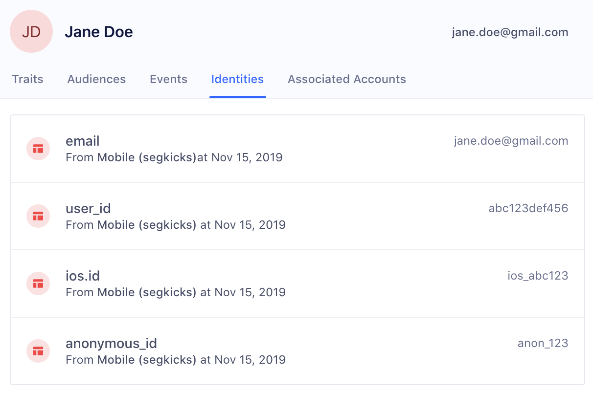

> note ""
> The steps in this guide pertain to spaces created before September 27th, 2020. For spaces created after September 27th, 2020, please refer to the [Identity onboarding guide](/docs/unify/identity-resolution/identity-resolution-onboarding/).

## Default externalIDs

The Identity Graph creates or merges profiles based on externalIDs. ExternalIDs will become the identities attached to a user profile in the Profile explorer.

> success ""
> Navigate to **Unify > Profile explorer** to view identities attached to a profile, along with custom traits, event history, and more.



Segment automatically promotes the following traits and IDs in track and identify calls to externalIDs:

| External ID Type   | Message Location in Track or Identify Call                                                                    |
| ------------------ | ------------------------------------------------------------------------------------------------------------- |
| user_id            | userId                                                                                                        |
| email              | traits.email or context.traits.email                                                                          |
| android.id         | context.device.id when context.device.type = 'android'                                                        |
| android.idfa       | context.device.advertisingId when context.device.type = 'android' AND context.device.adTrackingEnabled = true |
| android.push_token | context.device.token when context.device.type = 'android'                                                     |
| anonymous_id       | anonymousId                                                                                                   |
| cross_domain_id    | cross_domain_id when XID has been enabled for the workspace                                                   |
| ga_client_id       | context.integrations['Google Analytics'].clientId when explicitly captured by users                           |
| group_id           | groupId                                                                                                       |
| ios.id             | context.device.id when context.device.type = 'ios'                                                            |
| ios.idfa           | context.device.advertisingId when context.device.type = 'ios'     |
| ios.push_token     | context.device.token when context.device.type = 'ios'                                                         |

> note ""
> The Google clientID(ga_clientid) is a unique value created for each browser-device pair and will exist for 2 years if the cookie is not cleared. The analytics.reset() call should be triggered from Segment end when the user logs off. This call will clear the cookies and local Storage created by Segment. It doesn’t clear data from other integrated tools. So on the next login, the user will be assigned with a new unique anonymous_id, but the same ga_clientid will remain if this cookie is not cleared. Hence, the profiles with different anonymous_id but with same ga_clientid will get merged.

## Custom externalIDs

Unify resolves identity for any other externalIDs that you bind to users - such as a phone number or any custom identifier that you support.

As long as you've configured custom externalIDs, such as `phone`, in your Space's Identity Resolution rules, you can include it with the `context.externalIds` array, the `properties` object, or the `context.traits` object.  

As seen in the example below, you can send custom `externalIds` in the `context` object of any call to Segment's API.

The four fields below (id, type, collection, encoding) are all required:

| Key        | Value                                                                        |
| ---------- | ---------------------------------------------------------------------------- |
| id         | value of the externalID                                                      |
| type       | name of externalID type (`app_id`, `ecommerce_id`, `shopify_id`, and more)   |
| collection | `users` if a user-level identifier or `accounts` if a group-level identifier |
| encoding   | `none`                                                                       |

As an example:

``` js
analytics.track('Subscription Upgraded', {
   plan: 'Pro',
   mrr: 99.99
}, {
  externalIds: [
    {
      id: '123-456-7890',
      type: 'phone',
      collection: 'users',
      encoding: 'none'
    }
  ]
})
```
Additionally, adding `phone` with the `properties` object gets picked up by Unify and applied as an externalID:
```js
analytics.track('Subscription Upgraded', { plan: 'Pro', mrr: 99.99, phone: '123-456-7890'})
```
You can also include `phone` using the [`context.traits`](/docs/connections/sources/catalog/libraries/website/javascript/identity/#saving-traits-to-the-context-object) object and Unify adds it as an externalID to the profile.

```js
analytics.track('Subscription Upgraded', { plan: 'Pro', mrr: 99.99}, {traits : {phone_number: '123-456-7890'}})
```

Unify creates a user (user_id: `use_123`)  with the custom externalID (phone: `123-456-7890`). Query the user's phone record by using the externalID (phone: `123-456-7890`), or update the profile with that externalID going forward. (Note: externalIDs must be lower-case.)

## Viewing promoted externalIDs

Users can view which externalIDs are promoted on each event by viewing the raw payload on Events in the User Profile in the "external_ids" object.

For example, the following user had anonymous_id and user_id promoted as identifiers from the Course Clicked track call:


## Example

For example, a new anonymous user visits your Pricing page:

``` js
analytics.page('Pricing', {
  anonymousId: 'anon_123'
  title: 'Acme Pricing',
  url: 'https://acme.com/pricing',
  referrer: 'https://google.com/'
});
```

At this point, the Identity Graph will create a new user with external id (anonymous_id: `anon_123`) and a persistent and globally unique segment_id, in this case: `use_4paotyretuj4Ta2bEYQ0vKOq1e7`.


Any new events received with the same external id (anonymous_id: `anon_123`) are appended to same user `use_4paotyretuj4Ta2bEYQ0vKOq1e7`.

Next, the user goes to a sign up form and signs up:

``` js
analytics.track('User Signup', {
  userId: 'use_123',
  anonymousId: 'anon_123'
});
```

At this point, the Identity Graph associates external ID (user_id: `use_123`) with the same user `use_4paotyretuj4Ta2bEYQ0vKOq1e7`.

