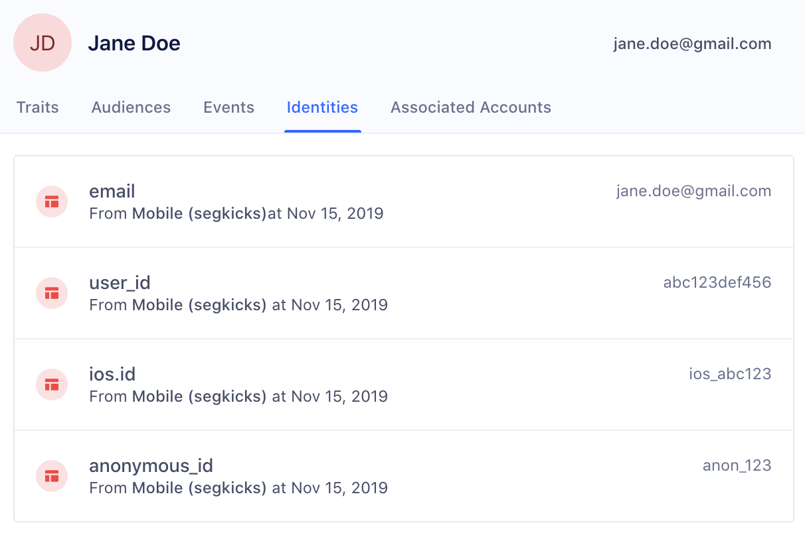
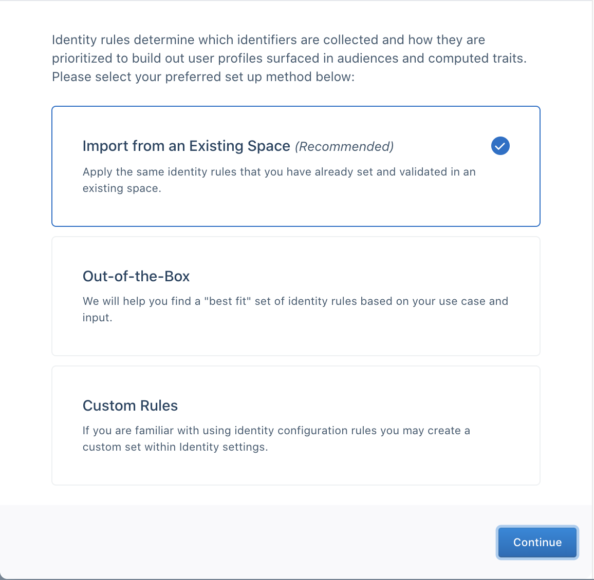
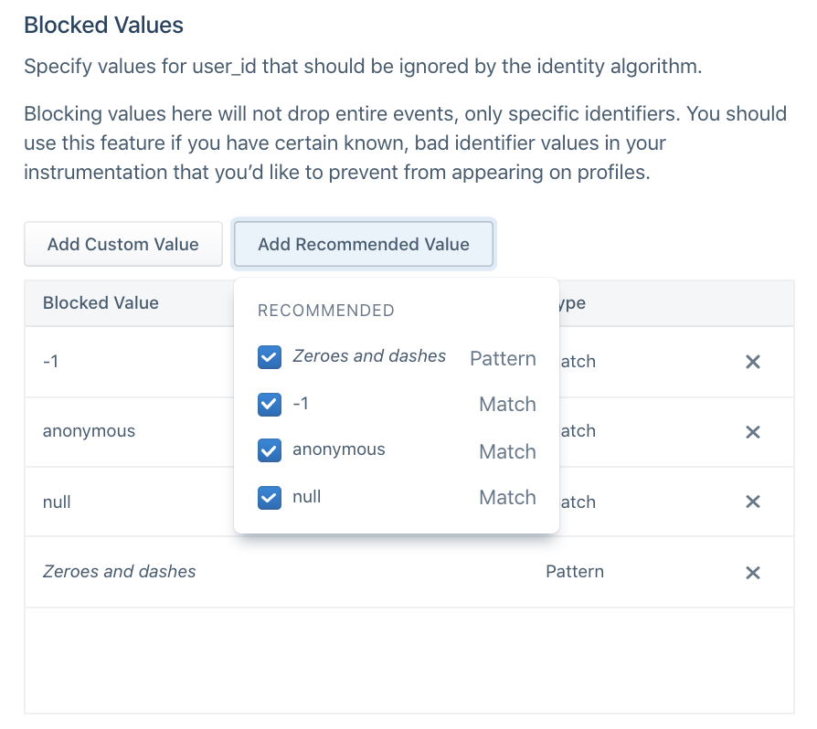
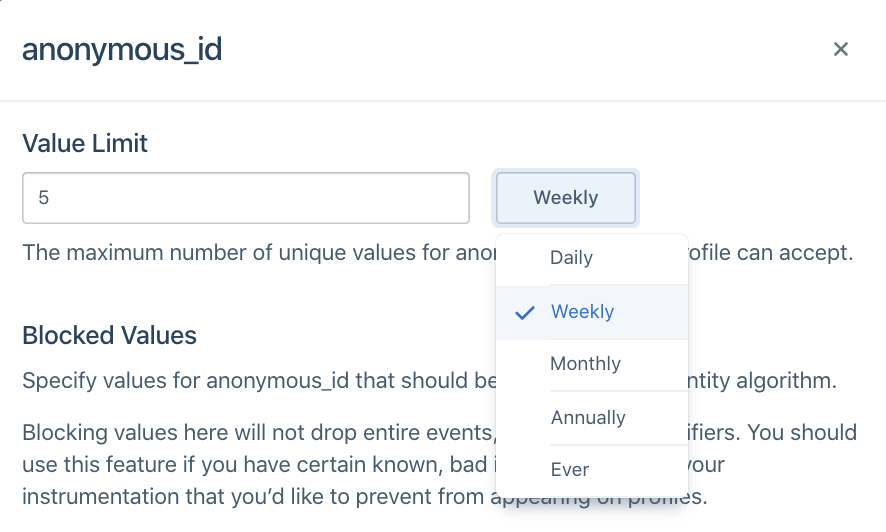
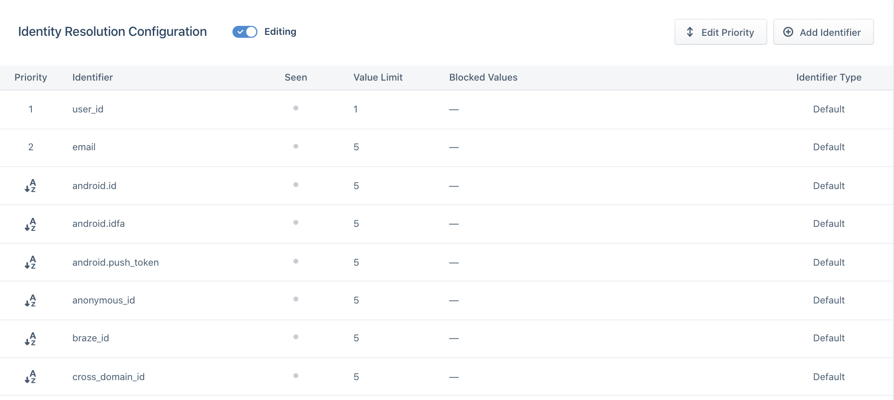
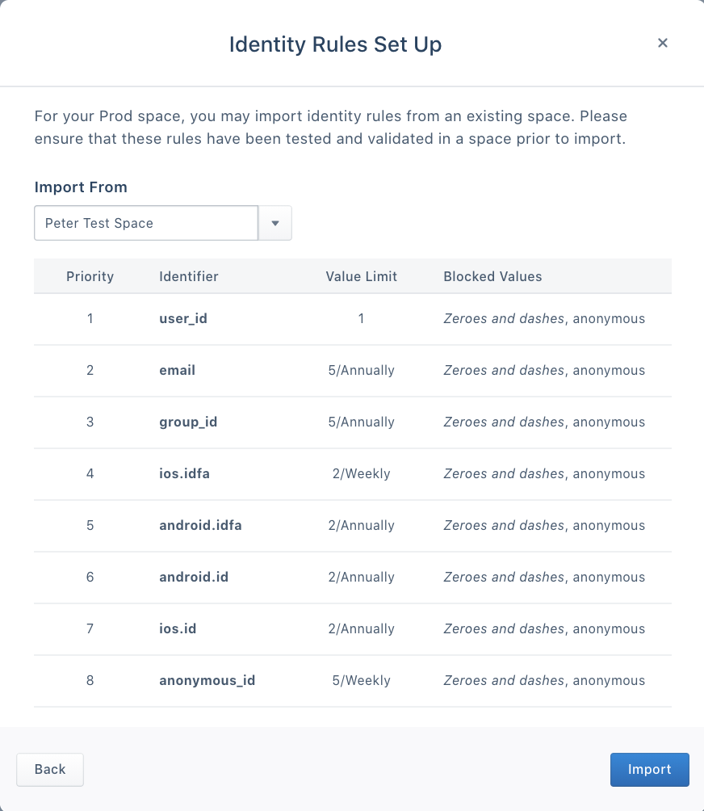

Identity Resolution unifies user identifiers (like email addresses, device IDs, or custom IDs) from multiple sources into a single, accurate user profile. This process prevents data fragmentation and ensures your ability to deliver personalized experiences and actionable insights.

This page explains:

- How to configure Identity Resolution during initial setup.
- How to modify settings to adapt to evolving data sources and requirements.

## How Identity Resolution works

Segment creates and merges user profiles based on a space's Identity Resolution configuration. Segment searches for identifiers such as `userId`, `anonymousId`, and `email` on incoming events and matches them to existing profiles or creates new profiles. These identifiers display in the Identities tab of a User Profile in the Profile explorer.

Navigate to **Unify > Profile explorer** to view identities attached to a profile, along with custom traits, event history, and more.

### Flat matching logic

Flat matching logic determines how Segment processes events to match them with existing profiles or create new ones. This ensures accurate profile resolution when events contain multiple identifiers.

When Segment receives a new event, it looks for profiles that match any of the identifiers on the event. Based on the existence of a match, one of three actions occurs:

**1: Create a new profile**  
If no existing profiles match any identifiers in the event, Segment creates a new user profile.

**2: Add to existing profile**  
If a single profile matches all identifiers in the event, Segment maps the traits, identifiers, and events from the call to that profile. If the profile exceeds its identifier limits, Segment defers to the Identity Resolution rules.

**3: Merge existing profiles**  
If multiple profiles match identifiers in the event, Segment checks the Identity Resolution rules and merges profiles accordingly.

#### Example: Shared iPad Use Case
In shared device scenarios, like in-store iPads used by multiple customers, events from different users may share the same device identifier. Without proper Identity Resolution rules, these events might merge into a single user profile. To avoid inaccurate merges, configure rules to block default identifiers or set appropriate priorities.

## Identity Resolution settings

> success ""
> Workspace owners, administrators, and users with the Identity Admin role can edit Identity Resolution Settings.

Identity Admins should configure Identity Resolution ettings to protect the identity graph from inaccurate merges and ensure the accuracy of user profiles.

Segment recommends testing Identity Resolution rules in a Dev space before applying them to Production. Ensure your Dev space matches expected data and business logic before duplicating settings for a Production environment.

### Implications of changing Identity Resolution rules

Updating Identity Resolution rules can affect your profiles and downstream systems in critical ways. Loosening rules is typically safe, but stricter rules may fragment or corrupt profiles, especially those already in use.

Before making any changes, consider these key impacts:

- **Less restrictive rules**:  
  Increasing identifier limits or expanding priorities applies only to future events and generally won’t disrupt existing profiles.
- **More restrictive rules**:  
  - Profiles may no longer merge as expected, resulting in duplicate or fragmented profiles.
  - Existing profiles that adhered to old rules might lose connections to key identifiers, leading to corrupted profiles and issues in downstream tools or reports.
- **Testing changes**:  
  Always test rule changes in a Dev space with representative data to validate behavior, including profile merges, identifier integrity, and downstream tool compatibility.

- **Documentation**:  
  Keep a record of rule changes for your team and to help troubleshoot.

### Best practices for avoiding profile corruption

- Avoid making rules stricter after profiles have already been created in Production.
- Implement stricter rules early in your Dev space configuration to prevent future disruptions.
- Regularly review your profiles to ensure Identity Resolution settings align with your data model and business requirements.

When you create a space, start by choosing an Identity Resolution configuration. If this is your first space, select from these options:

- Out-of-the-Box Configuration: A quick-start option that helps most users get set up with minimal effort.
- Custom Configuration: Recommended for users with unique data needs or specific identifiers.
- Import Settings: Available for users with existing configurations. You can import settings from another space to maintain consistency across environments.

### Out-of-the-box

For most first-time users, Segment recommends that you use the out-of-the-box configuration and answer a short series of questions for a best-fit setup for your use-case.

If you have custom unique identifiers or don't have a canonical `user_id`, you're automatically redirected to the Identity Resolution Settings page to complete your setup.

### Custom rules

If you're familiar with identity or have custom identifiers, Segment recommends selecting Custom Rules.

Segment redirects you to the Identity Resolution Settings page where you can add Default Identifiers or Custom Identifiers.

Segment promotes the following default traits and identifiers in Track and Identify calls to external IDs:

| External ID Type     | Message Location in Track or Identify Call                                                                            |
| -------------------- | --------------------------------------------------------------------------------------------------------------------- |
| `user_id`            | `userId`                                                                                                              |
| `email`              | `traits.email` or `properties.email.context.traits.email.` or `context.externalIds`                                   |
| `android.id`         | `context.device.id` when `context.device.type` = `android`                                                            |
| `android.idfa`       | `context.device.advertisingId` when `context.device.type` = `android` AND `context.device.adTrackingEnabled` = `true` |
| `android.push_token` | `context.device.token` when `context.device.type` = `android`                                                         |
| `anonymous_id`       | `anonymousId`                                                                                                         |
| `ga_client_id`       | `context.integrations['Google Analytics'].clientId` when explicitly captured by users                                 |
| `group_id`           | `groupId`                                                                                                             |
| `ios.id`             | `context.device.id` when `context.device.type` = `ios`                                                                |
| `ios.idfa`           | `context.device.advertisingId` when `context.device.type` = `ios` AND `context.device.adTrackingEnabled` = `true`     |
| `ios.push_token`     | `context.device.token` when `context.device.type` = `ios`                                                             |

These identifiers are pre-configured and labeled as *Default* in the Identity Resolution table.

#### Adding Custom Identifiers
To add a custom identifier:
1. Enter the **Trait or Property Key** to match on (e.g., `app_id` or `customer_key`).
2. Preview the locations where Segment looks for the identifier.
3. Configure additional options, such as value limits and blocked values, to ensure accurate profile resolution.

Segment accepts both camelCase and snake_case for context.traits, traits, and properties to accommodate varying data formats. However, for identifiers in the context.externalIds object, Segment requires lowercase types to ensure consistency and prevent potential processing errors.

After you define custom identifiers, you can refine their behavior further by blocking invalid values or setting limits.

#### Blocked values

Segment recommends that you proactively prevent using certain values as identifiers. While these values remain in the payload on the event itself, it is not promoted to an identifier Segment uses to determine user profiles.

This is important when developers have a hard-coded value for fields like `user_id` during QA or development that then erroneously make it to production. This may cause hundreds of profiles to merge incorrectly and can have costly consequences if these spaces already feed data into a production email marketing tool or push notification tool downstream.

In the past, Segment has seen certain default values that cause large amounts of profiles to merge incorrectly. Segment suggests that for every identifier, customers opt into automatically blocking the following suggested values:

| Value                         | Type            |
| ----------------------------- | --------------- |
| Zeroes and Dashes (^[0-]*$)   | Pattern (REGEX) |
| -1                            | Exact Match     |
| null                          | Exact Match     |
| anonymous                     | Exact Match     |

Before sending data through, Segment also recommends that you add any default hard-coded values that your team uses during the development process, such as `void` or `abc123`.

#### Limit

Identity Admins can specify the total number of values allowed per identifier type on a profile during a certain period. For example, in the image below, the `anonymous_id` field has a limit of **5 Weekly**.

This will vary depending on how companies define a user today. In most cases, companies rely on `user_id` to distinguish user profiles and Segment defaults to the following configurations:

| Identifier            | Limit |
| --------------------- | ----- |
| user_id               | 1     |
| all other identifiers | 5     |

Specific cases may deviate from this default. For example, a case where a user can have more than one `user_id` but one email, like when `shopify_id` and an internal UUID define a user. In this case, an example configuration may be:

| Identifier            | Limit |
| --------------------- | ----- |
| email                 | 1     |
| user_id               | 2     |
| all other identifiers | 5     |

When you choose the limit on an identifier, ask the following questions about each of the identifiers you send to Segment:

1. Is it an immutable ID? An immutable ID, such as `user_id`, should have `1 ever` per user profile.
2. Is it a constantly changing ID? A constantly changing ID, such as `anonymous_id` or `ga_client_id`, should have a short sliding window, such as **5 weekly** or **5 monthly**, depending on how often your application automatically logs out the user.
3. Is it an ID that updates on a yearly basis? Most customers will have around five emails or devices at any one time, but can update these over time. For identifiers like `email`, `android.id`, or `ios.id`, Segment recommends a longer limit like **5 annually**.

#### Priority

Segment considers the priority of an identifier once that identifier exceeds the limit on the final profile.

For example, consider a Segment space with the following Identity Resolution configurations:

| Identifier   | Limit | Priority |
| ------------ | ----- | -------- |
| user_id      | 1     | 1        |
| email        | 5     | 2        |
| anonymous_id | 5     | 3        |

A profile already exists with `user_id` **abc123** and `email` **jane@example1.com**. A new event comes in with new `user_id` **abc456** but the same `email` **jane@example1.com**.

If this event maps to this profile, the resulting profile would then contain two `user_id` values and one `email`. Given that `user_id` has a limit of 1, this exceeds the limit of that identifier. As a result, Segment checks the priority of the `user_id` identifier. Since `email` ranks lower than `user_id`, Segment demotes `email` as an identifier on the incoming event and tries again.

At this point, the event searches for any profiles that match just the identifier user_id `abc456`. Now there are no existing profiles with this identifier, so Segment creates a new profile with user_id `abc456`.

By default, Segment explicitly orders `user_id` and `email` as rank `1` and `2`, respectively. All other identifiers must be manually configured in the Identity Resolution Settings page. 

For example, if the configured identifiers for an event include `user_id`, `email`, `anonymous_id`, and `ga_client_id`, their priority order would be:

| Identifier     | Priority |
| -------------- | -------- |
| `user_id`      | 1        |
| `email`        | 2        |
| `anonymous_id` | 3        |
| `ga_client_id` | 4        |

If you want to add a new identifier such as `android.id`, you must explicitly configure its rule in the Identity Resolution Settings page. Once configured, it would follow the defined priority order, such as:

| Identifier     | Priority |
| -------------- | -------- |
| `user_id`      | 1        |
| `email`        | 2        |
| `android.id`   | 3        |
| `anonymous_id` | 4        |
| `ga_client_id` | 5        |

Segment no longer adds new identifiers automatically. For Identity Resolution to work with new identifiers, you must manually create rules in the Identity Resolution Settings page before sending events.

When choosing the priority of your identifier, ask the following questions about each of the identifiers you send to Segment:

1. Is it an immutable ID? Give immutable IDs, such as user_id, highest priority.
2. Are they unique IDs? Give Unique IDs such as email higher priority than possibly shared identifiers like android.id or ios.id.
3. Does it temporarily identify a user? Identifiers such as anonymous_id, ios.idfa, and ga_client_id are constantly updated or expired for a user. Generally speaking, rank these lower than identifiers that permanently identify a user.

## Best practices for Identity Resolution

To maintain an accurate identity graph and avoid incorrect profile merges, Segment recommends the following best practices:

### Choose limits that fit your data patterns

Carefully setting limits for each identifier type ensures that profiles remain accurate without excessive or conflicting data. Keep the following guidelines in mind when you configure limits:

- **Immutable IDs** like `user_id`: Assign a strict limit of `1 ever` to ensure profiles have only one permanent identifier.
- **Frequently changing IDs** like `anonymous_id` or `ga_client_id`: Use a sliding window limit, like 5 weekly, to reflect temporary or session-based identifiers.
- **Rarely updated IDs** like `email`, `android.id`, or `ios.id`: Use a longer limit, like **5 annually**, to account for updates over time.

### Define clear identifier priorities

Priorities determine how Segment resolves conflicts when multiple identifiers exceed their limits. Assigning clear priorities helps ensure that your most reliable identifiers get used for matching. Use these recommendations to set priorities:

- Assign immutable identifiers like `user_id` the highest priority.
- Rank unique but mutable identifiers like `email` below immutable identifiers.
- Lower the priority of temporary or shared identifiers such as `anonymous_id` or `ios.idfa`.

#### Example:

If your application sends `user_id`, `email`, and `anonymous_id`, prioritize identifiers like this:

1. `user_id` (highest priority)
2. `email`
3. `anonymous_id` (lowest priority)

### Proactively block invalid identifier values

Using invalid or placeholder values as identifiers can cause inaccurate merges and data fragmentation. To prevent this, use [blocked values](/docs/unify/identity-resolution/identity-resolution-settings/#blocked-values) to exclude common defaults and test values. Segment ignores blocked values during Identity Resolution, but blocked values remain in the event payload for debugging. 

Segment recommends blocking:

- **Common hard-coded test values**: `void`, `abc123`, `-1`
- **Patterns of invalid values**: `^[0-]*$` (like zeros or dashes)
- **Null or anonymous values**: `null`, `anonymous`

### Test changes in a Dev space

Before you make changes to Identity Resolution settings in production, validate your updates in a Dev space. Testing ensures that rules behave as expected and align with your business logic. After you confirm the behavior, duplicate the tested settings into your production space.

### Regularly review and update rules

Your data sources and user behaviors may change over time. Periodically review your Identity Resolution settings to update identifier limits, blocked values, and priorities as needed to maintain accuracy and prevent issues.

## Importing from an existing space

Importing Identity Resolution settings from an existing space is a quick way to replicate tested and validated configurations. This option is available to new spaces after creating an initial Dev space.

Segment recommends importing settings when your Dev space rules are finalized and align with your business logic. After importing, review the identifiers, priorities, limits, and blocked values to confirm accuracy before completing the import.

## Connect a source

After you configure Identity Resolution settings, the next step is to connect a [source](/docs/connections/sources/) to the Segment space.

## Create an audience

After you connect a source, Segment creates user profiles based off of replayed and newly incoming data.

The next step, which is important in the Dev space, is to create an audience to ensure that user profiles have populated correctly and that the Identity Resolution settings follow expected business logic.

For example, if there should be 100,000 distinct users who have a `user_id`, this would be a great way to validate that the Identity Resolution settings have calculated profiles correctly.

For more information about how to create audiences and traits, see Segment's [Audiences docs](/docs/engage/audiences/).